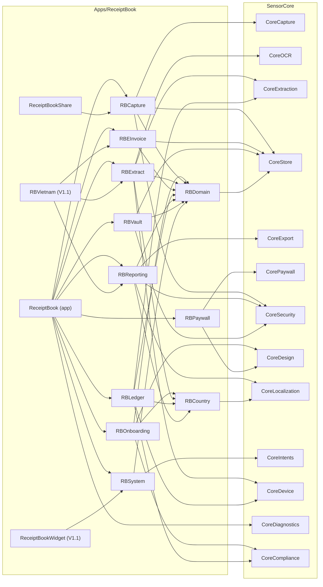
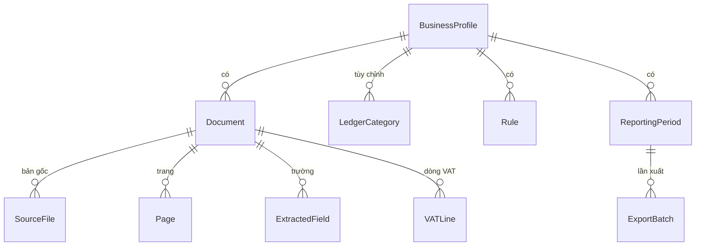

# Thiết kế kỹ thuật: Sổ chứng từ riêng tư (`ReceiptBook`, mã `SCT`)

Tài liệu này mô tả phần riêng của app. Kiến trúc chung, interface lõi và ngân sách hiệu năng chung nằm ở [shared-core.md](../shared-core.md) và không lặp lại ở đây. Feature và ước tính ở [epics-features.md](epics-features.md).

Code Swift trong tài liệu là **phác thảo** để thống nhất thiết kế, viết theo Swift 6, không phải code cuối cùng. Chữ ký API Apple đánh dấu ⚠ phải đối chiếu tài liệu Xcode 26 trong S0.

## 1. Kiến trúc tổng quan

App gồm 3 target và một Swift package cục bộ `ReceiptBookKit`:
- `ReceiptBook`: app chính, SwiftUI + Observation.
- `ReceiptBookShare`: Share Extension nhận PDF, XML, ảnh từ Mail, Files, Safari (MVP).
- `ReceiptBookWidget`: WidgetKit (`V1.1`).

Nguyên tắc riêng của app, bổ sung cho mục 2 của shared-core:
- **Luật trước, AI sau.** Mọi trường có thể trích bằng luật trên mọi iPhone. Foundation Models chỉ lấp chỗ trống và phân loại khi máy hỗ trợ.
- **Bản gốc bất biến.** Byte của ảnh, PDF, XML được ghi một lần. Mọi sửa đổi chỉ tác động lên trường đã trích và có audit.
- **Tiền là `Decimal` + mã ISO 4217.** Không có `Double` cho tiền ở bất kỳ tầng nào. Điểm tin cậy (0–1) được phép là `Double`.
- **Extension không làm việc nặng.** Share Extension chỉ chép file vào hộp nhận trong App Group. App xử lý khi mở.
- **Không mạng.** Không `URLSession` trong app và extension; CI của lõi chặn (CORE-E01-02).

### 1.1 Pipeline xử lý chứng từ

```mermaid
flowchart LR
    A1["Camera (VisionKit)"] --> IN
    A2["Photos / Files / Mở bằng"] --> IN
    A3["Share Extension (App Group)"] --> IN
    IN["Hộp nhận: lưu byte gốc + SHA-256"] --> DUP{"Trùng hash?"}
    DUP -- "có" --> STOP["Báo đã có, không tạo mới"]
    DUP -- "không" --> T{"Loại đầu vào"}
    T -- "XML UBL / CII" --> EP["Parser e-invoice (XMLParser)"]
    T -- "PDF có XML nhúng" --> EX["Trích file nhúng PDF/A-3 (CGPDF)"] --> EP
    T -- "PDF có lớp chữ" --> PT["Lấy chữ bằng PDFKit"]
    T -- "Ảnh / PDF quét" --> OCR["OCR: DocumentRecognizer hoặc LineRecognizer (vi-VT)"]
    PT --> RX
    OCR --> RX["ReceiptRuleExtractor"]
    OCR --> LX["ReceiptLLMExtractor (nếu FM khả dụng)"]
    PT --> LX
    RX --> MG["MergedExtractor + điểm tin cậy"]
    LX --> MG
    EP --> VAL
    MG --> VAL["Kiểm tra: toán VAT, ngày, bậc VAT, nghi trùng"]
    VAL --> CL["Phân loại: luật → FM → chưa phân loại"]
    CL --> RV{"Cần xem lại?"}
    RV -- "có" --> UI["Màn xem lại và sửa (audit)"] --> ST
    RV -- "không" --> ST["Lưu: SwiftData + BlobStore + AuditLog"]
    ST --> PR["Gán kỳ theo ngày chứng từ"]
    PR --> XP["Xuất: PDF đơn / CSV / PDF kỳ / ZIP + manifest SHA-256"]
```



### 1.2 Phụ thuộc module



### 1.3 Đồng thời

- `ProcessingQueue` là `actor`, xử lý tuần tự từng chứng từ trong Hộp nhận. Mỗi bước là hàm `async` nhận và trả kiểu `Sendable` (`RecognizedDocument`, `Extracted<ReceiptFields>`, `EInvoice`).
- Ghi SwiftData ở nền qua `@ModelActor actor DocumentWriter`. UI đọc qua `@Query` trên main actor.
- Khi app vào nền giữa lúc xử lý, dùng `UIApplication.beginBackgroundTask` để kết thúc chứng từ đang chạy, phần còn lại tiếp tục ở lần mở sau. `BGContinuedProcessingTask` của iOS 26 cho nhập hàng loạt là lựa chọn `V1.1` ⚠ cần xác minh.

## 2. Module map

```
Apps/ReceiptBook/
├── ReceiptBook/                 # target app: @main, điều hướng, màn hình
├── ReceiptBookShare/            # Share Extension
├── ReceiptBookWidget/           # WidgetKit (V1.1)
├── Resources/
│   ├── CountryPacks/            # gb.json, de.json, fr.json, us.json (vn.json V1.1)
│   └── Localizable.xcstrings
└── Packages/ReceiptBookKit/     # Swift package, Swift 6, iOS 26+
    ├── Sources/RBDomain, RBCountry, RBOnboarding, RBCapture, RBExtract, RBEInvoice,
    │           RBLedger, RBReporting, RBVault, RBSystem, RBPaywall, RBVietnam
    └── Tests/                   # Swift Testing, fixture e-invoice, ảnh mẫu nhỏ
```

| Module (target) | Epic | Nội dung | Dùng CORE |
|---|---|---|---|
| `RBDomain` | E07 | `@Model`, `Money`, `DayKey`, enum, `VersionedSchema`, `SchemaMigrationPlan` | CoreStore |
| `RBCountry` | E01, E10 | Gói quốc gia (JSON): tiền tệ, bậc VAT theo ngày hiệu lực, quy tắc kỳ, danh mục, từ khóa, định dạng CSV, khóa disclaimer | CoreLocalization |
| `RBOnboarding` | E01 | Onboarding, hồ sơ, cài đặt thuế | CoreDesign, CoreCompliance, CoreDevice |
| `RBCapture` | E02 | Luồng chụp, nhập, "Mở bằng", hộp nhận App Group, hàng đợi, chặn trùng | CoreCapture, CoreStore (`BlobStore`), CoreSecurity (SHA-256) |
| `RBExtract` | E03 | Điều phối OCR, `ReceiptRuleExtractor`, `ReceiptLLMExtractor`, kiểm tra, màn xem lại | CoreOCR, CoreExtraction, CoreDevice |
| `RBEInvoice` | E04 | Nhận diện định dạng, parser UBL/CII, trích file nhúng PDF/A-3, bản xem đọc được | CoreStore, CoreExport (render PDF) |
| `RBLedger` | E05 | Danh mục, rules engine, phân loại FM, màn sổ | CoreExtraction, CoreDevice, CoreCompliance (`AIGeneratedLabel`) |
| `RBReporting` | E06 | Quy tắc kỳ, CSV, PDF đơn, PDF kỳ, ZIP, màn xuất | CoreExport, CoreSecurity, CoreLocalization |
| `RBVault` | E07 | Bất biến, xóa mềm, khóa khi xuất, xóa toàn bộ, sao lưu (`V1.1`) | CoreStore (`AuditLog`), CoreSecurity |
| `RBSystem` | E08 | Tìm kiếm; App Intents, `IndexedEntity`, dữ liệu widget (`V1.1`) | CoreIntents |
| `RBPaywall` | E09 | Product ID, bảng tính năng bị khóa, nội dung paywall theo storefront | CorePaywall |
| `RBVietnam` | E11 | Gói VN, luật tiếng Việt, XML hóa đơn VN, sổ hộ kinh doanh (`V1.1`) | CoreOCR (qua RBExtract) |
| `ReceiptBookShare` | E02 | `NSItemProvider` → file trong App Group; không link RBExtract | (qua RBCapture) |

`CoreDiagnostics` dùng ở target app. `DataScannerViewController` (CORE-E02-02) không dùng trong SCT.

## 3. Mô hình dữ liệu

### 3.1 Kiểu giá trị

```swift
import Foundation

/// Mã tiền tệ ISO 4217. Số chữ số lẻ lấy từ bảng; mặc định 2.
public struct CurrencyCode: Hashable, Sendable, Codable, RawRepresentable {
    public let rawValue: String                               // "GBP", "EUR", "USD", "CHF", "VND"
    public init(rawValue: String) { self.rawValue = rawValue.uppercased() }
    public var minorUnitDigits: Int { Self.minorUnitTable[rawValue] ?? 2 }
    static let minorUnitTable: [String: Int] = ["GBP": 2, "EUR": 2, "USD": 2, "CHF": 2, "VND": 0]
}

/// Tiền luôn là Decimal đã làm tròn theo tiền tệ. Không bao giờ dùng Double.
public struct Money: Hashable, Sendable, Codable {
    public let amount: Decimal
    public let currency: CurrencyCode

    public init(_ amount: Decimal, _ currency: CurrencyCode) {
        self.amount = amount.rounded(scale: currency.minorUnitDigits)
        self.currency = currency
    }
    public init(minorUnits: Int64, currency: CurrencyCode) {
        self.init(Decimal(minorUnits) / pow(10, currency.minorUnitDigits), currency)
    }
    /// 12,34 € → 1234; 50.000 ₫ → 50000
    public var minorUnits: Int64 {
        NSDecimalNumber(decimal: amount * pow(10, currency.minorUnitDigits)).int64Value
    }
}

extension Decimal {
    public func rounded(scale: Int, mode: NSDecimalNumber.RoundingMode = .plain) -> Decimal {
        var input = self
        var result = Decimal()
        NSDecimalRound(&result, &input, scale, mode)
        return result
    }
}

/// Ngày trên chứng từ, không có giờ và múi giờ: 5/7/2026 → 20260705.
public struct DayKey: Hashable, Comparable, Sendable, Codable {
    public let year: Int, month: Int, day: Int
    public var intValue: Int { year * 10_000 + month * 100 + day }
    public static func < (a: DayKey, b: DayKey) -> Bool { a.intValue < b.intValue }
    /// Chỉ dùng với n ≥ 0 và ngày đầu kỳ là 1 hoặc 6 (luôn tồn tại trong mọi tháng).
    public func addingMonths(_ n: Int) -> DayKey {
        let m0 = (month - 1) + n
        return DayKey(year: year + m0 / 12, month: m0 % 12 + 1, day: day)
    }
}
```

Cách lưu tiền: `@Model` lưu **số nguyên đơn vị nhỏ nhất** (`Int64`) cộng mã tiền tệ, API dùng `Money`. Lý do: SwiftData lưu `Decimal` trong SQLite có thể đi qua kiểu số thực và mất độ chính xác ⚠ cần xác minh bằng 🧪 spike 0,5 ngày trong SCT-E07-01. Nếu spike cho thấy `Decimal` được lưu chính xác thì vẫn giữ `Int64` để `#Predicate` và sắp xếp đơn giản. Đơn giá dòng hàng của e-invoice có thể có hơn 2 chữ số lẻ; trường này lưu dạng chuỗi Decimal gốc.

### 3.2 Enum

```swift
public enum DocumentKind: String, Codable, Sendable { case receipt, invoice, creditNote, eInvoice }
public enum Direction: String, Codable, Sendable { case expense, income }
public enum DocumentStatus: String, Codable, Sendable { case queued, processing, needsReview, ready, failed }
public enum IntakeSource: String, Codable, Sendable { case camera, photos, files, shareExtension, openIn }
public enum FieldKey: String, Codable, Sendable {
    case vendor, vendorTaxID, date, gross, net, vat, currency, invoiceNumber, paymentMethod, kind
}
public enum FieldSource: String, Codable, Sendable { case rules, pdfText, llm, merged, eInvoice, vendorMemory, user }
public enum PaymentMethod: String, Codable, Sendable { case cash, card, bankTransfer, directDebit, other }
public enum PeriodKind: String, Codable, Sendable { case monthly, quarterly, yearly, custom }
public enum ExportFormat: String, Codable, Sendable { case singlePDF, periodCSV, periodPDF, zipBundle }
public enum RuleOrigin: String, Codable, Sendable { case user, learned, pack }
/// Loại hình; ánh xạ sang từng nước nằm trong gói quốc gia ⚠ cần xác minh tên gọi pháp lý.
public enum BusinessKind: String, Codable, Sendable {
    case soleTrader, landlord, freiberufler, gewerbetreibender, microEntrepreneur, selfEmployed, hoKinhDoanh
}
```

Enum lưu dưới dạng chuỗi `…Raw` trong `@Model` để `#Predicate` lọc được và để đổi tên case không làm hỏng dữ liệu.

### 3.3 `@Model`

Mọi thuộc tính có giá trị mặc định và mọi quan hệ là optional, không dùng `#Unique`. Đây là điều kiện để bật CloudKit ở `V1.1` mà không phải đổi schema ⚠ cần xác minh danh sách ràng buộc của SwiftData + CloudKit.

```swift
import SwiftData

@Model final class BusinessProfile {
    var id: UUID = UUID()
    var name: String = ""
    var countryCode: String = "GB"                      // ISO 3166-1 alpha-2
    var kindRaw: String = BusinessKind.soleTrader.rawValue
    var vatRegistered: Bool = false
    var smallBusinessExemption: Bool = false            // DE Kleinunternehmer §19 UStG ⚠
    var baseCurrency: String = "GBP"
    var taxYearStartMonth: Int = 4                      // UK 6/4 ⚠
    var taxYearStartDay: Int = 6
    var periodKindRaw: String = PeriodKind.quarterly.rawValue
    var packVersion: String = "gb.2026.1"               // phiên bản gói quốc gia đang dùng
    var createdAt: Date = Date.now
    @Relationship(deleteRule: .cascade, inverse: \Document.business) var documents: [Document]? = []
    @Relationship(deleteRule: .cascade, inverse: \LedgerCategory.business) var categories: [LedgerCategory]? = []
    @Relationship(deleteRule: .cascade, inverse: \Rule.business) var rules: [Rule]? = []
    @Relationship(deleteRule: .cascade, inverse: \ReportingPeriod.business) var periods: [ReportingPeriod]? = []
    init() {}
}

/// Một chứng từ (Beleg): biên lai, hóa đơn, credit note hoặc e-invoice.
@Model final class Document {
    var id: UUID = UUID()
    var businessID: UUID = UUID()                       // lặp lại để #Predicate nhanh, không đi qua quan hệ
    var kindRaw: String = DocumentKind.receipt.rawValue
    var directionRaw: String = Direction.expense.rawValue
    var statusRaw: String = DocumentStatus.queued.rawValue
    var sourceRaw: String = IntakeSource.camera.rawValue
    var capturedAt: Date = Date.now
    var documentDay: Int?                               // DayKey.intValue
    var vendorName: String?
    var vendorKey: String?                              // tên chuẩn hóa (mục 5.3)
    var vendorTaxID: String?                            // VAT Reg No, USt-IdNr., N° TVA, MST
    var invoiceNumber: String?
    var currency: String = "GBP"
    var grossMinor: Int64?
    var netMinor: Int64?
    var vatMinor: Int64?
    var paymentMethodRaw: String?
    var categoryCode: String?                           // mã ổn định trong gói, ví dụ "gb.se.travel" ⚠
    var ocrText: String = ""                            // chỉ để tìm kiếm trong app
    var primarySHA256: String = ""                      // hash file gốc chính, để chặn trùng
    var needsReview: Bool = true
    var deletedAt: Date?                                // xóa mềm
    var deletionReason: String?
    var business: BusinessProfile?
    @Relationship(deleteRule: .cascade, inverse: \SourceFile.document) var originals: [SourceFile]? = []
    @Relationship(deleteRule: .cascade, inverse: \Page.document) var pages: [Page]? = []
    @Relationship(deleteRule: .cascade, inverse: \ExtractedField.document) var fields: [ExtractedField]? = []
    @Relationship(deleteRule: .cascade, inverse: \VATLine.document) var vatLines: [VATLine]? = []
    init() {}

    var gross: Money? {
        grossMinor.map { Money(minorUnits: $0, currency: CurrencyCode(rawValue: currency)) }
    }
}

/// Byte gốc, ghi một lần. Ảnh từ camera, PDF, XML, hoặc XML trích từ PDF/A-3.
@Model final class SourceFile {
    var id: UUID = UUID()
    var blobID: UUID = UUID()                           // file trong BlobStore (CORE-E05-02)
    var contentType: String = "public.jpeg"             // UTType identifier
    var byteCount: Int64 = 0
    var sha256: String = ""
    var originalFilename: String?
    var roleRaw: String = "primary"                     // primary, embeddedXML, visualPDF
    var derivedFromID: UUID?                            // XML trích từ PDF → id của SourceFile PDF
    var importedAt: Date = Date.now
    var document: Document?
    init() {}
}

/// Trang hiển thị. Ảnh chụp 3 trang = 3 SourceFile + 3 Page; PDF 3 trang = 1 SourceFile + 3 Page;
/// XRechnung chỉ có XML = 1 SourceFile + 0 Page (bản xem được render từ dữ liệu).
@Model final class Page {
    var id: UUID = UUID()
    var index: Int = 0
    var sourceFileID: UUID = UUID()
    var pageInSource: Int = 0
    var previewBlobID: UUID?                            // JPEG khoảng 1.024 px, tạo lại được
    @Attribute(.externalStorage) var recognizedJSON: Data?   // dòng + bounding box từ CoreOCR
    var document: Document?
    init() {}
}

@Model final class ExtractedField {
    var id: UUID = UUID()
    var keyRaw: String = FieldKey.gross.rawValue
    var value: String = ""                              // dạng chuẩn: "1234.56", "2026-07-05", "EUR"
    var confidence: Double = 0                          // 0–1, là điểm, không phải tiền
    var sourceRaw: String = FieldSource.rules.rawValue
    var pageIndex: Int?
    var boxX: Double?                                   // tọa độ chuẩn hóa 0–1 trên trang
    var boxY: Double?
    var boxWidth: Double?
    var boxHeight: Double?
    var needsReview: Bool = false
    var document: Document?
    init() {}
}

@Model final class VATLine {
    var id: UUID = UUID()
    var rateBasisPoints: Int = 0                        // 19 % → 1900; 5,5 % → 550
    var taxCategoryCode: String?                        // mã loại thuế trong e-invoice, ví dụ "S" ⚠
    var netMinor: Int64 = 0
    var vatMinor: Int64 = 0
    var grossMinor: Int64 = 0
    var sourceRaw: String = FieldSource.rules.rawValue
    var document: Document?
    init() {}
}

/// Danh mục chuẩn nằm trong gói JSON. Bảng này chỉ chứa danh mục tùy chỉnh và danh mục bị ẩn.
@Model final class LedgerCategory {
    var id: UUID = UUID()
    var code: String = ""
    var customName: String?
    var mapsToCode: String?                             // danh mục tùy chỉnh → mã chuẩn khi xuất
    var isHidden: Bool = false
    var business: BusinessProfile?
    init() {}
}

@Model final class Rule {
    var id: UUID = UUID()
    var originRaw: String = RuleOrigin.user.rawValue
    var priority: Int = 100                             // nhỏ chạy trước
    var conditionData: Data = Data()                    // JSON của RuleCondition
    var actionData: Data = Data()                       // JSON của RuleAction
    var isEnabled: Bool = true
    var hitCount: Int = 0
    var overrideCount: Int = 0                          // số lần liên tiếp người dùng sửa ngược
    var business: BusinessProfile?
    init() {}
}

struct RuleCondition: Codable, Sendable {
    var vendorKeyEquals: String?
    var textContainsAny: [String] = []
    var minGrossMinor: Int64?
    var maxGrossMinor: Int64?
    var vatRateBasisPoints: Int?
    var paymentMethod: PaymentMethod?
    var direction: Direction?
}
struct RuleAction: Codable, Sendable {
    var categoryCode: String?
    var paymentMethod: PaymentMethod?
    var businessUsePercent: Int?                        // V1.1
}

/// Kỳ báo cáo. Tạo khi người dùng xem hoặc xuất kỳ đó.
@Model final class ReportingPeriod {
    var id: UUID = UUID()
    var businessID: UUID = UUID()
    var kindRaw: String = PeriodKind.quarterly.rawValue
    var label: String = ""                              // "2026-27 Q2"
    var startDay: Int = 0                               // DayKey.intValue, gồm ngày này
    var endDayExclusive: Int = 0                        // không gồm ngày này
    var business: BusinessProfile?
    @Relationship(deleteRule: .cascade, inverse: \ExportBatch.period) var exports: [ExportBatch]? = []
    init() {}
}

@Model final class ExportBatch {
    var id: UUID = UUID()
    var createdAt: Date = Date.now
    var formatRaw: String = ExportFormat.zipBundle.rawValue
    var documentCount: Int = 0
    var currency: String = "GBP"
    var totalGrossMinor: Int64 = 0
    var manifestSHA256: String = ""                     // hash của manifest.csv
    var documentIDsData: Data = Data()                  // [UUID] dạng JSON
    var isStale: Bool = false                           // chứng từ trong kỳ bị sửa sau lần xuất
    var period: ReportingPeriod?
    init() {}
}
```

`AuditEntry` do `CoreStore` cung cấp (CORE-E05-03) và được đưa vào schema của app, không định nghĩa lại. Các trường SCT ghi vào:

| Trường | Ví dụ |
|---|---|
| `at` | thời điểm UTC |
| `entityType`, `entityID` | `"Document"`, UUID của chứng từ |
| `action` | `create`, `update`, `softDelete`, `restore`, `export` |
| `field`, `oldValue`, `newValue` | `"gross"`, `"12.00"`, `"21.00"` |
| `source` | `rules`, `llm`, `eInvoice`, `user`, `import` |
| `appVersion` | `"1.0 (42)"` |

`AuditEntry` không có quan hệ SwiftData tới `Document` mà giữ `entityID`, để bản ghi còn lại cả khi chứng từ bị xóa hẳn. Chuỗi hash nối các bản ghi là `V1.1` (SCT-E07-06).

`VendorMemory` (`V1.1`, SCT-E03-07) lưu theo `vendorKey`: tên hiển thị, alias, đếm danh mục, tiền tệ và bậc VAT thường gặp.

### 3.4 Quan hệ



- `Document` thuộc `ReportingPeriod` theo **khoảng ngày** (`startDay ≤ documentDay < endDayExclusive`), không qua quan hệ SwiftData. Khi người dùng đổi ngày bắt đầu năm thuế hoặc loại kỳ, không cần gán lại từng chứng từ.
- `Document.categoryCode` trỏ tới mã trong gói hoặc `LedgerCategory.code`.
- `Page.sourceFileID` trỏ tới `SourceFile.id` trong cùng chứng từ.
- Chỉ mục: `#Index<Document>([\.businessID, \.documentDay], [\.primarySHA256], [\.vendorKey])` (API iOS 18) ⚠ cần xác minh cú pháp.

```swift
enum SCTSchemaV1: VersionedSchema {
    static let versionIdentifier = Schema.Version(1, 0, 0)
    static var models: [any PersistentModel.Type] {
        [BusinessProfile.self, Document.self, SourceFile.self, Page.self, ExtractedField.self,
         VATLine.self, LedgerCategory.self, Rule.self, ReportingPeriod.self, ExportBatch.self,
         AuditEntry.self]                               // AuditEntry từ CoreStore
    }
}
```

## 4. Pipeline chi tiết

| # | Bước | API | Vào → Ra | Lỗi và cách xử lý | Độ tin cậy |
|---|---|---|---|---|---|
| 1 | Nhận | `VNDocumentCameraViewController` (CORE-E02-01), `PhotosPicker`, `fileImporter` (CORE-E02-03), `onOpenURL`, `NSItemProvider` trong Share Extension | ảnh, PDF, XML → `SourceFile` + byte trong `BlobStore` | Loại không hỗ trợ: báo rõ loại file. File trên 50 MB (ngưỡng đề xuất): từ chối. Quyền camera bị từ chối: màn hướng dẫn mở Cài đặt | – |
| 2 | Chặn trùng | CryptoKit `SHA256` | byte → hash | Trùng hash: không tạo mới, mở bản cũ | – |
| 3 | Phân loại đầu vào | `UTType`, đọc 4 KB đầu của XML, `PDFDocument`, `CGPDFDocument` | file → `.eInvoiceXML`, `.pdfWithXML`, `.pdfText`, `.image` | PDF mã hóa: coi như ảnh, báo nếu không mở được | – |
| 4a | E-invoice | `XMLParser` (mục 4.5) | XML → `EInvoice` | XML hỏng, DOCTYPE, namespace lạ: trạng thái lỗi, vẫn giữ file gốc | 1,0 nếu kiểm tra cơ bản đạt |
| 4b | Chữ từ PDF | PDFKit `PDFPage.string`, `PDFSelection` | PDF có lớp chữ → dòng chữ | Lớp chữ rỗng hoặc rác: chuyển sang OCR | nguồn `pdfText` |
| 4c | OCR | `DocumentRecognizer` (`RecognizeDocumentsRequest`) hoặc `LineRecognizer` (`VNRecognizeTextRequest`, `vi-VT`) qua CORE-E03-03 | ảnh → `RecognizedDocument` | Ngôn ngữ không hỗ trợ: dùng recognizer dự phòng. Không đọc được chữ: trạng thái lỗi, cho nhập tay | theo dòng |
| 5 | Luật | `ReceiptRuleExtractor` (mục 4.2) | `RecognizedDocument` → `Extracted<ReceiptFields>` | Không tìm thấy trường: để trống, không đoán | theo từng heuristic |
| 6 | LLM | `ReceiptLLMExtractor` (mục 4.3) | văn bản đã cắt khối → `ReceiptDraft` | `.unavailable`, lỗi context window, lỗi guardrail: bỏ qua bước này | tối đa 0,6 nếu luật không xác nhận |
| 7 | Hợp nhất | `MergedExtractor` (CORE-E04-03) | 2 kết quả → trường + điểm | Mâu thuẫn: gắn "cần xem lại" | mục 4.4 |
| 8 | Kiểm tra | `VATCheck`, ngày hợp lý, bậc VAT trong gói, nghi trùng (mục 5) | trường → danh sách vấn đề | Mỗi vấn đề hạ điểm trường liên quan | – |
| 9 | Phân loại | Rules engine, Foundation Models (mục 4.6) | trường + văn bản → `categoryCode` | Không có gợi ý: "Chưa phân loại" | nhãn "gợi ý" |
| 10 | Xem lại | SwiftUI, CoreDesign | trường → trường đã xác nhận | – | sửa tay = 1,0, nguồn `user` |
| 11 | Lưu | `DocumentWriter` (`@ModelActor`), `AuditLog` | – | Lỗi ghi: giữ trạng thái `queued`, thử lại | – |
| 12 | Xuất | CoreExport (PDF, CSV, ZIP, SHA-256) | kỳ → file | Thiếu dung lượng: báo số MB cần | – |

### 4.1 Điều phối OCR

- PDF có lớp chữ (hóa đơn gửi qua email thường là PDF sinh từ phần mềm) lấy chữ trực tiếp bằng PDFKit, nhanh hơn và chính xác hơn OCR. Tọa độ dòng lấy từ `PDFSelection` theo dòng ⚠ cần xác minh độ ổn định.
- Ảnh và PDF quét: chọn recognizer theo ngôn ngữ của hồ sơ cộng gợi ý ngôn ngữ từ OCR lần đầu. `RecognizeDocumentsRequest` cho EN/DE/FR nếu danh sách ngôn ngữ lúc chạy có (danh sách 26 ngôn ngữ chưa công bố ⚠). Tiếng Việt dùng `VNRecognizeTextRequest` với `recognitionLanguages = ["vi-VT"]` đặt rõ ràng.
- Nhiều trang: OCR từng trang, giải phóng ảnh sau mỗi trang, nối dòng theo thứ tự trang. Trang cuối thường chứa tổng, nên luật tìm tổng quét từ trang cuối lên.

### 4.2 `ReceiptRuleExtractor`

Conform `FieldExtractor` của `CoreExtraction`, chạy trên mọi máy.

```swift
import CoreExtraction
import CoreOCR

public struct ReceiptFields: Sendable {
    public var vendor: String?
    public var vendorTaxID: String?
    public var day: DayKey?
    public var gross: Money?
    public var vatLines: [VATLineValue] = []
    public var invoiceNumber: String?
    public var paymentMethod: PaymentMethod?
    public var kind: DocumentKind = .receipt
}
public struct VATLineValue: Sendable { public var rateBasisPoints: Int; public var net, vat, gross: Decimal }

public struct ReceiptRuleExtractor: FieldExtractor {
    let pack: CountryPack                              // từ khóa, thứ tự ngày, bậc VAT, tiền tệ mặc định
    public func extract(from doc: RecognizedDocument,
                        context: ExtractionContext) async throws -> Extracted<ReceiptFields> {
        var fields = ReceiptFields()
        var confidence: [String: Double] = [:]
        let lines = doc.lines.map { NormalizedLine($0, folding: pack.locale) }   // hạ chữ, bỏ dấu
        let currency = CurrencyFinder(pack).find(in: lines) ?? pack.defaultCurrency
        if let hit = TotalFinder(pack, currency).find(in: lines, detected: doc.detected) {
            fields.gross = hit.value; confidence["gross"] = hit.confidence
        }
        fields.vatLines = VATTableFinder(pack, currency).find(in: lines)
        if let hit = DateFinder(pack).find(in: lines, detected: doc.detected) {
            fields.day = hit.value; confidence["date"] = hit.confidence
        }
        // người bán, số hóa đơn, phương thức, loại chứng từ: cùng kiểu
        return Extracted(value: fields, fieldConfidence: confidence, source: .rules)
    }
}
```

**Từ khóa** (nằm trong gói quốc gia, so khớp sau khi hạ chữ và bỏ dấu):

| Trường | EN | DE | FR | VI (`V1.1`) |
|---|---|---|---|---|
| Tổng phải trả | total, grand total, amount due, balance due, total to pay | summe, gesamt, gesamtbetrag, zu zahlen, endbetrag | total ttc, net à payer, montant ttc, à payer | tổng cộng, tổng tiền thanh toán, tổng thanh toán, cộng tiền thanh toán |
| Net | subtotal, net, total excl. vat | netto, nettobetrag, summe netto | total ht, montant ht | cộng tiền hàng, tiền trước thuế |
| VAT | vat, vat @, total vat | mwst, ust, umsatzsteuer, mehrwertsteuer, inkl. mwst | tva, dont tva | thuế gtgt, tiền thuế gtgt, thuế suất |
| Loại trừ khi tìm tổng | change, cash tendered, tip | gegeben, rückgeld, trinkgeld | rendu, espèces rendues, pourboire | tiền thừa, tiền khách đưa |
| Số hóa đơn | invoice no, receipt no | rechnungsnummer, rechnung nr, beleg-nr, bon-nr | facture n°, n° de facture | số hóa đơn, số:, ký hiệu |
| Mã số thuế người bán | vat reg no, vat no | ust-idnr, steuernummer | n° tva intracommunautaire, siret | mst, mã số thuế |
| Thanh toán | card, visa, mastercard, contactless, cash | bar, ec, girocard, kartenzahlung | cb, carte bancaire, espèces | tiền mặt, chuyển khoản, thẻ |
| Credit note | credit note, refund | gutschrift, storno | avoir | hóa đơn điều chỉnh |

Định dạng mã số thuế (tiền tố nước, số chữ số) dùng để tăng điểm tin cậy, không dùng để từ chối ⚠ cần xác minh từng định dạng.

**Heuristic chính:**
1. **Số tiền.** Dấu phân cách cuối cùng, nếu theo sau đúng 2 chữ số, là dấu thập phân; các dấu khác là phân cách nghìn. Hỗ trợ `1.234,56`, `1,234.56`, `1 234,56`, số âm dạng `12,50-` (biên lai Đức) và `(12.50)`. Tiền tệ 0 chữ số lẻ (VND) thì mọi dấu là phân cách nghìn. Chỉ 1 chữ số sau dấu (`12.5`) thì hạ điểm.
2. **Tổng.** Ứng viên là số tiền trên dòng có từ khóa tổng, hoặc số bên phải nhất của dòng đó. Bỏ các dòng có từ loại trừ. Quét từ cuối văn bản lên. Nhiều ứng viên thì chọn số lớn nhất không nằm trên dòng loại trừ. Tăng điểm khi: khớp tổng các dòng thanh toán; khớp tổng các `VATLine`; trùng với giá trị tiền mà `RecognizeDocumentsRequest` phát hiện.
3. **Bảng VAT.** Tìm dòng có phần trăm `(\d{1,2}([.,]\d{1,2})?)\s?%` và 1–3 số tiền. Với 3 số, thử mọi hoán vị để tìm bộ (net, VAT, gross) thỏa net + VAT = gross và VAT ≈ net × bậc trong dung sai (mục 5.2), vì thứ tự cột khác nhau giữa các nước. Biên lai Đức hay ghi mã `A`, `B` ở dòng hàng và bảng `A 19,0% …`. Với 1 số, xác định nó là VAT nếu ≈ gross × r / (1 + r), còn lại suy ra và đánh dấu nguồn `derived` với điểm thấp hơn.
4. **Ngày.** Regex theo thứ tự của nước (`dd.MM.yy(yy)` DE, `dd/MM/yyyy` UK/FR, `MM/dd/yyyy` US, `yyyy-MM-dd`, tên tháng EN/DE/FR, "ngày … tháng … năm …" VI); `NSDataDetector` là dự phòng. Loại ngày trong tương lai quá 1 ngày. Cảnh báo nếu cũ hơn năm thuế trước.
5. **Người bán.** Trong 25% trên của trang đầu, chọn dòng có chiều cao chữ lớn nhất, bỏ dòng giống địa chỉ (mã bưu chính), số điện thoại, URL, "Rechnung", "Invoice". Sau đó chuẩn hóa `vendorKey` (mục 5.3).
6. **Loại chứng từ.** Có từ khóa credit note thì đảo dấu tổng. Có số hóa đơn, địa chỉ người mua và mã số thuế thì là `invoice`, còn lại là `receipt`.

```swift
/// Đọc số tiền theo cả hai kiểu dấu. Phác thảo; test đầy đủ ở SCT-E03-02.
func parseAmount(_ raw: String, currency: CurrencyCode) -> Decimal? {
    let negative = raw.hasSuffix("-") || raw.hasPrefix("-") || raw.hasPrefix("(")
    let s = raw.filter { $0.isNumber || $0 == "." || $0 == "," }
    var decimalIndex: String.Index? = nil
    if currency.minorUnitDigits > 0,
       let i = s.lastIndex(where: { $0 == "." || $0 == "," }),
       s.distance(from: i, to: s.endIndex) == 3 {       // đúng 2 chữ số sau dấu cuối
        decimalIndex = i
    }
    var digits = ""
    for i in s.indices {
        if i == decimalIndex { digits.append(".") } else if s[i].isNumber { digits.append(s[i]) }
    }
    guard var value = Decimal(string: digits, locale: Locale(identifier: "en_US_POSIX")) else { return nil }
    if negative { value.negate() }
    return value
}
```

### 4.3 `ReceiptLLMExtractor`

Chỉ chạy khi `CoreDevice.Capabilities.onDeviceLLM == .available` và ngôn ngữ văn bản nằm trong danh sách ngôn ngữ của model (CORE-E04-02). Số tiền và ngày trả về dạng chuỗi, app tự parse sang `Decimal` và `DayKey`, để model không bao giờ sinh `Double` cho tiền.

```swift
import FoundationModels

@Generable
struct ReceiptDraft {
    @Guide(description: "Seller or merchant name exactly as printed, without address")
    var vendor: String?
    @Guide(description: "Document date as YYYY-MM-DD")
    var date: String?
    @Guide(description: "Grand total actually paid, digits with '.' as decimal separator, e.g. 1234.56")
    var total: String?
    @Guide(description: "ISO 4217 currency code such as GBP, EUR, USD, CHF, VND")
    var currency: String?
    @Guide(description: "Invoice or receipt number if printed")
    var invoiceNumber: String?
    @Guide(description: "One entry per VAT rate printed on the document", .maximumCount(4))  // ⚠ tên guide
    var vatLines: [VATLineDraft]
    var paymentMethod: PaymentMethodDraft?
}

@Generable
struct VATLineDraft {
    @Guide(description: "VAT rate in percent, e.g. 19 or 5.5")
    var ratePercent: String
    @Guide(description: "Net amount for this rate, '.' as decimal separator")
    var net: String?
    @Guide(description: "VAT amount for this rate, '.' as decimal separator")
    var vat: String?
}

@Generable
enum PaymentMethodDraft { case cash, card, bankTransfer, directDebit, other }

func draft(from text: String) async throws -> ReceiptDraft {
    let session = LanguageModelSession(instructions: """
        You copy fields from receipt or invoice text. Copy values as printed.
        If a value is not clearly present, leave it empty. Never guess or compute totals.
        """)
    return try await session.respond(to: text, generating: ReceiptDraft.self).content
}
```

- **Cắt khối.** Ngữ cảnh 4.096 token mỗi phiên trên iOS 26 gồm instructions, prompt và output. Biên lai: gửi 12 dòng đầu (người bán, ngày) và 40 dòng cuối (tổng, VAT). Hóa đơn nhiều trang: mỗi trang một phiên, gộp kết quả theo quy tắc "luật trước". Đếm token bằng `tokenCount(for:)` khi có (iOS 26.4) ⚠, nếu không thì ước lượng theo ký tự.
- **Lỗi.** `exceededContextWindowSize`: cắt ngắn và thử 1 lần. Guardrail hoặc lỗi khác: bỏ qua, pipeline vẫn có kết quả từ luật.
- **Quy định sử dụng.** Chỉ trích xuất và phân loại, không đưa lời khuyên thuế (acceptable use của Foundation Models).

### 4.4 Hợp nhất và điểm tin cậy

`MergedExtractor` của lõi chạy luật trước và dùng LLM để lấp trường thiếu. App đặt các mức sau, hiệu chỉnh bằng `ocr-bench`:

| Tình huống | Điểm | Cần xem lại |
|---|---|---|
| Luật và LLM trùng | max(hai điểm) + 0,05, tối đa 0,99 | Không, nếu ≥ ngưỡng |
| Chỉ luật, từ khóa cùng dòng, qua kiểm tra VAT | 0,9 | Không |
| Chỉ luật, suy từ số lớn nhất | 0,6 | Có |
| Chỉ LLM, luật không kiểm chứng được | tối đa 0,6 | Có |
| Luật và LLM mâu thuẫn | 0,4 | Có |
| Lấy từ XML e-invoice, kiểm tra cơ bản đạt | 1,0 | Không |
| Người dùng sửa | 1,0 | Không |

Chứng từ tự sang `ready` chỉ khi ba trường quan trọng (tổng, ngày, tiền tệ) đều ≥ 0,85 và kiểm tra VAT đạt. Ngưỡng 0,85 là điểm khởi đầu; mục tiêu là các trường tự chấp nhận đúng ≥ 98% (mục 12).

### 4.5 Hóa đơn điện tử

**Nhận diện định dạng** bằng phần tử gốc và namespace (⚠ cần xác minh với đặc tả EN 16931, XRechnung, ZUGFeRD):

| Định dạng | Phần tử gốc | Namespace |
|---|---|---|
| UBL Invoice (XRechnung UBL) | `Invoice` | `urn:oasis:names:specification:ubl:schema:xsd:Invoice-2` |
| UBL Credit Note | `CreditNote` | `urn:oasis:names:specification:ubl:schema:xsd:CreditNote-2` |
| CII (XRechnung CII, ZUGFeRD, Factur-X) | `CrossIndustryInvoice` | `urn:un:unece:uncefact:data:standard:CrossIndustryInvoice:100` |
| PDF/A-3 có XML nhúng | PDF | Tên file nhúng thường là `factur-x.xml`, `zugferd-invoice.xml`, `xrechnung.xml` ⚠ |

**Ánh xạ trường** theo Business Term (BT) của EN 16931. Đường dẫn rút gọn, bỏ tiền tố; ⚠ toàn bộ bảng phải đối chiếu đặc tả trước khi code:

| BT | Ý nghĩa | UBL | CII |
|---|---|---|---|
| BT-1 | Số hóa đơn | `Invoice/ID` | `ExchangedDocument/ID` |
| BT-2 | Ngày | `Invoice/IssueDate` | `ExchangedDocument/IssueDateTime/DateTimeString` |
| BT-3 | Loại (hóa đơn, credit note) | `InvoiceTypeCode` | `ExchangedDocument/TypeCode` |
| BT-5 | Tiền tệ | `DocumentCurrencyCode` | `ApplicableHeaderTradeSettlement/InvoiceCurrencyCode` |
| BT-27 | Tên người bán | `AccountingSupplierParty/Party/PartyLegalEntity/RegistrationName` | `ApplicableHeaderTradeAgreement/SellerTradeParty/Name` |
| BT-31 | VAT ID người bán | `AccountingSupplierParty/Party/PartyTaxScheme/CompanyID` | `SellerTradeParty/SpecifiedTaxRegistration/ID` |
| BT-109 | Tổng net | `LegalMonetaryTotal/TaxExclusiveAmount` | `SpecifiedTradeSettlementHeaderMonetarySummation/TaxBasisTotalAmount` |
| BT-110 | Tổng VAT | `TaxTotal/TaxAmount` | `…MonetarySummation/TaxTotalAmount` |
| BT-112 | Tổng gồm VAT | `LegalMonetaryTotal/TaxInclusiveAmount` | `…MonetarySummation/GrandTotalAmount` |
| BT-115 | Số phải trả | `LegalMonetaryTotal/PayableAmount` | `…MonetarySummation/DuePayableAmount` |
| BG-23 | Phân tích VAT theo bậc | `TaxTotal/TaxSubtotal` (`TaxableAmount`, `TaxAmount`, `TaxCategory/ID`, `TaxCategory/Percent`) | `ApplicableHeaderTradeSettlement/ApplicableTradeTax` (`BasisAmount`, `CalculatedAmount`, `CategoryCode`, `RateApplicablePercent`) |
| BT-84 | IBAN người nhận | `PaymentMeans/PayeeFinancialAccount/ID` | `SpecifiedTradeSettlementPaymentMeans/PayeePartyCreditorFinancialAccount/IBANID` |

**Parser.** `XMLParser` (SAX, có sẵn, không cần thư viện ngoài) với `shouldProcessNamespaces = true` để nhận tên cục bộ. Giữ một ngăn xếp đường dẫn; khi đóng một phần tử lặp (`TaxSubtotal`, `ApplicableTradeTax`, dòng hàng) thì chốt một nhóm. Hai parser UBL và CII dùng chung bộ gom, chỉ khác bảng đường dẫn.

```swift
import Foundation

/// Gom giá trị theo đường dẫn tên cục bộ. Phác thảo cho SCT-E04-02/03.
final class PathCollector: NSObject, XMLParserDelegate {
    private var path: [String] = []
    private var text = ""
    private(set) var values: [String: [String]] = [:]
    private(set) var groups: [[String: String]] = []     // mỗi nhóm thuế một từ điển
    private var currentGroup: [String: String]?
    let wanted: Set<String>
    let groupElement: String                             // "TaxSubtotal" hoặc "ApplicableTradeTax"

    init(wanted: Set<String>, groupElement: String) {
        self.wanted = wanted; self.groupElement = groupElement
    }

    func parser(_ parser: XMLParser, didStartElement elementName: String, namespaceURI: String?,
                qualifiedName qName: String?, attributes attributeDict: [String: String] = [:]) {
        path.append(elementName); text = ""
        if elementName == groupElement { currentGroup = [:] }
    }
    func parser(_ parser: XMLParser, foundCharacters string: String) { text += string }
    func parser(_ parser: XMLParser, didEndElement elementName: String, namespaceURI: String?,
                qualifiedName qName: String?) {
        let key = path.joined(separator: "/")
        let value = text.trimmingCharacters(in: .whitespacesAndNewlines)
        if wanted.contains(key) { values[key, default: []].append(value) }
        if currentGroup != nil, !value.isEmpty { currentGroup?[elementName] = value }
        if elementName == groupElement, let g = currentGroup { groups.append(g); currentGroup = nil }
        path.removeLast(); text = ""
    }
}

func parseEInvoiceXML(_ data: Data, map: EInvoicePathMap) throws -> PathCollector {
    // Hóa đơn điện tử không cần DTD; từ chối để tránh tấn công entity.
    if let head = String(data: data.prefix(4096), encoding: .utf8), head.contains("<!DOCTYPE") {
        throw EInvoiceError.doctypeNotAllowed
    }
    let parser = XMLParser(data: data)
    parser.shouldProcessNamespaces = true
    parser.shouldResolveExternalEntities = false
    let collector = PathCollector(wanted: map.paths, groupElement: map.taxGroupElement)
    parser.delegate = collector
    guard parser.parse() else { throw EInvoiceError.malformed(parser.parserError) }
    return collector
}
```

**Trích XML nhúng từ PDF/A-3** 🧪 (SCT-E04-01). PDFKit không có API công khai cho file nhúng ⚠, nên dùng CoreGraphics đọc cây tên `EmbeddedFiles` trong catalog, dự phòng bằng mảng `/AF`:

```swift
import CoreGraphics

/// Trả về (tên file, dữ liệu đã giải nén) của các file nhúng. Phác thảo cho spike.
func embeddedFiles(in url: URL) -> [(name: String, data: Data)] {
    guard let doc = CGPDFDocument(url as CFURL), !doc.isEncrypted, let catalog = doc.catalog else { return [] }
    var names: CGPDFDictionaryRef?
    var tree: CGPDFDictionaryRef?
    guard CGPDFDictionaryGetDictionary(catalog, "Names", &names), let names,
          CGPDFDictionaryGetDictionary(names, "EmbeddedFiles", &tree), let tree else { return [] }
    var result: [(String, Data)] = []
    walkNameTree(tree) { name, fileSpec in                // duyệt "Names" và đệ quy "Kids"
        var ef: CGPDFDictionaryRef?
        var stream: CGPDFStreamRef?
        var format = CGPDFDataFormat.raw
        guard CGPDFDictionaryGetDictionary(fileSpec, "EF", &ef), let ef,
              CGPDFDictionaryGetStream(ef, "F", &stream), let stream,
              let data = CGPDFStreamCopyData(stream, &format), format == .raw else { return }
        result.append((name, data as Data))
    }
    return result
}
```

Chọn file XML theo tên đã biết, nếu không có thì theo namespace gốc. Giới hạn kích thước file nhúng (ví dụ 5 MB) trước khi parse. Nếu spike thất bại: ZUGFeRD/Factur-X được xử lý như PDF có lớp chữ (bước 4b), và người dùng được nhắc xin người bán gửi kèm file XML.

**Lưu trữ.** XML gốc và PDF gốc là hai `SourceFile` (PDF `visualPDF`, XML `embeddedXML` có `derivedFromID`). Bản xem đọc được render lại từ dữ liệu mỗi lần mở và khi xuất PDF, không lưu thành bản gốc.

**Kiểm tra cơ bản** (SCT-E04-06): có BT-1, BT-2, BT-5, BT-27, BT-112; Σ nhóm thuế BasisAmount = BT-109; BT-109 + BT-110 = BT-112 trong dung sai 1 đơn vị nhỏ nhất. Màn hình luôn ghi "Kiểm tra cơ bản, không phải kiểm tra hợp lệ XRechnung đầy đủ".

### 4.6 Phân loại

Thứ tự: luật người dùng → luật học được → luật từ khóa của gói → Foundation Models (Pro, máy hỗ trợ) → "Chưa phân loại". Danh mục khác nhau theo nước nên không dùng enum cố định; Foundation Models chọn trong danh sách mã của gói bằng schema động:

```swift
import FoundationModels

/// Phác thảo; ⚠ cần xác minh chữ ký DynamicGenerationSchema và respond(to:schema:).
func suggestCategory(summary: String, pack: CategoryPack) async throws -> String? {
    let codes = pack.categories.map(\.code) + ["uncategorised"]
    let choice = DynamicGenerationSchema(name: "CategoryCode", anyOf: codes)
    let schema = try GenerationSchema(root: choice, dependencies: [])
    let session = LanguageModelSession(instructions: """
        Pick the one expense category code that fits the purchase. \
        If unsure, pick "uncategorised". Codes: \(pack.promptGlossary)
        """)
    let response = try await session.respond(to: summary, schema: schema)
    return try response.content.value(String.self)
}
```

- `summary` chỉ gồm tên người bán, loại chứng từ, vài dòng hàng đầu và tổng, để nằm gọn trong ngữ cảnh.
- `promptGlossary` là mô tả tiếng Anh ngắn của từng mã, nằm trong gói.
- Kết quả luôn hiện kèm `AIGeneratedLabel` dạng "Gợi ý bởi AI trên máy" và người dùng sửa được.
- Nếu 🧪 spike schema động thất bại (0,5 ngày trong SCT-E05-03): dùng `@Generable` với `String` rồi kiểm tra mã có trong danh sách, sai thì bỏ.

### 4.7 Xuất

**CSV giao dịch** (`transactions.csv`, 1 dòng cho mỗi `VATLine`; chứng từ không có dòng VAT xuất 1 dòng với bậc trống):

| Cột | Ví dụ | Ghi chú |
|---|---|---|
| `document_id` | `3F2A…` | UUID, ổn định giữa các lần xuất |
| `document_date` | `2026-07-05` | ISO 8601 cho mọi nước |
| `vendor` | `Shell` | |
| `vendor_tax_id` | `DE123456789` | |
| `invoice_number` | `R-2026-0815` | |
| `document_type` | `receipt` | receipt, invoice, credit_note, e_invoice |
| `direction` | `expense` | |
| `category_code`, `category_name` | `de.euer.fahrzeug`, `Kfz-Kosten` | ⚠ danh mục |
| `currency` | `EUR` | |
| `net`, `vat_rate`, `vat`, `gross` | `10.08`, `19`, `1.92`, `12.00` | không phân cách nghìn; dấu thập phân theo nước (mục 8) |
| `payment_method` | `card` | |
| `period` | `2026-Q3` | |
| `status` | `ready` | ready, needs_review |
| `original_file`, `sha256` | `originals/2026-07-05_Shell_3f2a.jpg`, `…` | |
| `source` | `rules` | rules, llm, e_invoice, user |

**Gói ZIP** (SCT-E06-04):

```
SCT_<hồ-sơ>_<kỳ>_<yyyyMMdd-HHmm>.zip
├── README.txt            # giải thích cột, disclaimer, phiên bản app và gói quốc gia
├── transactions.csv
├── summary.csv           # tổng theo danh mục và theo bậc VAT
├── period.pdf            # PDF tổng hợp kỳ, trang cuối in SHA-256 của từng bản gốc
├── audit.csv             # audit của các chứng từ trong kỳ
├── originals/            # byte gốc: ảnh, PDF, XML (tên: ngày_người-bán_8-ký-tự-id.đuôi)
└── manifest.csv          # đường dẫn, số byte, SHA-256 của mọi file ở trên
```

Hash của `manifest.csv` hiện ở màn xuất và lưu trong `ExportBatch.manifestSHA256`. ZIP không mã hóa; màn xuất ghi rõ điều này. File tạm nằm trong thư mục tạm có file protection `.complete` và bị xóa sau khi chia sẻ xong.

## 5. Thuật toán chính

### 5.1 Phát hiện trùng

Hai tầng:
1. **Trùng chính xác:** cùng SHA-256 byte gốc trong cùng hồ sơ → chặn, mở bản cũ.
2. **Nghi trùng:** truy vấn ứng viên cùng `businessID`, cùng `currency`, `grossMinor` bằng nhau, `documentDay` lệch ≤ 3 ngày. Tính điểm trong bộ nhớ:

```swift
struct Fingerprint: Sendable {
    let vendorKey: String?; let day: DayKey?; let grossMinor: Int64?
    let invoiceNumber: String?; let sellerTaxID: String?
}

func duplicateScore(_ a: Fingerprint, _ b: Fingerprint) -> Double {
    // e-invoice nhận 2 lần (PDF ZUGFeRD và XML riêng): cùng mã số thuế người bán + số hóa đơn
    if let ta = a.sellerTaxID, ta == b.sellerTaxID, let ia = a.invoiceNumber, ia == b.invoiceNumber { return 1 }
    var s = 0.0
    if a.grossMinor != nil, a.grossMinor == b.grossMinor { s += 0.35 }
    if let da = a.day, let db = b.day, abs(da.intValue - db.intValue) <= 1 { s += 0.25 }  // xấp xỉ, đủ cho ±1 ngày
    s += 0.25 * similarity(a.vendorKey, b.vendorKey)   // 1 − Levenshtein chuẩn hóa
    if let ia = a.invoiceNumber, let ib = b.invoiceNumber { s += ia == ib ? 0.15 : -0.3 }
    return s
}
```

- Điểm ≥ 0,8: cảnh báo "Có thể trùng với …" kèm link; người dùng chọn giữ cả hai, bỏ bản mới hoặc gộp.
- Biên lai giấy và hóa đơn điện tử của cùng giao dịch được gợi ý **liên kết** thay vì xóa, người dùng chọn bản nào được tính.
- So sánh `intValue` chỉ đúng trong cùng tháng; bản cuối dùng số ngày Julian. Trọng số là điểm khởi đầu, hiệu chỉnh trên bộ vàng.

### 5.2 Kiểm tra toán VAT

Với mỗi `VATLine` (r = bậc, u = 1 đơn vị nhỏ nhất của tiền tệ):
- `|net + vat − gross| ≤ 2u` (làm tròn từng dòng).
- `|round(net × r) − vat| ≤ max(2u, 0,1% × net)` (biên lai làm tròn theo dòng hàng hoặc theo tổng).
- Bậc r có trong gói quốc gia và còn hiệu lực ở ngày chứng từ. Bậc lạ thì cảnh báo, không chặn. Kế hoạch chỉ nêu bậc chuẩn DE 19%, UK 20%, FR 20%; các bậc giảm (ví dụ DE 7%, FR 10%, 5,5%, 2,1%, UK 5%, 0%) và ngày hiệu lực ⚠ cần xác minh trước khi đưa vào gói.

Với cả chứng từ:
- `|Σ gross_i − tổng| ≤ (n + 1)u` với n là số dòng VAT.
- Chỉ có gross và bậc thì suy ra `net = round(gross / (1 + r))`, `vat = gross − net`, nguồn `derived`, điểm thấp hơn.

```swift
enum VATIssue: Sendable, Equatable { case lineMismatch(Int), rateMismatch(Int), unknownRate(Int), totalMismatch }

func checkVAT(_ lines: [VATLineValue], total: Money, knownRates: Set<Int>) -> [VATIssue] {
    let digits = total.currency.minorUnitDigits
    let unit = 1 / pow(Decimal(10), digits)
    var issues: [VATIssue] = []
    for (i, l) in lines.enumerated() {
        if abs(l.net + l.vat - l.gross) > 2 * unit { issues.append(.lineMismatch(i)) }
        let expected = (l.net * Decimal(l.rateBasisPoints) / 10_000).rounded(scale: digits)
        if abs(expected - l.vat) > max(2 * unit, l.net / 1_000) { issues.append(.rateMismatch(i)) }
        if !knownRates.contains(l.rateBasisPoints) { issues.append(.unknownRate(i)) }
    }
    let sum = lines.reduce(Decimal.zero) { $0 + $1.gross }
    if !lines.isEmpty, abs(sum - total.amount) > Decimal(lines.count + 1) * unit { issues.append(.totalMismatch) }
    return issues
}
```

Hồ sơ không đăng ký VAT hoặc Kleinunternehmer: vẫn ghi VAT in trên chứng từ để đối chiếu. App không kết luận VAT có được khấu trừ hay không; việc đó do kế toán quyết định ⚠.

### 5.3 Học theo người bán

**Chuẩn hóa `vendorKey`:** hạ chữ, bỏ dấu (`folding(options: [.caseInsensitive, .diacriticInsensitive], locale:)`), bỏ hậu tố pháp lý (Ltd, Limited, PLC, GmbH, GmbH & Co. KG, AG, e.K., SARL, SAS, SA, EURL, Công ty TNHH… ⚠ danh sách trong gói), bỏ số cửa hàng (`#1234`, `Filiale 12`), gộp khoảng trắng. Ví dụ "SHELL DEUTSCHLAND OIL GMBH – Filiale 0815" → `shell deutschland oil`.

**Học danh mục (MVP, SCT-E05-02):**
- Mỗi lần người dùng đặt danh mục C cho người bán V: tăng `count[V][C]`.
- Khi `count[V][C] ≥ 2` và chiếm ≥ 80% số lần của V: hiện đề xuất "Luôn xếp V vào C?". Chỉ tạo luật khi người dùng đồng ý; luật có `origin = learned`, ưu tiên thấp hơn luật người dùng tự tạo.
- Khi người dùng sửa ngược kết quả của một luật học được 2 lần liên tiếp: tắt luật và hỏi lại.

**Nhớ người bán (`V1.1`, SCT-E03-07):** alias tên hiển thị, tiền tệ, bậc VAT, phương thức thanh toán thường gặp. Lần sau, trường khớp với trí nhớ được cộng 0,05 điểm, nguồn `vendorMemory`. Mọi dữ liệu học chỉ nằm trên máy.

### 5.4 Gán kỳ báo cáo

- Ngày dùng để gán: `documentDay` (ngày trên chứng từ). Chưa có thì dùng ngày chụp và gắn cờ "cần xem lại". Quy tắc tax point hay ngày thanh toán theo từng nước ⚠ cần xác minh; MVP dùng ngày chứng từ cho mọi nước.
- Kỳ là khoảng nửa mở `[start, end)` trên `DayKey`, không có giờ, nên không bị lệch múi giờ hay giờ mùa hè.
- Quy tắc kỳ nằm trong gói quốc gia:

| Nước | Kỳ mặc định | Lựa chọn | Ghi chú |
|---|---|---|---|
| UK | Quý theo năm thuế bắt đầu 6/4 (6/4–5/7, 6/7–5/10, 6/10–5/1, 6/1–5/4) | Quý theo lịch | ⚠ cần xác minh lịch kỳ MTD và quyền chọn quý theo lịch |
| DE | Quý theo lịch | Tháng, năm | ⚠ cần xác minh nhịp UStVA theo từng trường hợp |
| FR | Quý theo lịch | Tháng | ⚠ cần xác minh |
| US | Quý theo lịch | Năm | ⚠ kỳ nộp thuế ước tính không đều, không dùng làm kỳ mặc định |
| VN (`V1.1`) | Quý | Tháng | ⚠ cần xác minh kỳ kê khai hộ kinh doanh |

```swift
public struct PeriodRange: Sendable { public let label: String; public let start: DayKey; public let endExclusive: DayKey }
public protocol PeriodRule: Sendable { func period(containing day: DayKey) -> PeriodRange }

/// Quý theo năm thuế bắt đầu ngày startDay/startMonth. UK: 6/4 (⚠); DE, FR, US: 1/1.
public struct FiscalQuarterRule: PeriodRule {
    public let startMonth: Int, startDay: Int
    public func period(containing d: DayKey) -> PeriodRange {
        let thisYearStart = DayKey(year: d.year, month: startMonth, day: startDay)
        let fy = thisYearStart <= d ? d.year : d.year - 1
        var start = DayKey(year: fy, month: startMonth, day: startDay)
        for q in 1...4 {
            let end = start.addingMonths(3)
            if d < end { return PeriodRange(label: "\(fy)-Q\(q)", start: start, endExclusive: end) }
            start = end
        }
        preconditionFailure("một ngày luôn thuộc 1 trong 4 quý")
    }
}
```

- Credit note gán theo ngày của chính nó, không theo hóa đơn gốc.
- Sau khi xuất, `ExportBatch` lưu danh sách chứng từ. Khi một chứng từ trong khoảng ngày đó bị sửa, thêm, xóa, hoặc đổi ngày ra khỏi kỳ, `isStale = true` và màn sổ hiện banner "Kỳ này đã xuất ngày …; có N thay đổi sau đó".

## 6. Màn hình và điều hướng

Tab bar 4 tab: **Hộp nhận**, **Sổ**, **Xuất**, **Cài đặt**. Nút chụp nổi ở Hộp nhận và Sổ. Mỗi tab có `NavigationStack` riêng. Deep link nội bộ dùng cho App Intents và widget ở `V1.1`.

| Màn | Mục đích | Rỗng | Đang tải | Lỗi | Khóa (Face ID) | Paywall | Feature |
|---|---|---|---|---|---|---|---|
| Onboarding | Lời hứa, quốc gia, loại hình, VAT | – | – | – | – | Paywall 1 lần ở cuối, có nút đóng | SCT-E01-02, E09-03 |
| Hộp nhận | Chứng từ mới và cần xem lại | "Chưa có chứng từ. Chụp hoặc chia sẻ PDF từ Mail." | Dòng có tiến trình từng bước | "Không đọc được chữ" + Thử lại / Nhập tay | Lớp phủ xác thực | – | SCT-E02-04 |
| Chụp | Camera tài liệu của hệ thống | – | – | Quyền camera bị từ chối → hướng dẫn mở Cài đặt | – | – | SCT-E02-01 |
| Nhập | Photos, Files | – | Tiến trình theo file | Loại không hỗ trợ, quá lớn, đã có | – | – | SCT-E02-02 |
| Xem lại | Sửa trường, xác nhận | – | Khung xương khi đang trích | Trường tô đỏ và lý do (VAT lệch, ngày lạ) | Lớp phủ | – | SCT-E03-06 |
| Chi tiết chứng từ | Bản gốc, trường, bản xem e-invoice, PDF đơn, xóa | – | – | File gốc mất hoặc hỏng (`V1.1`) | Lớp phủ | – | SCT-E04-05, E06-02 |
| Sổ | Theo kỳ, lọc, tổng theo danh mục và bậc VAT | "Kỳ này chưa có chứng từ" | – | – | Lớp phủ | Nút "Tự phân loại" khi free | SCT-E05-04 |
| Tìm kiếm | Người bán, số tiền, số hóa đơn, chữ OCR | "Không tìm thấy" | – | – | Lớp phủ | – | SCT-E08-01 |
| Xuất | Chọn kỳ, kiểm tra trước, định dạng, chia sẻ | "Chưa có kỳ nào có chứng từ" | Tiến trình tạo ZIP | Thiếu dung lượng (ghi số MB cần) | Xác thực lại trước khi xuất | CSV, PDF kỳ, ZIP khi free | SCT-E06-06 |
| Paywall | Gói cạnh nhau, quyền lợi, mốc trial | – | Chờ tải sản phẩm | StoreKit lỗi → "Thử lại"; không bao giờ chặn tính năng miễn phí | – | – | SCT-E09-03 |
| Cài đặt | Hồ sơ, VAT, kỳ, danh mục và luật, khóa, pháp lý, quản lý gói, khôi phục mua, xuất toàn bộ bản gốc, xóa toàn bộ | – | Tiến trình khi xuất bản gốc | Thiếu dung lượng | Lớp phủ | – | SCT-E01-03, E07-04 |
| Share Extension | Xác nhận đã nhận file | – | Đang chép | Loại không hỗ trợ, quá lớn | Không hiện nội dung chứng từ | – | SCT-E02-03 |

Mọi màn dùng component của `CoreDesign`, hỗ trợ Dynamic Type cỡ lớn nhất và VoiceOver (CORE-E09-01, CORE-E09-02). Khung vùng nguồn trên ảnh ở màn xem lại có nhãn VoiceOver đọc tên trường và giá trị.

## 7. Ma trận thiết bị và dự phòng

| Năng lực | Điều kiện | Khi có | Khi không có |
|---|---|---|---|
| Camera tài liệu, OCR Vision | Mọi iPhone iOS 26 | Luồng chính | Không áp dụng; đây là lõi |
| `RecognizeDocumentsRequest` cho ngôn ngữ của chứng từ | Danh sách ngôn ngữ lúc chạy ⚠ | Đọc bảng, phát hiện số tiền và ngày | `VNRecognizeTextRequest` + luật |
| Tiếng Việt | `vi-VT` trong `supportedRecognitionLanguages` | Chế độ VN (`V1.1`) | Báo rõ, cho nhập tay |
| Foundation Models | iPhone 15 Pro trở lên, Apple Intelligence bật, model sẵn sàng, ngôn ngữ được hỗ trợ | Lấp trường thiếu, gợi ý danh mục | Chỉ luật. Ẩn nhãn AI. "Tự phân loại" (Pro) vẫn chạy bằng luật từ khóa, paywall ghi "AI trên máy hỗ trợ" |
| Foundation Models trạng thái `modelNotReady` | Model đang tải | Thử lại ở chứng từ kế tiếp | Như trên |
| Foundation Models iOS 27 (ảnh đầu vào, `OCRTool`) | `if #available(iOS 27, *)` | Chỉ sau khi so sánh ở SCT-E12-05 (`V2`) | Pipeline iOS 26 |
| `DataScannerViewController` | – | Không dùng trong SCT | – |
| Camera Control, Visual Intelligence | Máy có nút Camera Control ⚠ | `V1.1` (SCT-E08-05) | Nút chụp trong app, widget |
| Face ID / Touch ID / mật mã | `LAContext` (CORE-E08-01) | Khóa app | Dùng mật mã máy |

Ngôn ngữ:

| Ngôn ngữ | UI | OCR | Foundation Models | Luật từ khóa |
|---|---|---|---|---|
| EN (US, GB) | MVP | MVP | Có | MVP |
| DE | MVP | MVP | Có | MVP |
| FR | MVP | MVP | Có | MVP |
| VI | `V1.1` | `vi-VT` ⚠ kiểm tra trên máy thật | Có (từ iOS 26.1) | `V1.1` |
| IT, ES, NL | `V2` | Kiểm tra lúc chạy | Có | `V2` |

Máy test tối thiểu theo mục 6 của shared-core: một máy không có Apple Intelligence (iPhone 12 hoặc 13) và một máy có (15 Pro trở lên). SCT không cần máy LiDAR.

## 8. Bản địa hóa

- **UI:** `en`, `en-GB`, `de`, `fr` ở MVP; `vi` ở `V1.1`. String Catalog có biến thể số nhiều ("%lld chứng từ").
- **Hai khái niệm tách riêng:** ngôn ngữ UI theo máy; quy tắc thuế và định dạng xuất theo **quốc gia của hồ sơ**. Người Đức dùng UI tiếng Anh vẫn có danh mục DE và CSV kiểu DE.
- **Hiển thị số và tiền:** `LocaleFormatters` của lõi theo storefront (CORE-E10-01), tiền tệ lấy từ chứng từ.
- **Nhập số ở màn xem lại:** parse theo locale của hồ sơ bằng `Decimal.FormatStyle` (`ParseableFormatStyle`) ⚠ cần xác minh với chuỗi có phân cách nghìn; dự phòng bằng `parseAmount` ở mục 4.2.

| Quốc gia hồ sơ | Phân cách cột CSV | Dấu thập phân | Ngày trong CSV | Mã hóa |
|---|---|---|---|---|
| UK, US | `,` | `.` | `yyyy-MM-dd` | UTF-8 có BOM |
| DE, FR, AT, CH | `;` | `,` | `yyyy-MM-dd` | UTF-8 có BOM |
| VN (`V1.1`) | `;` ⚠ theo cài đặt Excel phổ biến ở VN | `,` | `yyyy-MM-dd` | UTF-8 có BOM |

Mẫu xuất cho từng phần mềm kế toán (`V1.1`) có thể cần ngày dạng `dd/MM/yyyy` hoặc `dd.MM.yyyy` ⚠ theo đặc tả nhập của từng phần mềm. Màn xuất cho đổi phân cách cột nếu kế toán yêu cầu.

**Thuật ngữ** (bảng thuật ngữ trong SCT-E10-01):

| Khái niệm | EN-GB | EN-US | DE | FR | VI |
|---|---|---|---|---|---|
| Chứng từ | receipt / document | receipt | Beleg | justificatif | chứng từ |
| Hóa đơn | invoice | invoice | Rechnung | facture | hóa đơn |
| Thuế giá trị gia tăng | VAT | sales tax ⚠ | MwSt / USt | TVA | thuế GTGT |
| Kế toán | accountant | accountant | Steuerberater | expert-comptable | kế toán |
| Kỳ | quarter / period | quarter | Quartal / Zeitraum | trimestre / période | quý / kỳ |

**Tên danh mục** lưu bằng mã ổn định (`gb.se.travel`, `de.euer.fahrzeug`…). Tên hiển thị là khóa String Catalog trong gói. Nguyên văn tên danh mục theo biểu mẫu thuế của từng nước ⚠ cần xác minh; CSV xuất cả mã và tên.

## 9. Quyền riêng tư, bảo mật và tuân thủ

| Hạng mục (nguồn) | Cách làm trong SCT | Feature |
|---|---|---|
| Nhãn "Data Not Collected" (App Privacy) | Không SDK analytics, quảng cáo hay crash gửi đi; không `URLSession` trong app và extension (CI của lõi); dữ liệu chỉ rời máy khi người dùng tự chia sẻ file xuất | CORE-E01-02, SCT-E10-02 |
| Privacy manifest | `PrivacyInfo.xcprivacy` cho app, Share Extension và widget, lý do cho UserDefaults, file timestamp, disk space | SCT-E10-02 |
| GDPR | Xử lý trên máy; không tài khoản; privacy policy đủ 4 ngôn ngữ (thêm VI ở `V1.1`) | SCT-E10-02 |
| 5.1.1 Purpose string | `NSCameraUsageDescription` nói rõ "chụp hóa đơn và biên lai, ảnh chỉ lưu trên iPhone". `PhotosPicker` không cần quyền thư viện. Không xin vị trí hay danh bạ | SCT-E10-02 |
| 5.1.1(v) Xóa tài khoản | Không có tài khoản nên không áp dụng; vẫn có "Xóa toàn bộ dữ liệu" | SCT-E07-04 |
| 5.1.2 Chia sẻ với AI bên thứ ba | Không có. Không bật Private Cloud Compute | – |
| AI Act Điều 50, quy định sử dụng Foundation Models | Gợi ý danh mục và trường do Foundation Models điền có nhãn `AIGeneratedLabel`; chỉ trích xuất và phân loại, không tư vấn thuế | SCT-E05-03, SCT-E10-02 |
| 2.3 / 2.3.1 Không quảng cáo sai | Không tuyên bố "HMRC recognised/approved", "MTD-compatible software" hay "GoBD-zertifiziert"; ảnh chụp màn hình không nói độ chính xác; CI tìm các cụm cấm trong bundle và `ci/metadata` | SCT-E10-02 |
| Cảnh báo theo ngành: thuế (báo cáo) | Disclaimer lần đầu và trong Cài đặt: "App không nộp dữ liệu cho HMRC và không được HMRC công nhận. Dùng file xuất với phần mềm tương thích MTD hoặc gửi cho kế toán. App không thay thế tư vấn thuế." Bản DE: không thay thế Steuerberater, không cam kết GoBD ⚠ rà soát câu chữ pháp lý | SCT-E10-02 |
| Lưu trữ kiểu GoBD ⚠ | Bản gốc bất biến + SHA-256; XML e-invoice lưu nguyên byte; audit log; xóa mềm; manifest khi xuất. App **không** tuyên bố đáp ứng GoBD, không khuyên hủy bản giấy ("ersetzendes Scannen" có quy tắc riêng). Nhắc thời hạn lưu trữ là `V1.1` ⚠ số năm | SCT-E07-02, E06-04, E07-08 |
| 4.3 Spam, 4.2 tính năng tối thiểu | Quy trình dọc chụp → cấu trúc hóa → xuất theo kỳ; e-invoice; Review Notes nêu khác biệt | SCT-E10-03 |
| 2.1 Hoàn chỉnh | Test trên máy không có Apple Intelligence; quyền camera bị từ chối; IAP chạy được khi review | SCT-E12-03, SCT-E10-03 |
| 3.1.1 / 3.1.2 IAP, "ongoing value" | Chỉ Apple IAP. Giá trị liên tục của thuê bao: cập nhật gói quốc gia (bậc VAT, danh mục, định dạng e-invoice, mẫu xuất) | SCT-E09-01 |
| 3.1.2(c), 5.6 Paywall | Gói cạnh nhau, không toggle, giá thực là chữ lớn nhất, mốc "Ngày 7", một lối từ chối, nút đóng, link "Quản lý gói" | SCT-E09-03 |
| EU: điều khoản DMA, DSA, thanh toán | Small Business Program (15% từ 1/10/2026); khai DSA trader status bằng địa chỉ doanh nghiệp; không link-out, không thanh toán thay thế | Thủ tục S0 |
| §312k BGB, nút rút hợp đồng EU, DMCC (UK, dự kiến 2027) | Apple là bên bán với IAP; app vẫn có link "Quản lý/hủy gói" tới cài đặt Apple và ghi rõ giá sau trial | SCT-E09-03 |
| EAA | Có thể được miễn (doanh nghiệp siêu nhỏ); vẫn hỗ trợ VoiceOver, Dynamic Type, tương phản | SCT-E10-04 |

**Bảo mật kỹ thuật:**
- File trong `BlobStore` và hộp nhận App Group dùng `FileProtectionType.complete`. Share Extension chỉ chạy khi máy đã mở khóa nên ghi được ⚠ cần xác minh với hộp nhận App Group.
- Khóa app (CORE-E08-01) cộng xác thực lại trước khi xuất. Snapshot app switcher bị che. Widget và Spotlight (`V1.1`) không hiện số tiền và bị xóa chỉ mục khi bật khóa.
- `XMLParser`: không resolve entity ngoài, từ chối DOCTYPE, giới hạn kích thước. PDF: bỏ qua file mã hóa, giới hạn kích thước file nhúng.
- Log (`CoreDiagnostics`) không chứa nội dung chứng từ, tên người bán hay số tiền.

## 10. StoreKit

### 10.1 Sản phẩm

| Product ID | Loại | Nhóm thuê bao | Ưu đãi giới thiệu | Storefront |
|---|---|---|---|---|
| `sct.pro.yearly` | Auto-renewable, 1 năm | `sct.pro` | Dùng thử miễn phí 7 ngày | Mọi storefront |
| `sct.pro.monthly` | Auto-renewable, 1 tháng | `sct.pro` | Không | Mọi storefront |
| `sct.pro.lifetime` | Non-consumable | – | – | Hiện trong UI chỉ ở DEU, AUT, CHE (`Storefront.current?.countryCode`); giới hạn phân phối theo lãnh thổ trong App Store Connect ⚠ cần xác minh |

Không có gói tuần ở EU, và SCT không có gói tuần ở bất kỳ đâu. Không có trial cho gói tháng, để paywall chỉ có một mốc trial rõ ràng.

### 10.2 Giá

Dải giá theo kế hoạch: $/£/€29.99–49.99/năm, trọn đời €39–59 cho khối nói tiếng Đức, VN 49.000–499.000₫. Giá khởi điểm đề xuất giữ cùng chữ số giữa $, £, € theo báo cáo:

| Storefront | Năm | Tháng | Trọn đời |
|---|---|---|---|
| US | $39.99 | $9.99 | – |
| UK | £39.99 | £9.99 | – |
| DE, AT, FR và EUR khác | 39,99 € | 9,99 € | 49,99 € (chỉ DE, AT) |
| CH | ⚠ bậc CHF tương đương | ⚠ | ⚠ |
| VN (`V1.1`) | 299.000₫ | 49.000₫ | – |

Căn cứ: trung vị Tây Âu năm $39.44, tháng $9.99 (RevenueCat 2026); Genius Scan Ultra $39.99 / 44,99 €. Sau 8 tuần, test giá trong dải 29.99–49.99 chỉ sau khi đã test bản dịch paywall (kế hoạch mục 6).

### 10.3 Quyền lợi và điểm chặn

Cả ba sản phẩm cho cùng quyền lợi `pro`. App hỏi `Entitlements` của `CorePaywall`, không hỏi product ID.

| Tính năng | Free | Pro | Có từ |
|---|---|---|---|
| Chụp, nhập, Share Extension, không giới hạn | Có | Có | MVP |
| Trích xuất trường, xem lại, e-invoice | Có | Có | MVP |
| Xem, tìm, PDF một chứng từ | Có | Có | MVP |
| Xuất toàn bộ bản gốc ra Files, xóa toàn bộ dữ liệu | Có | Có | MVP (SCT-E07-04) |
| Xuất theo kỳ: CSV, PDF kỳ, ZIP có manifest | – | Có | MVP |
| Tự phân loại (luật + AI trên máy hỗ trợ) | Phân loại tay và luật tự tạo | Có | MVP |
| Nhiều hồ sơ doanh nghiệp | 1 hồ sơ | Không giới hạn | `V1.1` |
| Mẫu xuất cho phần mềm kế toán | – | Có | `V1.1` |
| Đồng bộ CloudKit | – | Có | `V1.1` ⚠ |
| Sao lưu mã hóa | Có | Có | `V1.1` |

Nguyên tắc: không bao giờ khóa dữ liệu của người dùng. Khi thuê bao hết hạn, file đã xuất vẫn là của người dùng; chứng từ mới vẫn chụp và lưu được; chỉ xuất theo kỳ và tự phân loại cho chứng từ mới bị khóa. Người dùng free có "Xuất toàn bộ bản gốc" trong Cài đặt (SCT-E07-04): chép mọi file gốc ra một thư mục trong Files kèm danh sách SHA-256, không có CSV giao dịch và PDF kỳ. Giá trị trả phí là dữ liệu đã cấu trúc hóa theo kỳ, không phải quyền lấy lại file của chính mình.

```swift
import CorePaywall
import StoreKit

enum SCTProduct: String, CaseIterable, Sendable {
    case yearly = "sct.pro.yearly", monthly = "sct.pro.monthly", lifetime = "sct.pro.lifetime"
}

enum SCTFeature: Sendable { case periodExport, autoCategorize, multiBusiness, accountingFormats, cloudSync }

extension Entitlements {                               // Entitlements do CorePaywall cung cấp; .pro là quyền lợi SCT khai báo với lõi
    func allows(_ feature: SCTFeature) -> Bool { has(.pro) }
}

/// Gói trọn đời chỉ hiện ở storefront nói tiếng Đức.
func visibleProducts() async -> [SCTProduct] {
    let country = await Storefront.current?.countryCode   // mã ISO 3166-1 alpha-3, ví dụ "DEU"
    let lifetimeMarkets: Set<String> = ["DEU", "AUT", "CHE"]
    return SCTProduct.allCases.filter { $0 != .lifetime || lifetimeMarkets.contains(country ?? "") }
}
```

- Trial: kiểm tra `isEligibleForIntroOffer` của nhóm `sct.pro`; chỉ hiện "Hôm nay 0 €, Ngày 7: 39,99 €/năm, tự gia hạn" khi đủ điều kiện, không thì hiện giá thẳng.
- Người đã mua trọn đời và vẫn còn thuê bao: hiện nhắc "Quản lý gói" để tự hủy thuê bao; app không tự hủy.
- "Khôi phục mua" (`AppStore.sync()`) có ở MVP qua CORE-E07-01. Link "Quản lý gói" (`AppStore.showManageSubscriptions` hoặc `.manageSubscriptionsSheet`) nằm trong checklist paywall nên phải có ở MVP; lõi đã tách phần này thành CORE-E07-04 (MVP) và SCT-E09-03 dùng nó. Offer code và win-back dùng CORE-E07-03 ở `V1.1`.
- **Test:** file `.storekit` có 3 sản phẩm và trial; `SKTestSession` cho mua năm, hết trial, gia hạn, hết hạn, hoàn tiền, mua trọn đời khi đang có thuê bao, lỗi mạng khi mua (SCT-E12-03).
- **A/B không SDK (`V1.1`, SCT-E09-05):** biến thể B dùng product ID riêng (ví dụ `sct.pro.yearly.b`) cùng nhóm; chọn biến thể ngẫu nhiên và cố định trên máy; đọc kết quả theo SKU trong báo cáo Sales ⚠ cần xác minh cách App Store Connect tách trial theo product.

## 11. Hiệu năng

Ngân sách chung (OCR 1 trang ≤ 1,5 s trên iPhone 12, LLM ≤ 3 s trên 15 Pro, mở app lạnh ≤ 1 s, gói cài < 200 MB) theo mục 5 của shared-core. Ngân sách riêng của SCT, là mục tiêu thiết kế cần hiệu chỉnh sau spike:

| Chỉ số | Ngân sách | Đo bằng |
|---|---|---|
| Từ khi đóng camera tới khi thẻ chứng từ hiện trong Hộp nhận | ≤ 0,5 s (OCR chạy sau) | Signpost |
| OCR + luật, biên lai 1 trang | ≤ 2 s trên iPhone 12 | `ocr-bench`, XCTest `measure` |
| Lấy chữ PDF có lớp chữ, 3 trang | ≤ 0,3 s | XCTest |
| Parse XML e-invoice 1 MB | ≤ 100 ms | XCTest |
| Trích file nhúng PDF/A-3 | ≤ 300 ms | XCTest |
| Gợi ý danh mục bằng Foundation Models | ≤ 1,5 s trên 15 Pro ⚠ | Signpost |
| Cuộn danh sách 5.000 chứng từ | Không tụt khung hình thấy được | Instruments |
| Tìm kiếm trong 5.000 chứng từ | ≤ 300 ms | XCTest |
| Tạo ZIP 500 chứng từ | ≤ 60 s, có tiến trình; bộ nhớ đỉnh ≤ 200 MB (ghi từng file, không giữ cả gói trong RAM) | Instruments |
| Share Extension | Chỉ chép file; bộ nhớ thấp hơn giới hạn extension ⚠ cần xác minh con số | Instruments |
| Dung lượng mỗi trang | Ảnh gốc giữ như chụp; bản xem trước JPEG khoảng 1.024 px | Kiểm tra thủ công |

Nhập hàng loạt chạy tuần tự và tạm dừng khi `ProcessInfo.thermalState` ở mức `.serious` trở lên. Không kèm model ML nào trong bundle; gói quốc gia là JSON nhỏ.

## 12. Kiểm thử

### 12.1 Bộ dữ liệu vàng

Ảnh và PDF thật, đã che số thẻ và tên người, có nhãn trường theo schema JSON (SCT-E12-01). Nguồn: chứng từ của nhóm, của người dùng beta có đồng ý ⚠ cần quy trình đồng ý theo GDPR. File e-invoice mẫu lấy từ bộ test công khai của XRechnung, ZUGFeRD, Factur-X ⚠ cần xác minh nguồn và giấy phép.

| Nhóm | UK | DE | FR | US | Cộng MVP | VN (`V1.1`) |
|---|---|---|---|---|---|---|
| Biên lai giấy nhiệt (bán lẻ, xăng, nhà hàng) | 25 | 30 | 20 | 15 | 90 | 30 |
| PDF hóa đơn có lớp chữ | 10 | 15 | 10 | 5 | 40 | 10 |
| Hóa đơn A4 in hoặc quét | 10 | 10 | 10 | 5 | 35 | 10 |
| Ảnh khó (nhăn, mờ, nghiêng, phai) | 5 | 5 | 5 | 5 | 20 | 5 |
| **Cộng ảnh và PDF** | **50** | **60** | **45** | **30** | **185** | **55** |
| E-invoice: XRechnung UBL, CII, ZUGFeRD, Factur-X | – | 30 | 10 | – | 40 | 10 (XML VN) |

Mở rộng lên khoảng 500 file ở `V1.1` (SCT-E12-04). Bộ DE cần ít nhất 10 biên lai có 2 bậc VAT (19% và bậc giảm ⚠), vì đây là trường hợp dễ sai nhất.

### 12.2 Mục tiêu độ chính xác theo trường

Mục tiêu nội bộ cho MVP, đo bằng `ocr-bench` trên phần ảnh và PDF của bộ vàng. Hiệu chỉnh sau 🧪 spike OCR của S0.

| Trường | Cách so | Chỉ luật | Luật + Foundation Models |
|---|---|---|---|
| Tổng (gross) | Khớp chính xác | ≥ 92% | ≥ 95% |
| Ngày | Khớp chính xác | ≥ 90% | ≥ 93% |
| Tiền tệ | Khớp chính xác | ≥ 98% | ≥ 98% |
| Người bán | Khớp sau chuẩn hóa | ≥ 80% | ≥ 88% |
| Tổng VAT | ± 1 đơn vị nhỏ nhất | ≥ 85% | ≥ 90% |
| Mọi dòng VAT của chứng từ nhiều bậc | Đúng hết | ≥ 75% | ≥ 80% |
| Số hóa đơn (hóa đơn A4) | Khớp chính xác | ≥ 80% | ≥ 85% |
| Danh mục | Top-1 so với nhãn | ≥ 60% (luật từ khóa của gói) | ≥ 75% |
| **Trường tự chấp nhận (không cờ xem lại)** | Tỷ lệ đúng | **≥ 98%** | **≥ 98%** |
| E-invoice (mọi trường ở bảng 4.5) | Khớp chính xác | 100% | 100% |

Chỉ số quan trọng nhất là dòng "trường tự chấp nhận": thà hỏi người dùng nhiều hơn còn hơn lặng lẽ sai. CI fail nếu một trường tụt quá 2 điểm phần trăm (SCT-E12-02).

### 12.3 Loại test khác

- **Unit (Swift Testing):** `parseAmount` với mọi kiểu dấu và số âm; ngày theo từng nước; `checkVAT`; `FiscalQuarterRule` ở các ngày biên (5/4, 6/4, 5/1, 6/1, năm nhuận); `duplicateScore`; rules engine; `Money` làm tròn và đổi qua lại `minorUnits`; snapshot CSV theo từng quốc gia; manifest SHA-256.
- **E-invoice:** mỗi file mẫu có JSON kết quả mong đợi. Fuzz với XML hỏng, có DOCTYPE hoặc entity lồng nhau, PDF hỏng hoặc mã hóa: không crash, bộ nhớ có giới hạn.
- **UI (XCUITest):** onboarding → nhập ảnh mẫu (camera không có trên simulator, dùng launch argument nạp fixture) → xem lại → xuất với StoreKit test session. Chạy lại với Foundation Models bị ép `.unavailable`, quyền camera bị từ chối, khóa app bật.
- **StoreKit:** các kịch bản ở mục 10.3.
- **Bản địa hóa:** pseudo-locale chuỗi dài; chụp màn hình từng locale để soát.
- **Hiệu năng:** dữ liệu mẫu 1.000 và 5.000 chứng từ cho các chỉ số ở mục 11.
- **Beta:** TestFlight nhóm ngoài từ cuối S3 với người dùng thật ở UK và DE ⚠ cần tuyển; phản hồi qua TestFlight, không qua SDK.

## 13. Spike và rủi ro kỹ thuật

| Spike | Time-box | Câu hỏi | Xong khi | Nếu thất bại |
|---|---|---|---|---|
| 🧪 OCR EN/DE/FR/VI (của lõi, mục 8 shared-core) | 2 ngày, S0 | `RecognizeDocumentsRequest` hay `VNRecognizeTextRequest` cho từng ngôn ngữ? Có `vi-VT` không? | Bảng độ chính xác trên 50 chứng từ thật | Dùng `LineRecognizer` + luật cho ngôn ngữ đó |
| 🧪 File nhúng PDF/A-3 (SCT-E04-01) | 1 ngày, S0 | `CGPDFDocument` có đọc được `EmbeddedFiles` và `/AF` của file ZUGFeRD/Factur-X không? | Trích được ≥ 9/10 file mẫu | Xử lý như PDF có lớp chữ; nhắc xin file XML |
| 🧪 Lưu `Decimal` trong SwiftData (trong SCT-E07-01) | 0,5 ngày, S0 | `Decimal` có giữ chính xác qua SQLite không? | Đọc lại 10.000 giá trị ngẫu nhiên khớp | Giữ `Int64` đơn vị nhỏ nhất (đã là thiết kế mặc định) |
| 🧪 Foundation Models trích xuất (trong SCT-E03-04) | 1 ngày, S2 | Chất lượng và độ trễ trên 30 chứng từ mỗi ngôn ngữ; ngân sách token | Bảng so sánh với chỉ luật | Chuyển SCT-E03-04 sang `V1.1` (cut-line 1) |
| 🧪 Schema động cho danh mục (trong SCT-E05-03) | 0,5 ngày, S3 | `DynamicGenerationSchema` có ép được lựa chọn trong danh sách không? | 100% kết quả nằm trong danh sách | `@Generable` với `String` + kiểm tra danh sách |
| 🧪 Share Extension và App Group (trong SCT-E02-03) | 0,5 ngày, S2 | Giới hạn bộ nhớ; file protection; PDF 20 MB từ Mail | Chép thành công PDF 20 MB, app nhận ở lần mở sau | Chỉ nhận file ≤ ngưỡng, báo rõ |
| 🧪 XML hóa đơn VN (SCT-E11-03) | 1 ngày, `V1.1` | Cấu trúc XML thực tế và văn bản quy định hiện hành | Parse được 10 file mẫu từ nhiều nhà cung cấp | Chỉ OCR cho VN |
| 🧪 CloudKit và nhãn quyền riêng tư (trước SCT-E07-09) | 1 ngày, `V1.1` | Sync CloudKit private database có làm đổi nhãn "Data Not Collected"? | Kết luận có dẫn nguồn Apple | Không làm sync; giữ sao lưu mã hóa |
| 🧪 Camera Control / Visual Intelligence (SCT-E08-05) | 1 ngày, `V1.1` | API trên iOS 26 và iOS 27 cho app bên thứ ba | Demo hành động "Thêm vào ReceiptBook" | Bỏ, giữ widget và Shortcuts |

| Rủi ro kỹ thuật | Ảnh hưởng | Cách xử lý |
|---|---|---|
| Biên lai nhiệt phai, nhăn | Trích sai tổng | Ngưỡng tự chấp nhận thận trọng; màn xem lại nhanh; nhắc chụp lại khi OCR ít chữ |
| Định dạng số lẫn lộn (`1.234` là 1234 hay 1,234) | Sai tiền | Luật theo quốc gia hồ sơ; hạ điểm khi mơ hồ; kiểm tra VAT |
| Foundation Models trả sai hoặc chậm | Mất niềm tin | Luật trước; LLM chỉ lấp chỗ trống; điểm tối đa 0,6 nếu luật không xác nhận |
| E-invoice ngoài bộ mẫu (profile, phần mở rộng lạ) | Parse thiếu trường | Parser bỏ qua phần tử lạ; thiếu trường bắt buộc thì cần xem lại; giữ XML gốc |
| Dữ liệu chỉ nằm trên máy | Mất chứng từ khi mất máy | Nhắc bật backup thiết bị; nhắc xuất ZIP cuối kỳ; sao lưu mã hóa `V1.1` |
| Chữ ký API iOS 26/27 khác ghi chú | Trễ lịch | Mọi mục ⚠ về API xác minh trong S0 |
| Lịch vừa khít cho 2 dev | Lỡ nộp 1/12 | Cut-line và phương án B ở [lộ trình sprint](epics-features.md#lộ-trình-sprint) |

## 14. Câu hỏi mở

Mỗi câu cần người chịu trách nhiệm và hạn trả lời trong S0, trừ khi ghi khác.

1. **Kỳ MTD:** lịch quý chuẩn (6/4–5/7…) và quyền chọn quý theo lịch có đúng như bảng ở mục 5.4 không? Hạn nộp cập nhật quý và hạn tờ khai năm là ngày nào? ⚠
2. **Danh mục thuế:** danh sách và tên nguyên văn cho UK self-employment, UK property, DE (kiểu Anlage EÜR), FR, US. Có được dùng tên dòng của biểu mẫu thuế làm tên danh mục không? ⚠
3. **Kleinunternehmer và VAT:** màn xem lại và CSV nên xử lý VAT in trên chứng từ thế nào cho hồ sơ Kleinunternehmer? ⚠
4. **Thời hạn lưu trữ** chứng từ và e-invoice ở UK, DE, FR, VN là bao nhiêu năm, tính từ khi nào? ⚠ (cho SCT-E07-08)
5. **GoBD:** app có nên nói gì về GoBD không, hay chỉ mô tả tính năng (bất biến, hash, audit)? Câu chữ disclaimer DE cần rà soát pháp lý ⚠.
6. **Định dạng xuất kế toán:** đặc tả nhập CSV của Xero, QuickBooks, FreeAgent; DATEV Buchungsstapel có cần giấy phép hay đăng ký không; lexoffice, sevDesk nhận file gì ⚠.
7. **Pháp:** mốc cải cách hóa đơn điện tử và nghĩa vụ nhận của micro-entrepreneur; phần mềm kế toán phổ biến cho mẫu xuất `V2` ⚠.
8. **Việt Nam:** mẫu sổ doanh thu, chi phí hộ kinh doanh hiện hành (số hiệu văn bản); cấu trúc XML hóa đơn điện tử theo Nghị định 123/2020/NĐ-CP và văn bản sửa đổi; kỳ kê khai; ngưỡng 500 triệu đồng phải có sổ ⚠ (hạn: trước khi bắt đầu `V1.1`).
9. **Gói trọn đời:** giới hạn phân phối non-consumable theo lãnh thổ trong App Store Connect có làm được không, hay chỉ ẩn trong UI? Giá CHF? ⚠
10. **Xuất bản gốc miễn phí:** thiết kế đã chọn thư mục trong Files, không CSV, không PDF kỳ (SCT-E07-04). Sau 8 tuần, xem đánh giá và tỷ lệ chuyển đổi để biết điều này có làm yếu paywall không.
11. **Danh mục App Store:** Business hay Finance? Business có chuẩn tải → trial 9,1% và RPI D14 $0.31 theo báo cáo; cần đối chiếu từ khóa và đối thủ.
12. **iPad:** MVP chỉ iPhone hay universal? Đề xuất chỉ iPhone để giảm test.
13. **Khoản thu:** landlord và sole trader cần ghi thu cho MTD. Đưa SCT-E05-07 lên đầu `V1.1` hay giữ app chỉ cho chi phí?
14. **App Analytics:** dữ liệu phiên và giữ chân trong App Store Connect chỉ tính người dùng đồng ý chia sẻ; tỷ lệ đó có đủ để đọc KPI không? ⚠
15. **Hạn tờ khai năm ở UK** (cuối tháng 1 ⚠) có đủ để biện minh phương án B ra UK trước không?
16. ~~**Cho chủ lõi:** kéo phần "Quản lý gói" của CORE-E07-03 lên MVP~~ Đã xử lý: lõi thêm CORE-E07-04 (MVP, 0,5 ngày).
