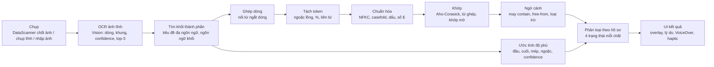
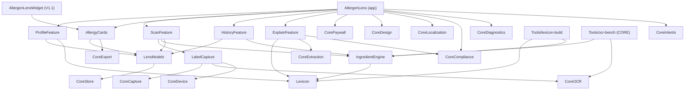
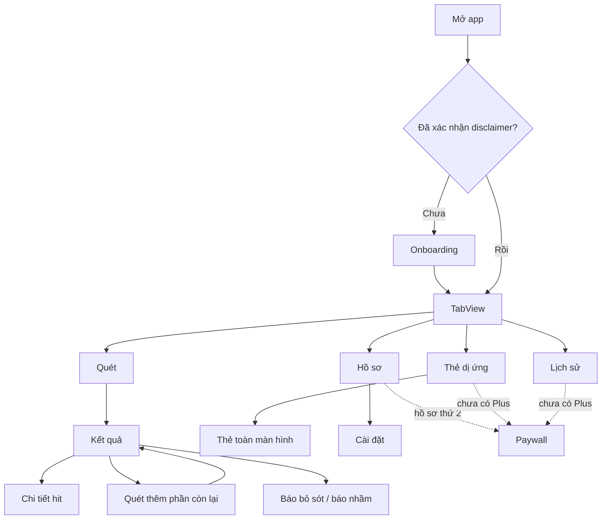

# AllergenLens (NDU) · Thiết kế kỹ thuật

Đọc [README của app](README.md) và [shared-core.md](../shared-core.md) trước. Tài liệu này chỉ mô tả phần riêng của app 02; mọi thứ đã có trong `SensorCore` được tham chiếu bằng ID `CORE-…`, không định nghĩa lại.

Code trong tài liệu là **phác thảo** để thống nhất interface, không phải code cuối cùng. Tên API Apple lấy từ `shared-core.md`, ghi chú nghiên cứu hoặc các API đã có lâu năm. Chữ ký hàm phải đối chiếu tài liệu Xcode 26 trước khi code; chỗ nào chưa chắc có dấu ⚠. Ví dụ từ ngữ trên nhãn (tiếng Đức, Pháp…) chỉ để minh họa thuật toán; từ điển thật do chuyên gia bản ngữ soạn và duyệt ⚠.

## 1. Kiến trúc tổng quan

Bốn quyết định định hình kiến trúc:

1. **Kết luận chỉ đến từ ảnh tĩnh.** Frame live của `DataScannerViewController` dùng để ngắm và (từ V1.1) xem trước. Khi người dùng bấm "Chốt kết quả", app lấy ảnh tĩnh, chạy Vision để có confidence và ứng viên cho từng dòng, rồi mới phân loại.
2. **Hai nguồn, một bộ phân tích.** Ảnh chốt từ live, ảnh chụp tĩnh dự phòng và ảnh nhập đều được chuyển thành cùng kiểu `LabelText` rồi đi qua cùng `IngredientEngine`.
3. **`IngredientEngine` là Swift thuần**, chỉ phụ thuộc Foundation. Nhờ vậy engine chạy được trong app, trong `Tools/lexicon-build` và trong `Tools/ocr-bench` trên macOS, và test nhanh không cần simulator.
4. **Từ điển là dữ liệu, không phải code.** File JSON có phiên bản, được `lexicon-build` kiểm tra và ký duyệt. MVP đóng gói trong app; V1.1 cập nhật qua Background Assets ⚠.

### 1.1 Luồng xử lý



### 1.2 Phụ thuộc module



`IngredientEngine` và `Lexicon` không phụ thuộc module `Core*` nào, để chạy được trong CLI macOS.

## 2. Module map

### 2.1 Cấu trúc thư mục

```
Apps/AllergenLens/
├── AllergenLens/                  # app target: điều hướng, composition root, cấu hình StoreKit, String Catalog
├── AllergenLensWidget/            # V1.1: widget mở thẻ dị ứng
├── Resources/
│   ├── lexicon/lexicon-<version>.json      # đầu ra của lexicon-build, đóng gói trong app
│   └── cards/<lang>.json                   # câu mẫu thẻ dị ứng đã duyệt
└── Packages/AllergenLensKit/
    ├── Sources/
    │   ├── LensModels/            # SwiftData model, value type dùng chung
    │   ├── IngredientEngine/      # khối, token, chuẩn hóa, khớp, ngữ cảnh, độ phủ, phân loại
    │   ├── Lexicon/               # schema, loader, automaton, tự kiểm, cập nhật (V1.1)
    │   ├── LabelCapture/          # màn quét live, chụp tĩnh, đèn, adapter OCR
    │   ├── ProfileFeature/        # onboarding, hồ sơ, hồ sơ gia đình
    │   ├── ScanFeature/           # màn kết quả, overlay, chi tiết hit, báo bỏ sót, lớp chẩn đoán
    │   ├── AllergyCards/          # template, trình tạo thẻ, toàn màn hình, xuất, Translation
    │   ├── HistoryFeature/        # lịch sử, sản phẩm đã lưu, phân tích lại
    │   └── ExplainFeature/        # V1.1: giải thích bằng Foundation Models
    └── Tests/
        ├── IngredientEngineTests/
        ├── LexiconTests/          # sinh tự động bởi lexicon-build
        └── SafetyBench/           # bộ văn bản an toàn, red-team, snapshot JSON, XCUITest helper
Tools/lexicon-build/               # CLI macOS (Swift): nguồn → JSON, kiểm tra, sinh test, diff
Content/AllergenLens/
├── lexicon-src/<lang>/*.yaml      # nguồn từ điển do người soạn, có trường người duyệt
├── cards-src/<lang>.yaml          # câu mẫu thẻ
└── safety-corpus/<lang>/*.json    # danh sách thành phần có đáp án
```

Bộ ảnh vàng không để trong git vì dung lượng lớn và có thể chứa ảnh do người beta gửi. Lưu ở kho riêng có kiểm soát truy cập ⚠ chốt nơi lưu.

### 2.2 Target của app

| Target | Loại | Trách nhiệm | Phụ thuộc chính | Chạy trên |
|---|---|---|---|---|
| `AllergenLens` | App | TabView, composition root, tiêm service qua `Environment`, paywall theo ngữ cảnh, App Shortcuts (V1.1) | Mọi feature module, `CorePaywall`, `CoreCompliance` | iOS 26+ |
| `AllergenLensWidget` | Widget extension (V1.1) | Mở thẻ dị ứng nhanh | `AllergyCards` | iOS 26+ |
| `LensModels` | Library | `@Model` SwiftData, `VersionedSchema` | `CoreStore` | iOS |
| `IngredientEngine` | Library, Swift thuần | Toàn bộ thuật toán ở mục 5 | `Lexicon` | iOS, macOS |
| `Lexicon` | Library, Swift thuần | Schema Codable, loader, automaton, chỉ mục trigram, tự kiểm, cập nhật | Foundation | iOS, macOS |
| `LabelCapture` | Library | Bọc màn quét, chụp tĩnh AVFoundation, đèn, adapter `RecognizedDocument` → `LabelText` | `CoreCapture`, `CoreOCR`, `CoreDevice` | iOS |
| `ProfileFeature` | Library | Onboarding, hồ sơ, chế độ ăn, thành phần tùy chỉnh | `LensModels`, `Lexicon`, `CoreDesign` | iOS |
| `ScanFeature` | Library | Màn quét, kết quả, overlay, báo bỏ sót, lớp chẩn đoán nội bộ | `LabelCapture`, `IngredientEngine`, `LensModels` | iOS |
| `AllergyCards` | Library | Template, render, toàn màn hình, xuất, ghi chú dịch | `LensModels`, `CoreExport`, Translation | iOS |
| `HistoryFeature` | Library | Lịch sử, sản phẩm, phân tích lại | `LensModels`, `IngredientEngine`, `CoreStore` | iOS |
| `ExplainFeature` | Library (V1.1) | Giải thích bằng Foundation Models có nhãn AI | `Lexicon`, `CoreExtraction`, `CoreCompliance` | iOS |
| `lexicon-build` | Executable (Tools) | Dựng và kiểm tra từ điển | `Lexicon`, `IngredientEngine` | macOS 26 |

### 2.3 Module CORE được dùng

| Module CORE | Dùng cho | Feature CORE |
|---|---|---|
| `CoreCapture` | Wrapper `DataScannerViewController` có vùng quan tâm; nhập ảnh; kiểm tra ống kính bẩn | CORE-E02-02, CORE-E02-03, CORE-E02-04 |
| `CoreOCR` | `DocumentRecognizer`, `LineRecognizer`, bộ chọn recognizer theo ngôn ngữ | CORE-E03-01, CORE-E03-02, CORE-E03-03 |
| `CoreExtraction` | `LLMExtractor` cho giải thích (V1.1) | CORE-E04-02 |
| `CoreStore` | `ModelContainer` có version, `BlobStore` với `.complete` | CORE-E05-01, CORE-E05-02 |
| `CoreExport` | PDF thẻ dị ứng | CORE-E06-01 |
| `CorePaywall` | Store service, `Entitlements`, màn paywall, offer code | CORE-E07-01, CORE-E07-02, CORE-E07-03 |
| `CoreSecurity` | Khóa Face ID tùy chọn trong Cài đặt | CORE-E08-01 |
| `CoreDesign` | Token, component, Dynamic Type, VoiceOver | CORE-E09-01, CORE-E09-02 |
| `CoreLocalization` | String Catalog | CORE-E10-01 |
| `CoreIntents` | App Shortcuts, Spotlight (V1.1/V2) | CORE-E11-01 |
| `CoreDiagnostics` | Logger, signpost; `ocr-bench` | CORE-E12-01, CORE-E12-02 |
| `CoreCompliance` | `Disclaimer`, `AIGeneratedLabel`, `PrivacyInfo.xcprivacy`, mẫu Review Notes | CORE-E13-01 |
| `CoreDevice` | `Capabilities.liveScanner`, `onDeviceLLM`, `ocrLanguages` | (nền của CORE) |

**Đề xuất mở rộng nhỏ cho `CoreOCR` (không phải feature mới):** `RecognizedDocument.Line` nên có thêm `alternatives: [String]` (top-N ứng viên của `VNRecognizedTextObservation.topCandidates(_:)`), và `LineRecognizer` nhận thêm `customWords`. NDU cần cả hai để tăng recall. Nếu chủ lõi không muốn đổi interface, `LabelCapture` gọi Vision trực tiếp cho lượt OCR thứ hai (mục 4.4).

## 3. Mô hình dữ liệu

### 3.1 SwiftData

```swift
// Phác thảo, không phải code cuối cùng. Swift 6, SwiftData, iOS 26.
import Foundation
import SwiftData

@Model final class Profile {
    @Attribute(.unique) var id: UUID
    var name: String
    var isPrimary: Bool                     // hồ sơ miễn phí duy nhất; luôn dùng được
    var diets: [String]                     // "vegan", "vegetarian", "coeliac", "lactose"
    var readingLanguages: [String]          // "en", "de", "fr", "it", "es", "nl", "sv", "da", "nb"
    var createdAt: Date
    @Relationship(deleteRule: .cascade) var selections: [AllergenSelection] = []
    @Relationship(deleteRule: .cascade) var customTerms: [CustomTerm] = []
    init(name: String, isPrimary: Bool) {
        id = UUID(); self.name = name; self.isPrimary = isPrimary
        diets = []; readingLanguages = ["en", "de", "fr", "it", "es", "nl", "sv", "da", "nb"]; createdAt = .now
    }
}

@Model final class AllergenSelection {
    var allergenId: String                  // id trong từ điển: "milk", "peanuts", "tree_nuts"…
    var severityRaw: String                 // "intolerance", "allergy", "severe"; chỉ ảnh hưởng hiển thị
    var profile: Profile?
    init(allergenId: String, severityRaw: String) { self.allergenId = allergenId; self.severityRaw = severityRaw }
}

@Model final class CustomTerm {
    var id: UUID
    var text: String                        // "kiwi"
    var variants: [String]                  // "kiwifruit", "Kiwis"…
    var languages: [String]                 // rỗng = mọi ngôn ngữ đọc
    var profile: Profile?
    init(text: String, variants: [String] = [], languages: [String] = []) {
        id = UUID(); self.text = text; self.variants = variants; self.languages = languages
    }
}

@Model final class ScanResult {
    @Attribute(.unique) var id: UUID
    var createdAt: Date
    var profileIDs: [UUID]
    var lexiconVersion: String              // "2027.04.1"
    var engineVersion: String               // "1.0.0"
    var coverageRaw: String                 // "complete", "partial", "noIngredientList", "unreadable", "unsupportedLanguage"
    var coverageGaps: [String]              // "missingEnd", "truncatedAtEdge"…
    var labelTextJSON: Data                 // [LabelText] đã mã hóa, để phân tích lại khi từ điển đổi
    var imageBlobIDs: [UUID]                // ảnh thu nhỏ trong BlobStore
    @Relationship(deleteRule: .cascade) var hits: [MatchHit] = []
    var product: SavedProduct?
    init(id: UUID = UUID(), createdAt: Date = .now, profileIDs: [UUID], lexiconVersion: String,
         engineVersion: String, coverageRaw: String, coverageGaps: [String], labelTextJSON: Data, imageBlobIDs: [UUID]) {
        self.id = id; self.createdAt = createdAt; self.profileIDs = profileIDs
        self.lexiconVersion = lexiconVersion; self.engineVersion = engineVersion
        self.coverageRaw = coverageRaw; self.coverageGaps = coverageGaps
        self.labelTextJSON = labelTextJSON; self.imageBlobIDs = imageBlobIDs
    }
}

@Model final class MatchHit {
    var readText: String                    // chữ như OCR đọc được: "Magermilchpulver"
    var entryID: String                     // "de.milk.term.0001"
    var targetID: String                    // allergenId, dietId hoặc "custom:<uuid>"
    var kindRaw: String                     // "direct", "derivative", "eNumber", "precautionary"
    var certaintyRaw: String                // "certain", "possibleSource"
    var qualityRaw: String                  // "exact", "fuzzy", "alternative"
    var editDistance: Double                // 0 khi khớp chính xác
    var imageIndex: Int
    var spanStart: Int                      // vị trí trong văn bản khối đã chuẩn hóa
    var spanLength: Int
    var boxesJSON: Data                     // [CGRect] chuẩn hóa 0–1 để vẽ overlay
    var confidence: Double                  // 0–1, gộp confidence OCR và chất lượng khớp
    var scan: ScanResult?
    init(readText: String, entryID: String, targetID: String, kindRaw: String, certaintyRaw: String,
         qualityRaw: String, editDistance: Double, imageIndex: Int, spanStart: Int, spanLength: Int,
         boxesJSON: Data, confidence: Double) {
        self.readText = readText; self.entryID = entryID; self.targetID = targetID
        self.kindRaw = kindRaw; self.certaintyRaw = certaintyRaw; self.qualityRaw = qualityRaw
        self.editDistance = editDistance; self.imageIndex = imageIndex
        self.spanStart = spanStart; self.spanLength = spanLength
        self.boxesJSON = boxesJSON; self.confidence = confidence
    }
}

@Model final class SavedProduct {
    @Attribute(.unique) var id: UUID
    var name: String
    var notes: String
    var barcode: String?                    // V1.1: chỉ là khóa tra cục bộ
    var photoBlobID: UUID?
    var createdAt: Date
    @Relationship(deleteRule: .nullify, inverse: \ScanResult.product) var scans: [ScanResult] = []
    init(name: String, notes: String = "") { id = UUID(); self.name = name; self.notes = notes; createdAt = .now }
}
```

- Enum lưu dạng chuỗi thô để migration đơn giản; value type trong engine dùng enum thật.
- Schema dùng `VersionedSchema` và `SchemaMigrationPlan` của CORE-E05-01.
- Thẻ dị ứng lưu dưới dạng `TravelCard` (hồ sơ, ngôn ngữ đích, danh sách câu mẫu, ghi chú, bản dịch ghi chú); lược bớt ở đây vì đơn giản.

### 3.2 Value type của engine

```swift
// Phác thảo. Module IngredientEngine, chỉ phụ thuộc Foundation.
public struct LabelLine: Sendable, Hashable, Codable {
    public var text: String
    public var alternatives: [String]       // ứng viên hạng 2..3 từ Vision
    public var box: CGRect                  // chuẩn hóa 0–1, gốc trên-trái
    public var confidence: Float?           // nil khi đến từ frame live
    public var touchesEdge: Bool            // chạm mép ảnh: có thể bị cắt
}

public struct LabelText: Sendable, Codable {
    public enum Source: Sendable, Codable, Hashable { case livePreview, stillPhoto, imported }
    public var imageIndex: Int
    public var lines: [LabelLine]
    public var source: Source
}

public enum AllergenStatus: String, Sendable, Codable {
    case detected              // "Phát hiện"
    case mayContain            // "Có thể có (vết/may contain)"
    case uncertain             // "Không chắc chắn, hãy đọc lại nhãn"
    case notFoundInReadText    // "Không thấy trong phần đã đọc"
}

public enum Coverage: Sendable, Equatable {
    case complete
    case partial([CoverageGap])
    case noIngredientList
    case unsupportedLanguage(String?)       // mã ngôn ngữ đoán được, ví dụ "fi"
    case unreadable
}

public enum CoverageGap: String, Sendable, Codable {
    case missingStart, missingEnd, truncatedAtEdge, unbalancedBrackets, lowConfidence, multiPhotoUnaligned
}

public enum MatchKind: String, Sendable, Codable { case direct, derivative, eNumber, precautionary }
public enum Certainty: String, Sendable, Codable { case certain, possibleSource }
public enum MatchQuality: Sendable, Codable, Equatable { case exact, fuzzy(distance: Double), alternative(rank: Int) }

public struct Hit: Sendable {
    public var readText: String
    public var entryID: String
    public var targetID: String
    public var kind: MatchKind
    public var certainty: Certainty
    public var quality: MatchQuality
    public var imageIndex: Int
    public var range: Range<Int>            // trong văn bản khối đã chuẩn hóa
    public var boxes: [CGRect]
    public var confidence: Double
}

public struct Analysis: Sendable {
    public var coverage: Coverage
    public var blocks: [IngredientBlock]
    public var hits: [Hit]
    public var claims: [Claim]              // "glutenfrei", "sans lactose": chỉ là thông tin
    public var statuses: [ProfileID: [TargetID: AllergenStatus]]
    public var lexiconVersion: String
    public var engineVersion: String
}

public protocol IngredientAnalyzing: Sendable {
    func analyze(_ texts: [LabelText], targets: TargetSet, lexicon: CompiledLexicon) -> Analysis
}
```

`CGRect` cần CoreGraphics; trên macOS vẫn có, nên engine vẫn chạy trong CLI.

### 3.3 Schema file từ điển

Một file JSON cho mọi ngôn ngữ, đầu ra của `lexicon-build`. Ví dụ dưới là **minh họa, chưa duyệt** ⚠.

```json
{
  "schemaVersion": 1,
  "lexiconVersion": "2027.04.1",
  "engineMinVersion": "1.0.0",
  "createdAt": "2027-04-16T00:00:00Z",
  "targets": [
    { "id": "milk", "kind": "allergen", "annexIIIndex": 7 },
    { "id": "coeliac", "kind": "diet", "includes": ["gluten_cereals"] },
    { "id": "vegan", "kind": "diet", "includes": ["milk", "eggs", "fish", "crustaceans", "molluscs", "animal_origin"] }
  ],
  "records": [
    {
      "targetId": "milk",
      "language": "de",
      "displayName": "Milch",
      "terms":        [ { "id": "de.milk.term.0001", "text": "Milch", "boundary": "any" } ],
      "synonyms":     [ { "id": "de.milk.syn.0001", "text": "Sahne", "boundary": "any" },
                        { "id": "de.milk.syn.0002", "text": "Rahm", "boundary": "suffix" } ],
      "derivatives":  [ { "id": "de.milk.der.0001", "text": "Molke", "boundary": "any", "reason": "Molke = whey, từ sữa" },
                        { "id": "de.milk.der.0002", "text": "Kasein", "boundary": "prefix", "reason": "protein sữa" },
                        { "id": "de.milk.der.0003", "text": "Laktose", "boundary": "any", "reason": "đường sữa" } ],
      "eNumbers": [],
      "negativePatterns": [
        { "id": "de.milk.neg.0001", "pattern": "laktosefrei", "scope": "claim" },
        { "id": "de.milk.neg.0002", "pattern": "Kakaobutter", "scope": "exclusion" },
        { "id": "de.milk.neg.0003", "pattern": "Kokosmilch", "scope": "exclusion" }
      ],
      "version": "2027.04.1",
      "review": {
        "authors": ["<tên người soạn>"],
        "reviewers": ["<người duyệt 1>", "<người duyệt 2>"],
        "approvedAt": "2027-04-12",
        "sources": ["Quy định (EU) 1169/2011 Annex II, bản tiếng Đức (EUR-Lex)"]
      }
    },
    {
      "targetId": "soybeans",
      "language": "*",
      "eNumbers": [ { "id": "x.soy.e.0001", "code": "E322", "certainty": "possibleSource",
                      "alsoTargets": ["eggs"], "reason": "lecithin có thể từ đậu nành, trứng hoặc nguồn khác ⚠" } ],
      "version": "2027.04.1",
      "review": { "authors": ["<…>"], "reviewers": ["<…>", "<…>"], "approvedAt": "2027-04-12", "sources": ["<…>"] }
    }
  ],
  "grammar": [ "… xem mục 3.4 …" ],
  "selfTest": [ { "language": "de", "text": "Zutaten: Weizenmehl, Magermilchpulver.", "expect": { "gluten_cereals": "detected", "milk": "detected" } } ]
}
```

| Trường | Ý nghĩa |
|---|---|
| `targetId` | Một trong 14 chất (`gluten_cereals`, `crustaceans`, `eggs`, `fish`, `peanuts`, `soybeans`, `milk`, `tree_nuts`, `celery`, `mustard`, `sesame`, `sulphites`, `lupin`, `molluscs`), một nhóm phụ trợ (`animal_origin`), hoặc một chế độ ăn |
| `language` | Mã ngôn ngữ BCP 47 của nhãn; `*` cho dữ liệu không phụ thuộc ngôn ngữ như số E |
| `terms`, `synonyms` | Tên trực tiếp của chất → `kind = direct` |
| `derivatives` | Chất dẫn xuất (whey, casein, spelt, malt…) → `kind = derivative`; bắt buộc có `reason` để hiện cho người dùng |
| `eNumbers` | `code`, `certainty` (`certain` hoặc `possibleSource`), `alsoTargets` cho nguồn mơ hồ |
| `boundary` | `word` (cả hai đầu là ranh giới từ), `prefix`, `suffix`, `any` (được nằm trong từ ghép). `any` chỉ cho term ≥ 4 ký tự |
| `negativePatterns` | `claim` (free-from: không tạo hit, hiện như thông tin) hoặc `exclusion` (cụm có chứa term nhưng không phải chất đó, ví dụ "Kakaobutter" với sữa) |
| `version`, `review` | Phiên bản của bản ghi; người soạn, **hai người duyệt**, ngày, nguồn. `lexicon-build` từ chối bản ghi thiếu |
| `selfTest` | Câu kiểm tra chạy mỗi lần nạp (NDU-E10-04) |

**Ngoại lệ trong Annex II.** Quy định có liệt kê một số ngoại lệ trong từng mục (ví dụ một số loại siro glucose từ lúa mì, dầu đậu nành tinh luyện hoàn toàn) ⚠ cần xác minh từ văn bản gốc. App **không áp dụng ngoại lệ** để bỏ hit: vẫn hiện "Phát hiện" kèm ghi chú "có thể thuộc ngoại lệ của quy định, hỏi chuyên gia". Chính sách này cần chuyên gia xác nhận vì làm tăng báo nhầm.

### 3.4 Ngữ pháp nhãn theo ngôn ngữ

Nằm trong cùng file từ điển, mảng `grammar`. Bảng dưới là **ví dụ khởi đầu** cho người bản ngữ soạn tiếp ⚠.

| Ngôn ngữ | Tiêu đề khối | Dấu kết thúc (ví dụ) | Câu phòng ngừa (ví dụ) | "Contains" | Free-from | Từ ghép |
|---|---|---|---|---|---|---|
| EN | Ingredients | Nutrition, Typical values, Best before, Storage | may contain (traces of) …; made in a factory that also handles … | Contains | …-free, free from, without | Không |
| DE | Zutaten | Nährwerte, Durchschnittliche Nährwerte, Mindestens haltbar bis, lagern | kann Spuren von … enthalten; kann … enthalten | Enthält | …frei, ohne | Có |
| FR | Ingrédients | Valeurs nutritionnelles, Déclaration nutritionnelle, À consommer de préférence avant, À conserver | peut contenir (des traces de) …; traces éventuelles de … | Contient | sans … | Không |
| IT | Ingredienti | Valori nutrizionali, Dichiarazione nutrizionale, Da consumarsi preferibilmente entro, Conservare | può contenere (tracce di) … | Contiene | senza … | Không |
| ES | Ingredientes | Información nutricional, Consumir preferentemente antes del, Conservar | puede contener (trazas de) … | Contiene | sin … | Không |
| NL | Ingrediënten | Voedingswaarde(n), Ten minste houdbaar tot, Bewaren | kan (sporen van) … bevatten | Bevat | …vrij, zonder | Có |
| SV | Ingredienser | Näringsvärde, Näringsdeklaration, Bäst före, Förvaras | kan innehålla (spår av) … | Innehåller | …fri, utan | Có |
| DA | Ingredienser | Næringsindhold, Næringsdeklaration, Mindst holdbar til, Opbevares | kan indeholde (spor af) … | Indeholder | …fri, uden | Có |
| NB | Ingredienser | Næringsinnhold, Næringsdeklarasjon, Best før, Oppbevares | kan inneholde (spor av) … | Inneholder | …fri, uten | Có |

Mỗi mục ngữ pháp còn có: liên từ ("and", "und", "et", "e", "y", "en", "och", "og"), tiền tố lược âm ("d'", "l'", "dell'", "all'"…), dấu mở nhóm ("Emulgator:", "Emulsifier:"…), và bảng gập dấu riêng.

Câu phòng ngừa (precautionary allergen labelling) là tự nguyện và cách viết chưa thống nhất trong EU ⚠ cần xác minh; vì vậy danh sách mẫu phải rộng và cập nhật theo báo cáo người dùng.

### 3.5 Mẫu thẻ dị ứng

```json
{
  "language": "it",
  "templateVersion": "2027.04.0",
  "review": { "translator": "<…>", "reviewers": ["<…>"], "approvedAt": "2027-04-05" },
  "phrases": {
    "card.title": "…",
    "intro.allergy": "…",
    "intro.coeliac": "…",
    "allergen.peanuts.allergy": "…",
    "allergen.peanuts.severe": "…",
    "diet.vegan": "…",
    "ask.kitchen": "…",
    "emergency": "…"
  }
}
```

Câu mẫu không được viết ở đây để tránh ai đó dùng bản chưa duyệt. Câu về mức độ nặng và cấp cứu phải qua duyệt y khoa (C08) ⚠.

**Ghi chú tùy chỉnh và Translation framework (NDU-E06-03).**
- Ghi chú được dịch **một lần, lúc người dùng soạn thẻ**, bằng `TranslationSession` lấy từ modifier `.translationTask`. Bản dịch được lưu cùng thẻ.
- Khi mở thẻ ở nước ngoài, app hiện bản đã lưu, nên không cần mô hình dịch hay mạng lúc đó.
- Nếu gói ngôn ngữ chưa tải, hệ thống cần mạng một lần để tải. App nói rõ điều này và gợi ý soạn thẻ trước chuyến đi.
- Bản dịch luôn đi kèm nhãn "Bản dịch máy, chưa kiểm tra" và nguyên văn ghi chú của người dùng. Câu mẫu không bao giờ đi qua dịch máy.
- Cách kiểm tra trạng thái gói ngôn ngữ và chữ ký hàm của Translation phải đối chiếu tài liệu Xcode 26 ⚠.

### 3.6 Lưu file và thời gian giữ

| Dữ liệu | Nơi lưu | Giữ bao lâu |
|---|---|---|
| Ảnh gốc lúc phân tích | Thư mục tạm, `.complete` | Xóa ngay sau khi tạo ảnh thu nhỏ |
| Ảnh thu nhỏ (cạnh dài khoảng 2048 px) cho overlay | `BlobStore` (CORE-E05-02) | Người dùng miễn phí: chỉ lần quét gần nhất. Plus: tới khi người dùng xóa |
| `LabelText` và `MatchHit` | SwiftData | Như trên |
| Ảnh sản phẩm đã lưu | `BlobStore` | Tới khi xóa sản phẩm |
| Thẻ xuất ra (PNG/PDF) | Tạo khi xuất, đưa qua share sheet | Không giữ trong app |

Khi gói Plus hết hạn: dữ liệu giữ nguyên nhưng bị khóa xem; hồ sơ gia đình còn nhưng chỉ hồ sơ chính được dùng để quét.

## 4. Pipeline chi tiết

### 4.1 Các bước

| # | Bước | API / thành phần | Vào → ra | Lỗi và cách xử lý | Độ tin cậy |
|---|---|---|---|---|---|
| 1 | Ngắm (live) | `DataScannerViewController` qua CORE-E02-02, `.text(languages:)`, `regionOfInterest` | Camera → khung hướng dẫn | `isSupported`/`isAvailable` false → chụp tĩnh; quyền bị từ chối → chỉ nhập ảnh | Không dùng để kết luận |
| 2 | Chốt ảnh | `capturePhoto()` của DataScanner ⚠; hoặc `AVCapturePhotoOutput`; hoặc `PhotosPicker` (CORE-E02-03) | → `CapturedPage` | Ảnh tối → gợi ý đèn; `DetectLensSmudgeRequest` vượt ngưỡng → nhắc lau camera | – |
| 3 | OCR lượt 1 | `CoreOCR` (CORE-E03-01/02/03): `RecognizeDocumentsRequest` hoặc `VNRecognizeTextRequest` `.accurate` với 9 ngôn ngữ | `CapturedPage` → `RecognizedDocument` → `LabelText` | Ngôn ngữ không có trong `supportedRecognitionLanguages` → tắt ngôn ngữ đó và báo | Confidence theo dòng, top-3 ứng viên |
| 4 | Tìm khối | `IngredientEngine.locateBlocks` + `NLLanguageRecognizer` làm gợi ý | `LabelText` → `[IngredientBlock]` | Không có tiêu đề → tìm khối "dạng danh sách"; không có → `noIngredientList` | Điểm tiêu đề (chính xác hoặc mờ) |
| 5 | OCR lượt 2 (tùy spike S2) | `VNRecognizeTextRequest` trên vùng khối, ngôn ngữ khối đặt đầu, `customWords` từ từ điển | Vùng khối → dòng bổ sung | Hết thời gian → bỏ qua lượt 2 | Hợp ứng viên của cả hai lượt |
| 6 | Ghép dòng, token, chuẩn hóa | Mục 5.2–5.4 | Khối → cây token | Ngoặc lệch → `unbalancedBrackets` | – |
| 7 | Khớp | Mục 5.5–5.6 | Token → `[Hit]` | – | Chính xác, mờ (khoảng cách), ứng viên |
| 8 | Ngữ cảnh | Mục 5.7 | Hit + câu → hit có `kind`, `claims` | – | – |
| 9 | Độ phủ | Mục 5.8 | Khối + dòng → `Coverage` | – | – |
| 10 | Phân loại | Mục 5.9 | → trạng thái theo hồ sơ | Tự kiểm từ điển trượt → mọi chất "Không chắc chắn" | – |
| 11 | Hiển thị | `ScanFeature` | → UI, VoiceOver, haptic | – | – |

### 4.2 Hai nguồn, một bộ phân tích

- **Frame live** chỉ có chữ và khung, không có confidence theo dòng (⚠ cần xác minh `RecognizedItem.Text` có lộ observation hay không). Vì vậy frame live không bao giờ tạo trạng thái "Không thấy".
- **Ảnh tĩnh** (chốt từ live, chụp tĩnh, nhập) đi qua Vision đầy đủ. Đây là nguồn duy nhất của kết quả.
- Cả hai được đưa về `LabelText`; engine không biết ảnh đến từ đâu, trừ trường `source` dùng cho luật "live không kết luận".
- Ảnh chốt từ live là **toàn khung hình**, không bị cắt theo vùng quan tâm. Vùng quan tâm chỉ giúp người dùng ngắm. Nhờ vậy phần chữ nằm ngoài khung vẫn được đọc và được dùng để ước tính độ phủ.

```swift
// Phác thảo — chữ ký VisionKit phải đối chiếu tài liệu Xcode 26 ⚠
@MainActor
func makeScanner(languages: [String]) -> DataScannerViewController {
    DataScannerViewController(
        recognizedDataTypes: [.text(languages: languages)],
        qualityLevel: .accurate,
        recognizesMultipleItems: true,
        isHighFrameRateTrackingEnabled: false,
        isPinchToZoomEnabled: true,
        isGuidanceEnabled: true,
        isHighlightingEnabled: true)
}

@MainActor
func commit(scanner: DataScannerViewController, pipeline: ScanPipeline, targets: TargetSet) async throws -> Analysis {
    let image = try await scanner.capturePhoto()          // ảnh tĩnh, không phải frame live
    let page = try await PageWriter.write(image)          // → CapturedPage của CORE, file protection .complete
    return try await pipeline.analyzeStill([page], targets: targets)
}
```

### 4.3 Luồng ảnh tĩnh

```swift
// Phác thảo
actor ScanPipeline {
    private let recognizer: any TextRecognizer             // CoreOCR, chọn qua CORE-E03-03
    private let refiner: BlockRefiner                      // lượt 2, gọi Vision trên vùng khối
    private let engine: any IngredientAnalyzing
    private let lexicon: LexiconProvider

    func analyzeStill(_ pages: [CapturedPage], targets: TargetSet) async throws -> Analysis {
        let compiled = try await lexicon.current()          // đã qua tự kiểm; nếu trượt thì engine trả "uncertain"
        var texts: [LabelText] = []
        for (index, page) in pages.enumerated() {
            let doc = try await recognizer.recognize(page, languages: targets.readingLanguages)
            var text = OCRAdapter.labelText(doc, imageIndex: index, source: .stillPhoto)
            for block in BlockLocator.locate(in: text, grammar: compiled.grammar) where block.needsRefinement {
                let extra = try await refiner.recognize(page, region: block.region,
                                                        languages: [block.language] + targets.readingLanguages,
                                                        customWords: compiled.customWords(for: block.language))
                text.mergeAlternatives(from: extra)          // chỉ thêm ứng viên, không thay dòng gốc
            }
            texts.append(text)
        }
        return engine.analyze(texts, targets: targets, lexicon: compiled)
    }
}
```

Chi tiết lượt 2 chốt sau spike S2:
- Có chạy lượt 2 hay không, và chạy khi nào (ví dụ khi confidence trung bình của khối < 0,8).
- `usesLanguageCorrection` bật hay tắt. Sửa theo từ điển ngôn ngữ có thể "sửa nhầm" một tên chất thành từ khác; cần đo cả hai.
- `customWords` có giới hạn số lượng không ⚠.
- Truyền nhiều ngôn ngữ cùng lúc có làm giảm độ chính xác không ⚠.

### 4.4 Nhiều ảnh cho một nhãn

- **MVP (NDU-E02-05):** mỗi ảnh phân tích riêng, hit được hợp lại. Độ phủ là "Đủ" chỉ khi một ảnh tự nó đủ. Nếu đầu danh sách ở ảnh 1 và cuối ở ảnh 2, độ phủ là "Một phần" với lý do `multiPhotoUnaligned`, vì chưa chứng minh được phần giữa đã được đọc.
- **V1.1 (NDU-E02-06):** căn dòng giữa các ảnh bằng chuỗi token chung dài nhất trên văn bản đã chuẩn hóa, yêu cầu vùng chồng lấn tối thiểu (ví dụ 5 token liên tiếp) ⚠ tham số chốt sau spike. Khi căn được đủ chuỗi từ tiêu đề tới dấu kết thúc thì độ phủ có thể là "Đủ".

### 4.5 Lỗi hiển thị cho người dùng

| Tình huống | Thông điệp (ý) | Hành động gợi ý |
|---|---|---|
| Ảnh quá tối | "Ảnh hơi tối, chữ có thể bị đọc sai" | Bật đèn, chụp lại |
| Ống kính bẩn | "Hình như camera bị mờ" | Lau camera |
| Không có chữ | "Không đọc được chữ" | Đưa máy gần hơn, giữ song song với nhãn |
| Không thấy danh sách | "Không tìm thấy danh sách thành phần" | Hướng camera vào phần "Ingredients / Zutaten / Ingrédients…" |
| Thiếu phần danh sách | "Chưa đủ phần danh sách: thiếu phần cuối" | Quét thêm phần còn lại |
| Ngôn ngữ chưa hỗ trợ | "Nhãn có vẻ bằng tiếng Phần Lan, app chưa đọc được ngôn ngữ này" | Tìm khối ngôn ngữ khác trên nhãn |
| Từ điển lỗi | "Không nạp được từ điển; kết quả tạm thời không đáng tin" | Mở lại app; cập nhật app |

## 5. Thuật toán chính

### 5.1 Tìm khối thành phần

1. Chuẩn hóa từng dòng (mục 5.4) và dò tiêu đề của 9 ngôn ngữ trong ngữ pháp. So khớp chính xác trước, rồi khớp mờ với khoảng cách ≤ 1 cho tiêu đề ≥ 8 ký tự. Tiêu đề thường kết thúc bằng ":" nhưng không bắt buộc.
2. Khối bắt đầu ngay sau tiêu đề và kéo dài tới khi gặp: tiêu đề khối của ngôn ngữ khác, dấu kết thúc (mục 3.4), khoảng trống dọc lớn hơn 1,5 lần chiều cao dòng trung vị, hoặc cột khác (khung dòng không chồng theo trục ngang).
3. Nhãn nhiều ngôn ngữ cho ra nhiều khối. Mỗi khối gắn ngôn ngữ theo tiêu đề; `NLLanguageRecognizer` chỉ dùng để kiểm tra chéo.
4. Không có tiêu đề nào: tìm vùng "dạng danh sách" (mật độ dấu phẩy cao, nhiều token có trong từ điển thực phẩm). Nếu thấy thì tạo khối không tiêu đề, độ phủ tối đa là "Một phần" (`missingStart`). Nếu không thấy thì `noIngredientList`.
5. Nếu `NLLanguageRecognizer` cho ngôn ngữ trội không thuộc 9 ngôn ngữ đọc và không có tiêu đề nào được hỗ trợ, trả `unsupportedLanguage`.
6. Hit nằm ngoài mọi khối (ví dụ mặt trước bao bì ghi "milk chocolate") vẫn được giữ và hiện với ghi chú "ngoài danh sách thành phần".

### 5.2 Ghép dòng và nối từ ngắt dòng

- Dòng trong khối được nối theo thứ tự đọc (trên xuống, trái sang phải trong cùng cột).
- Dòng kết thúc bằng "-" (hoặc gạch mềm) và dòng sau bắt đầu bằng chữ thường: tạo **cả hai** biến thể, "Wei-" + "zenmehl" → "Weizenmehl" và "Wei zenmehl". Khớp chạy trên cả hai; hit trùng vị trí được gộp.
- Không nối khi dòng sau bắt đầu bằng liên từ ("und", "and", "et"…). Đây là dấu gạch treo kiểu "Milch- und Sahneerzeugnisse"; phần "Milch" vẫn là một token và vẫn được khớp.
- Dòng kết thúc giữa từ mà không có "-" và chạm mép phải của ảnh: đánh dấu `truncatedAtEdge`, không nối.

### 5.3 Tách token

Ngữ pháp dung thứ (tolerant), phân tích đệ quy xuống:

```
list     = item { sep item } [ "." ] ;
sep      = "," | ";" | "·" | "•" | conj ;
item     = [ label ":" ] phrase [ percent ] { group } [ percent ] ;
group    = "(" list ")" | "[" list "]" ;
phrase   = word { word } ;
percent  = number [ ( "," | "." ) digits ] ws? "%" ;
conj     = liên từ theo ngôn ngữ, lấy từ ngữ pháp ;
label    = tên nhóm như "Emulgator", "Emulsifier", "Antioxidant" ;
```

- Kết quả là cây token. Ví dụ "Schokolade 20 % (Zucker, Kakaobutter, Vollmilchpulver (Milch))" cho 3 cấp; "Milch" có cha "Vollmilchpulver".
- Ngoặc thiếu: tự đóng ở cuối khối và gắn `unbalancedBrackets`. Ngoặc thừa: bỏ qua ký tự. **Không bao giờ bỏ token.**
- Phần trăm được tách khỏi chữ để khớp, nhưng giữ lại để hiển thị.
- Lược âm tiếng Pháp/Ý: "d'arachide" cho ra cả "d'arachide" và "arachide".
- Token có "-" cho ra ba biến thể: giữ gạch, nối liền, tách rời.

### 5.4 Chuẩn hóa

Thứ tự cố định, và phải idempotent (chạy hai lần cho cùng kết quả):

1. Unicode NFKC; thay ký tự điều khiển bằng dấu cách.
2. Thống nhất dấu nháy (’ ‘ ` → '), gạch (‐ ‑ – — → -), dấu cách (NBSP, dấu cách mảnh → dấu cách thường); gộp dấu cách liên tiếp.
3. Casefold.
4. Gập dấu: bỏ dấu kết hợp sau NFD (é → e, ü → u, å → a); bảng riêng cho chữ không tách được: ß → ss, ø → o, æ → ae, œ → oe. Term trong từ điển được chuẩn hóa cùng cách, nên va chạm (nếu có) chỉ làm tăng hit; `lexicon-build` báo cáo va chạm mới.
5. Số E: biểu thức `e\s?-?\s?([0-9oOlISBZ]{3,4})([a-z]|\([ivx]+\))?` → "e322", "e322i". Trong phần số, sửa nhầm lẫn OCR: O → 0, l/I → 1, S → 5, B → 8, Z → 2 ⚠ tham số chốt sau spike S3.
6. Giữ bản đồ vị trí từ chuỗi chuẩn hóa về dòng và khung gốc, để vẽ overlay.

### 5.5 Khớp chính xác

- Dựng một automaton **Aho-Corasick** từ mọi term, đồng nghĩa, dẫn xuất, loại trừ và claim của 9 ngôn ngữ (đã chuẩn hóa). Dựng một lần khi nạp từ điển.
- Chạy automaton trên văn bản khối đã chuẩn hóa, gồm cả các biến thể ở mục 5.2–5.3. Term nhiều từ ("arachis oil", "huile d'arachide", "lait écrémé en poudre") khớp tự nhiên vì văn bản đã gộp dấu cách.
- Kiểm ranh giới theo `boundary` của term:

| `boundary` | Điều kiện | Ví dụ |
|---|---|---|
| `word` | Hai đầu là ranh giới token | "ei" (NL), "egg", "soy" |
| `prefix` | Đầu là ranh giới | "Kasein" trong "Kaseinat" |
| `suffix` | Cuối là ranh giới | "milch" trong "Vollmilch" |
| `any` | Bất kỳ, chỉ cho term ≥ 4 ký tự | "milch" trong "Magermilchpulver", "weizen" trong "Weizenmehl" |

- Term ≤ 3 ký tự luôn là `word`. `lexicon-build` từ chối `any` cho term ngắn.
- **Loại trừ** chỉ có hiệu lực khi khớp chính xác và chỉ che đúng chất được ghi trong mục loại trừ, đúng đoạn chữ đó. Ví dụ "Buchweizen" che "weizen" (gluten) trong chính token đó, không che "Weizen" ở chỗ khác. "Erdnussbutter" có thể che "butter" (sữa) nhưng không che "Erdnuss" (lạc) ⚠ quyết định của chuyên gia.
- Dữ liệu tùy chỉnh (NDU-E01-04) được biên dịch thành automaton phụ nhỏ, `boundary = prefix` để bắt số nhiều ("Kiwis").

### 5.6 Khớp mờ

Chỉ chạy cho token **không** có hit chính xác, để bắt lỗi OCR.

| Độ dài term (sau chuẩn hóa) | Khoảng cách tối đa | Ví dụ |
|---|---|---|
| ≤ 4 ký tự | 0 (không khớp mờ) | "ei", "egg", "lait", "soja" |
| 5–7 | 1 | "weizen", "sesame" |
| 8–12 | 1; hoặc 2 nếu cả hai lỗi thuộc bảng nhầm lẫn OCR | "haselnuss" |
| ≥ 13 | 2 | "magermilchpulver" |

- Khoảng cách: **Damerau-Levenshtein dạng optimal string alignment**, chi phí thay thế theo bảng nhầm lẫn OCR. Ví dụ ban đầu cho một ký tự: l ↔ I ↔ 1 0,3; O ↔ 0 0,3; e ↔ c 0,5; h ↔ b 0,6. Nhầm lẫn nhiều ký tự (rn ↔ m, cl ↔ d, vv ↔ w) xử lý bằng biến thể token, mỗi lần thay 0,5. Mất dấu (ü ↔ u) đã được bước chuẩn hóa gập đi ⚠ mọi chi phí chốt sau spike S3.
- Sinh ứng viên bằng chỉ mục trigram ký tự trên term; chỉ tính khoảng cách cho term chung ít nhất 1 trigram với token (với term 5–7 ký tự) hoặc 2 trigram (term dài hơn).
- Ngôn ngữ có từ ghép: xét thêm cửa sổ con trong token dài ≥ 8 ký tự, độ dài bằng độ dài term ± 1, chỉ cho term `any`.
- Phạm vi ngôn ngữ: mặc định là ngôn ngữ của khối cộng tiếng Anh; khi ngôn ngữ khối không chắc thì cả 9. Chốt sau spike S3 theo số báo nhầm.
- **Ứng viên OCR hạng 2–3**: chạy khớp chính xác và khớp mờ trên từng ứng viên của dòng có confidence thấp. Hit chỉ đến từ ứng viên (không có ở ứng viên hạng 1) có `quality = alternative`.
- **Gần khớp (near-miss)**: token có khoảng cách lớn hơn ngưỡng tối đa 1 bậc **và** confidence dòng < 0,5 được ghi là near-miss của chất đó. Near-miss không tạo hit nhưng đẩy chất đó sang "Không chắc chắn".

```swift
// Phác thảo: khoảng cách OSA có trọng số nhầm lẫn OCR
struct OCRConfusion: Sendable {
    let substitution: [Pair: Double]       // chi phí < 1 cho cặp hay nhầm
    func cost(_ a: Character, _ b: Character) -> Double { a == b ? 0 : substitution[Pair(a, b)] ?? 1 }
}

func ocrDistance(_ s: [Character], _ t: [Character], _ c: OCRConfusion, cap: Double) -> Double {
    guard !s.isEmpty, !t.isEmpty else { return Double(max(s.count, t.count)) }
    var d = Array(repeating: Array(repeating: 0.0, count: t.count + 1), count: s.count + 1)
    for i in 0...s.count { d[i][0] = Double(i) }
    for j in 0...t.count { d[0][j] = Double(j) }
    for i in 1...s.count {
        var rowMin = Double.infinity
        for j in 1...t.count {
            var v = min(d[i-1][j] + 1, d[i][j-1] + 1, d[i-1][j-1] + c.cost(s[i-1], t[j-1]))
            if i > 1, j > 1, s[i-1] == t[j-2], s[i-2] == t[j-1] { v = min(v, d[i-2][j-2] + 1) }  // hoán vị
            d[i][j] = v
            rowMin = min(rowMin, v)
        }
        if rowMin > cap { return rowMin }   // cắt sớm khi cả hàng đã vượt ngưỡng
    }
    return d[s.count][t.count]
}
// Nhầm lẫn nhiều ký tự (rn ↔ m, cl ↔ d, vv ↔ w) không nằm trong hàm này: token được sinh biến thể
// trước khi tính khoảng cách, mỗi lần thay cộng 0,5 vào kết quả.
```

### 5.7 Ngữ cảnh: câu phòng ngừa, "Contains", free-from, loại trừ

**Câu phòng ngừa.** Mẫu trong ngữ pháp có chỗ trống `{LIST}`. Ví dụ DE "kann (Spuren von)? {LIST} enthalten", FR "peut contenir (des traces de)? {LIST}".
- Chỗ trống kéo dài tới động từ kết thúc (DE, NL: "enthalten", "bevatten"), dấu ".", dấu kết thúc, hoặc tối đa 25 token.
- Mọi hit nằm trong chỗ trống đổi `kind` thành `precautionary`.
- Nếu một câu phòng ngừa **không** được nhận ra, các hit bên trong vẫn là `direct` và cho "Phát hiện". Nghĩa là lỗi ở bước này thiên về cảnh báo quá tay, không bỏ sót.

**"Contains".** "Contains: milk, soy" / "Enthält: …" / "Contient : …": hit trong câu này là `direct` (chắc chắn).

**Free-from và phủ định.**
- Dạng hậu tố trong cùng token ("glutenfrei", "gluten-free", "lactosevrij", "laktosfri") và dạng tiền tố với token kế tiếp ("sans gluten", "senza lattosio", "sin gluten", "ohne Milch", "zonder", "utan", "uden", "uten").
- Chỉ che **đúng** term nằm trong cụm đó. Cụm được lưu thành `Claim` và hiện như thông tin: "Nhãn ghi: glutenfrei".
- Không bao giờ che hit khác của cùng chất ở chỗ khác. Nếu có claim "glutenfrei" và có hit "Hafer" thì hiện cả hai kèm ghi chú "Nhãn ghi không gluten nhưng có yến mạch, hãy kiểm tra". Cách xử lý yến mạch với người coeliac cần chuyên gia chốt ⚠.

**Loại trừ.** Xem mục 5.5. Loại trừ luôn khớp chính xác, không bao giờ khớp mờ.

### 5.8 Ước tính độ phủ

Tính cho từng khối, dựa trên 5 tín hiệu:

| Tín hiệu | Đạt khi | Lỗ hổng nếu không đạt |
|---|---|---|
| Đầu danh sách | Có tiêu đề khối | `missingStart` |
| Cuối danh sách | Gặp dấu kết thúc hoặc tiêu đề khối khác sau khối; hoặc token cuối kết thúc bằng "." và sau đó là khoảng trống dọc lớn; và dòng cuối không chạm mép dưới ảnh | `missingEnd` |
| Không bị cắt | Không dòng nào của khối chạm mép trái/phải ảnh với chữ dở dang | `truncatedAtEdge` |
| Ngoặc cân bằng | Đếm ngoặc mở bằng ngoặc đóng | `unbalancedBrackets` |
| Chữ đủ rõ | Confidence nhỏ nhất của dòng trong khối ≥ 0,3 và trung bình ≥ 0,6 ⚠ chốt sau spike S2 | `lowConfidence` |

- Khối "Đủ" khi đạt cả 5 tín hiệu. Thiếu bằng chứng thì mặc định là "Một phần".
- Độ phủ của lần quét: `unreadable` nếu tổng chữ quá ít hoặc confidence trung bình toàn ảnh quá thấp; `unsupportedLanguage` như mục 5.1; `noIngredientList` nếu không có khối; `complete` nếu ít nhất một khối "Đủ"; còn lại `partial`.
- Nhãn nhiều ngôn ngữ: chỉ báo hiện theo từng khối, ví dụ "Đã đọc hết khối tiếng Đức; khối tiếng Pháp chưa đủ". Việc lấy khối tốt nhất làm độ phủ chung cần chuyên gia xác nhận, vì bản dịch trên nhãn có thể không khớp nhau ⚠.

### 5.9 Luật phân loại cuối

Áp dụng cho từng chất (hoặc chế độ ăn, hoặc thành phần tùy chỉnh) trong từng hồ sơ đang quét. Luật dừng ở dòng đầu tiên đúng.

| Thứ tự | Điều kiện | Trạng thái |
|---|---|---|
| 0 | Tự kiểm từ điển trượt | Không chắc chắn, hãy đọc lại nhãn |
| 1 | Có hit `direct`, `derivative` hoặc `eNumber` với `certainty = certain`, chất lượng `exact` hoặc `fuzzy` (gồm câu "Contains") | Phát hiện |
| 2 | Có hit `precautionary`, hoặc hit `possibleSource` (ví dụ "E322" không ghi nguồn, "Eiweiß" trong tiếng Đức) | Có thể có |
| 3 | Độ phủ là `unreadable`, `noIngredientList` hoặc `unsupportedLanguage` | Không chắc chắn, hãy đọc lại nhãn |
| 4 | Có hit chỉ từ ứng viên OCR (`alternative`), có near-miss, hoặc có token bị cắt ở mép là tiền tố của một term của chất đó | Không chắc chắn, hãy đọc lại nhãn |
| 5 | Còn lại | Không thấy trong phần đã đọc (kèm chỉ báo độ phủ) |

```swift
// Phác thảo
func status(for target: TargetID, hits: [Hit], nearMisses: Set<TargetID>, edgePrefixes: Set<TargetID>,
            coverage: Coverage, lexiconHealthy: Bool) -> AllergenStatus {
    guard lexiconHealthy else { return .uncertain }
    let mine = hits.filter { $0.targetID == target }
    let solid = mine.filter { if case .alternative = $0.quality { return false }; return true }
    if solid.contains(where: { $0.kind != .precautionary && $0.certainty == .certain }) { return .detected }
    if solid.contains(where: { $0.kind == .precautionary || $0.certainty == .possibleSource }) { return .mayContain }
    switch coverage {
    case .unreadable, .noIngredientList, .unsupportedLanguage: return .uncertain
    case .complete, .partial: break
    }
    if mine.count > solid.count || nearMisses.contains(target) || edgePrefixes.contains(target) { return .uncertain }
    return .notFoundInReadText
}
```

- Mức độ nghiêm trọng không có trong hàm này, đúng như thiết kế.
- Chế độ ăn là hợp của các nhóm con; trạng thái của chế độ ăn là trạng thái "nặng nhất" của các nhóm con theo thứ tự Phát hiện > Có thể có > Không chắc chắn > Không thấy.
- Chế độ "Cả nhà" chạy luật cho từng hồ sơ và hiện theo từng người.

### 5.10 Thiên về recall và cách trình bày báo nhầm

- Mọi quyết định mơ hồ đi về phía cảnh báo: khớp mờ thêm hit, ứng viên OCR đẩy sang "Không chắc chắn", câu phòng ngừa không nhận ra thì thành "Phát hiện", ngoại lệ Annex II không được áp dụng, độ phủ thiếu bằng chứng thì là "Một phần".
- Báo nhầm được làm cho **dễ kiểm tra bằng mắt**: mỗi hit hiện chữ đọc được, vùng ảnh, mục từ điển và lý do. Người dùng nhìn nhãn một giây là biết.
- Hit khớp mờ có nhãn "Đọc gần đúng: 'Weizcn' ≈ Weizen". Hit từ ứng viên hiện "Chữ này có thể là 'Milch'".
- MVP **không có nút ẩn hit**. Chỉ có "Báo nhầm" (NDU-E10-05) để đưa vào quy trình sửa từ điển. Không có loại trừ cá nhân lưu vĩnh viễn.
- Mục tiêu precision chỉ là phụ (mục 12). Báo nhầm có hệ thống được sửa bằng mục loại trừ do chuyên gia duyệt, không bằng cách nới ngưỡng.

## 6. Màn hình và điều hướng



| Màn | Nội dung chính | Trạng thái cần thiết kế |
|---|---|---|
| Onboarding | Giới thiệu; disclaimer phải bấm "Tôi hiểu"; chọn chất; chế độ ăn; thành phần tùy chỉnh; mức độ; ngôn ngữ đọc; quyền camera; ưu đãi Plus có nút đóng rõ | Chưa bấm "Tôi hiểu"; quyền camera bị từ chối |
| Quét | Khung vùng quan tâm, chữ hướng dẫn, nút đèn, "Chốt kết quả", "Chụp ảnh", "Chọn ảnh", chip hồ sơ đang quét | Live; chụp tĩnh (không hỗ trợ live); không có quyền camera; đang xử lý; máy nóng |
| Kết quả | Chip hồ sơ; banner độ phủ và 3 chip (đầu, cuối, rõ chữ); câu tổng kết; 4 nhóm trạng thái; ảnh có overlay; nút "Quét thêm", "Lưu sản phẩm", "Báo bỏ sót"; footer disclaimer cố định | `complete`, `partial`, `noIngredientList`, `unsupportedLanguage`, `unreadable`; từ điển lỗi; có claim free-from; hit ngoài danh sách |
| Chi tiết hit | Chữ đọc được, vùng ảnh phóng to, mục từ điển, loại hit, lý do, độ tin cậy; "Giải thích" (V1.1, có nhãn AI); "Báo nhầm" | FM không khả dụng |
| Hồ sơ | Danh sách hồ sơ, sửa, thêm (Plus), chế độ "Cả nhà" | Gói hết hạn |
| Thẻ dị ứng | Chọn hồ sơ, ngôn ngữ đích, xem trước song ngữ, ghi chú, toàn màn hình, xuất | Chưa có Plus (xem trước); gói dịch chưa tải; offline |
| Lịch sử | Danh sách quét, sản phẩm đã lưu, ngày quét, "Quét lại" | Chưa có Plus (chỉ lần gần nhất); "Kết quả đã thay đổi" (V1.1) |
| Cài đặt | Ngôn ngữ đọc, disclaimer đầy đủ, phiên bản từ điển và engine, "Có gì mới trong từ điển" (V1.1), báo lỗi, quyền riêng tư, khóa Face ID, quản lý gói, khôi phục mua, xóa toàn bộ dữ liệu | – |

Chữ trên màn kết quả (bản tiếng Anh là nguồn cho String Catalog; toàn bộ cần luật sư rà ⚠):

| Trạng thái | Tiếng Việt (tài liệu) | Tiếng Anh (UI) | Màu và biểu tượng |
|---|---|---|---|
| `detected` | Phát hiện | Detected | Đỏ, dấu chấm than |
| `mayContain` | Có thể có (vết/may contain) | May contain (traces) | Hổ phách, dấu cảnh báo |
| `uncertain` | Không chắc chắn, hãy đọc lại nhãn | Uncertain — check the label | Tím, dấu hỏi |
| `notFoundInReadText` | Không thấy trong phần đã đọc | Not found in the text read | Xám trung tính, gạch ngang; **không** dùng xanh lá, **không** dùng dấu tích |
| Banner `complete` | Đã đọc hết danh sách thành phần | Whole ingredient list read | – |
| Banner `partial` | Chưa đủ phần danh sách: thiếu phần cuối | Only part of the list was read: end missing | – |
| Footer | Công cụ hỗ trợ — luôn đọc lại nhãn | Assistive tool — always read the label | – |

Thứ tự trên màn: Phát hiện → Có thể có → Không chắc chắn → Không thấy. Nhóm "Không thấy" hiện dạng danh sách tên gọn, luôn kèm chữ "trong phần đã đọc".

## 7. Ma trận thiết bị và dự phòng

| Tình huống | Phát hiện bằng | Hành vi |
|---|---|---|
| Live scanner không hỗ trợ hoặc không khả dụng | `CoreDevice.Capabilities.liveScanner` (`DataScannerViewController.isSupported && .isAvailable`) | Chụp tĩnh AVFoundation và nhập ảnh; cùng pipeline |
| Không có quyền camera | Trạng thái quyền AVFoundation | Chỉ nhập ảnh; banner mở Cài đặt |
| Không điều khiển được đèn khi DataScanner đang chạy ⚠ | Spike S2 | Nút đèn chuyển sang chế độ chụp tĩnh có đèn |
| Foundation Models không có (máy cũ, Apple Intelligence tắt, model chưa tải) | `SystemLanguageModel.default.availability` | Ẩn nút "Giải thích"; lý do từ từ điển luôn có |
| Ngôn ngữ UI không có trong Foundation Models (PL, FI) | `SystemLanguageModel.supportedLanguages` | Ẩn "Giải thích" |
| Nhãn tiếng Phần Lan | Live Text không có tiếng Phần Lan | `unsupportedLanguage`; V2 thử khối tiếng Thụy Điển trên cùng nhãn (NDU-E04-06) ⚠ |
| Nhãn tiếng Ba Lan, Bồ Đào Nha | Live Text có, nhưng chưa có từ điển | `unsupportedLanguage` ở MVP; V2 thêm (NDU-E04-05) |
| Ngôn ngữ đọc không có trong `supportedRecognitionLanguages` của request đang dùng | Kiểm tra lúc chạy (CORE-E03-03) | Tắt ngôn ngữ đó, báo trong Cài đặt |
| Gói ngôn ngữ Translation chưa tải | Translation framework ⚠ | Câu mẫu vẫn dùng được; ghi chú không dịch, báo cần mạng để tải |
| Máy nóng hoặc Low Power Mode | `ProcessInfo.processInfo.thermalState`, `isLowPowerModeEnabled` | Tắt lượt OCR thứ 2; V1.1 giảm tần số xem trước live |
| Không có mạng | – | Mọi chức năng lõi chạy; chỉ mua IAP, tải gói dịch và (V1.1) cập nhật từ điển cần mạng |
| Máy yếu nhất chạy iOS 26 ⚠ | – | Ngân sách hiệu năng đo trên iPhone 12 như CORE; kiểm tra thêm máy cũ nhất được hỗ trợ |

Thiết bị test tối thiểu theo CORE, cộng: iPhone 12 (ngân sách hiệu năng), một máy có Apple Intelligence (V1.1), và một máy đặt ngôn ngữ hệ thống khác tiếng Anh.

## 8. Bản địa hóa

App có ba lớp ngôn ngữ độc lập:

| Lớp | MVP | V1.1 | V2 |
|---|---|---|---|
| UI (String Catalog) | `en`, `en-GB`, `de`, `fr`, `it`, `es`, `nl` | + `sv`, `da`, `nb` | + `pl`, `fi`, `pt-PT`, `vi` |
| Đọc nhãn (từ điển + ngữ pháp) | EN, DE, FR, IT, ES, NL, SV, DA, NB | – | + PT, PL; FI sau spike |
| Thẻ dị ứng (câu mẫu đã duyệt) | 9 ngôn ngữ như đọc nhãn | + PT, PL, FI, EL, HR (đề xuất ⚠) | Theo yêu cầu người dùng |
| Metadata App Store | 7 locale | + SV, DA, NB | + PL, FI, PT, VI |
| Giải thích bằng FM | – | Ngôn ngữ UI nằm trong `supportedLanguages` | – |

- Thứ tự UI khác bậc chung của báo cáo (bậc 1 chỉ có EN, DE, FR) vì thị trường đợt 1 của app này có IT, ES, NL.
- **Đọc nhãn độc lập với UI.** Người Đức dùng UI tiếng Đức vẫn đọc được nhãn tiếng Ý. Mặc định bật cả 9 ngôn ngữ đọc; tắt bớt sẽ có cảnh báo giảm độ nhạy.
- **Tên chất lấy từ từ điển** (`displayName` đã duyệt), không lấy từ String Catalog. Chỉ có một nguồn tên chất cho cả UI, thẻ và kết quả.
- Metadata EN-UK là ô từ khóa thứ hai miễn phí trên hầu hết storefront EU. Từ khóa địa phương chưa có dữ liệu, phải đo bằng Apple Ads.
- Test chuỗi cấm (NDU-E09-02) chạy trên mọi locale, gồm "safe", "an toàn", "sicher", "unbedenklich", "sûr", "sans danger", "sicuro", "seguro", "veilig", "säker", "sikker", "trygg" ⚠ người bản ngữ bổ sung danh sách.
- Định dạng ngày theo locale qua CORE-E10-01.

## 9. An toàn, quyền riêng tư và tuân thủ

### 9.1 Safety case

| ID | Mối nguy | Nguyên nhân | Biện pháp | Rủi ro còn lại | Kiểm chứng |
|---|---|---|---|---|---|
| H1 | Bỏ sót chất có trong danh sách đã đọc đủ | Thiếu term, chuẩn hóa sai, loại trừ quá rộng | Hai người duyệt mỗi ngôn ngữ; test sinh cho từng term; loại trừ chỉ khớp chính xác và theo đoạn; cổng phát hành | Thấp–vừa (term hiếm, tên vùng miền) | Bộ văn bản 100%; bộ ảnh 0 critical miss |
| H2 | OCR đọc sai tên chất | Bao bì cong, bóng, chữ nhỏ, thiếu sáng | Khớp mờ; ứng viên top-3; near-miss → "Không chắc chắn"; đèn; nhắc lau camera; nhiều ảnh | Vừa | Bench theo nhãn độ khó |
| H3 | Báo "Đủ" khi thực ra thiếu phần danh sách | Không có dấu kết thúc rõ; ảnh cắt | 5 tín hiệu độ phủ; thiếu bằng chứng → "Một phần" | Thấp–vừa | Tỷ lệ "Đủ" sai ≤ 1% |
| H4 | Người dùng hiểu "Không thấy" là "an toàn" | Đọc lướt | Không có từ và biểu tượng "an toàn"; màu trung tính; câu "trong phần đã đọc"; footer cố định | Vừa (hành vi) | Test người dùng trong beta; test chuỗi cấm |
| H5 | Nhãn bằng ngôn ngữ chưa hỗ trợ | Du lịch ngoài 9 ngôn ngữ | Nhận diện ngôn ngữ → "Không chắc chắn" cho mọi chất | Thấp | Nhãn FI, PL, PT trong bộ red-team |
| H6 | Không nhận ra câu "may contain" | Biến thể câu | Lỗi thiên về "Phát hiện" (mục 5.7); cập nhật mẫu theo báo cáo | Thấp | Red-team |
| H7 | Công thức sản phẩm đã đổi | Dùng kết quả cũ | Không hiện kết quả cũ như hiện tại; ngày quét; "Quét lại" | Thấp | UI test |
| H8 | Quét nhầm hồ sơ | Hồ sơ đang chọn không rõ | Chip hồ sơ trên màn quét và kết quả; chế độ "Cả nhà" | Thấp | UI test |
| H9 | Chất ngoài 14 chất EU | Người dùng dị ứng thứ khác | Thành phần tùy chỉnh; app nói rõ chỉ tra những gì có trong hồ sơ | Vừa | Onboarding |
| H10 | Từ điển hỏng hoặc bản cập nhật lỗi | File hỏng, gói tải về lỗi | Tự kiểm lúc nạp; lùi về bản đóng gói; không hạ phiên bản | Thấp | Test tiêm lỗi |
| H11 | Giải thích AI sai hoặc nói "an toàn" (V1.1) | Mô hình tự sinh | Chỉ diễn đạt lại mục từ điển; lọc từ cấm; nhãn "Do AI tạo"; không ảnh hưởng trạng thái | Thấp | Bộ đánh giá theo ngôn ngữ |
| H12 | Thẻ dị ứng dịch sai | Dịch máy | Câu mẫu do người dịch và duyệt; dịch máy chỉ cho ghi chú, có nhãn | Thấp | Duyệt bản ngữ |
| H13 | Nhãn in sai, thiếu khai báo, nhiễm chéo không ghi | Ngoài tầm app | Disclaimer; không cam kết điều không kiểm được | Giữ nguyên | – |

**Rủi ro còn lại được chấp nhận** và phải nói rõ với người dùng: app chỉ đọc chữ in trên nhãn; không biết lỗi của nhà sản xuất, nhiễm chéo không ghi, hay chất nằm ngoài hồ sơ. Cách giảm duy nhất là thông điệp "Công cụ hỗ trợ — luôn đọc lại nhãn" ở mọi chỗ có kết quả.

### 9.2 Vị trí disclaimer

| Vị trí | Nội dung (ý) | Hình thức |
|---|---|---|
| Onboarding | App là công cụ hỗ trợ đọc nhãn, không phải tư vấn y tế; có thể bỏ sót; luôn đọc lại nhãn; hỏi bác sĩ về dị ứng của bạn | Màn riêng, phải bấm "Tôi hiểu" |
| Màn kết quả | "Công cụ hỗ trợ — luôn đọc lại nhãn" | Footer cố định, không ẩn, đọc bởi VoiceOver |
| Chi tiết hit | Lý do khớp; ngoại lệ Annex II nếu có | Trong sheet |
| Thẻ dị ứng | Thẻ hỗ trợ giao tiếp, không thay thế tư vấn y tế | Footer |
| Giải thích AI (V1.1) | "Do AI tạo — có thể sai" | `AIGeneratedLabel` của CORE |
| Ảnh chia sẻ (V1.1) | Footer, phiên bản từ điển, thời điểm | In trên ảnh |
| Cài đặt | Văn bản đầy đủ, phiên bản từ điển và engine | Trang riêng |
| App Store | Mô tả không hứa độ chính xác; ảnh chụp màn hình không phóng đại; không dùng "safe" | Metadata |

Văn bản cuối cùng do luật sư rà (C15) ⚠.

### 9.3 Quy trình sự cố

| Mức | Định nghĩa | Phản hồi | Sửa |
|---|---|---|---|
| S1 | Critical miss, hoặc từ điển thiếu một term phổ biến của chất trong Annex II | Xác nhận ≤ 48 giờ | Sửa từ điển và thêm test ≤ 72 giờ; phát hành bản mới và xin expedited review (MVP) hoặc gói Background Assets (V1.1); phân tích nguyên nhân |
| S2 | Bỏ sót khi độ phủ "Một phần"; câu phòng ngừa không nhận ra | ≤ 72 giờ | Bản cập nhật kế tiếp |
| S3 | Báo nhầm | ≤ 1 tuần | Gom vào đợt cập nhật từ điển |

- Kênh nhận: nút "Báo bỏ sót / báo nhầm" (NDU-E10-05) soạn email tới hộp thư riêng. Email chứa văn bản OCR, phiên bản từ điển và engine, ngôn ngữ; ảnh chỉ đính kèm khi người dùng bật. Không gì được gửi nếu người dùng không bấm gửi.
- Người xử lý: dev cộng người duyệt từ điển của ngôn ngữ đó. Mỗi sự cố S1 có bản phân tích: nhóm nguyên nhân (từ điển, chuẩn hóa, OCR, độ phủ, UI), test hồi quy mới, cập nhật bộ vàng.
- Email được xóa sau khi xử lý xong, thời hạn giữ ghi trong privacy policy ⚠ (dev trở thành bên kiểm soát dữ liệu của email đó theo GDPR).
- Sổ sự cố lưu trong repo riêng, không chứa dữ liệu cá nhân.

### 9.4 App Review và Guideline 1.4.1

- 1.4.1 soát kỹ app có thể đưa dữ liệu sai hoặc dùng để chẩn đoán. App không chẩn đoán, không đo chỉ số cơ thể, không khuyên ăn hay không ăn.
- Review Notes (dựa trên mẫu CORE-E13-01) nêu:
  - app đọc chữ in trên nhãn và đối chiếu với từ điển on-device; không có server;
  - 4 trạng thái, không bao giờ nói "an toàn"; disclaimer ở onboarding và mọi màn kết quả;
  - cách test: kèm vài ảnh nhãn mẫu trong phần đính kèm của App Review, cách bật trial, máy nào có tính năng nào;
  - điểm khác biệt để tránh 4.3: quy trình dọc cho người dị ứng, độ phủ, 9 ngôn ngữ, thẻ dị ứng.
- Bảng câu hỏi độ tuổi mới có câu về chủ đề y tế/sức khỏe; trả lời trung thực ⚠ cần xem câu hỏi thật.
- Danh mục App Store (Health & Fitness hay Food & Drink) chưa chốt (mục 14).

### 9.5 Foundation Models và AI Act

- Quy định sử dụng Foundation Models cấm dùng cho dịch vụ y tế có quản lý. App chỉ dùng FM (V1.1) để diễn đạt lại một mục từ điển đã khớp. FM không quyết định trạng thái, không trả lời câu hỏi tự do, không phải chatbot ⚠ cần rà lại quy định trước khi bật.
- AI Act Điều 50 áp dụng từ 2/8/2026. OCR và khớp từ điển nằm ngoài phạm vi. Văn bản do FM sinh ra luôn có `AIGeneratedLabel` ("Do AI tạo / AI-generated / KI-generiert / Généré par IA", thêm IT, ES, NL).

```swift
// Phác thảo — V1.1, ExplainFeature. Chỉ chạy khi CORE báo LLMStatus.available.
import FoundationModels

@Generable struct TermExplanation {
    @Guide(description: "At most two short sentences in plain language, using only the facts given.")
    var text: String
}

func explain(_ facts: EntryFacts, uiLanguage: Locale.Language) async throws -> String? {
    guard case .available = SystemLanguageModel.default.availability else { return nil }
    let session = LanguageModelSession(instructions: """
        Rephrase the given facts about a food ingredient in plain language. \
        Do not add facts. Do not give medical advice. Never say a product is safe or unsafe.
        """)
    let response = try await session.respond(to: facts.prompt(in: uiLanguage), generating: TermExplanation.self)
    let text = response.content.text
    return OutputFilter.accept(text, mustMention: facts.targetDisplayName, language: uiLanguage) ? text : nil
}
```

`OutputFilter` loại câu có từ cấm, câu không nhắc tên chất, câu dài quá giới hạn. Bị loại thì hiện lý do do người viết trong từ điển.

### 9.6 Accessibility và EAA

- EAA áp dụng từ 28/6/2025; doanh nghiệp siêu nhỏ (dưới 10 người **và** doanh thu ≤ €2 triệu) được miễn phần dịch vụ. Vẫn làm đầy đủ vì rẻ, giúp người khiếm thị đọc nhãn, và tăng cơ hội được giới thiệu.
- VoiceOver: câu tổng kết được thông báo đầu tiên (`UIAccessibility.post(notification: .announcement, argument:)`), rồi tới từng nhóm; mỗi hit có nhãn đọc đủ: "Phát hiện: sữa, từ chữ Magermilchpulver".
- Haptic bằng `UINotificationFeedbackGenerator` (`.error` cho Phát hiện, `.warning` cho Có thể có và Không chắc chắn). Haptic chỉ là kênh phụ.
- Dynamic Type tới cỡ accessibility lớn nhất; tương phản đạt mức WCAG AA ⚠ chọn chuẩn; không dùng màu làm kênh duy nhất; tôn trọng Reduce Motion khi phóng ảnh.
- Thẻ dị ứng: chữ lớn, tương phản cao, giữ màn hình sáng (`isIdleTimerDisabled`).
- Khai Accessibility Nutrition Labels chỉ cho tính năng mà mọi tác vụ chính dùng được.

### 9.7 Quyền riêng tư

| Dữ liệu | Nơi lưu | Rời máy? |
|---|---|---|
| Hồ sơ dị ứng, chế độ ăn, thành phần tùy chỉnh | SwiftData, file protection | Không |
| Ảnh nhãn, văn bản OCR, kết quả | `BlobStore` `.complete`, SwiftData | Không; chỉ khi người dùng tự chia sẻ hoặc đính kèm vào email báo lỗi |
| Thẻ dị ứng | SwiftData; file khi xuất | Chỉ khi người dùng chia sẻ |
| Giao dịch | StoreKit | Apple xử lý |
| Gói dịch, gói từ điển (V1.1) | Hệ thống tải xuống | Không gửi dữ liệu người dùng |
| Log | OSLog, không có nội dung thành phần hay hồ sơ | Không |

- Hồ sơ dị ứng có thể là dữ liệu sức khỏe theo GDPR Điều 9 ⚠. Vì không rời máy nên dev không xử lý dữ liệu này.
- Nhắm nhãn "Data Not Collected": không SDK analytics, không crash reporter bên thứ ba, không `URLSession` (CI của CORE chặn). Email báo lỗi do người dùng tự gửi có ảnh hưởng tới nhãn này không ⚠ cần xác minh hướng dẫn App Privacy.
- Purpose string cụ thể, ví dụ `NSCameraUsageDescription`: "AllergenLens reads the ingredient list on food packaging. Photos are processed on this iPhone and are not uploaded." Nhập ảnh dùng `PhotosPicker` nên không cần quyền thư viện ảnh; xuất thẻ qua share sheet nên không cần quyền ghi ảnh.
- Khóa Face ID tùy chọn qua CORE-E08-01.

### 9.8 Mục pháp lý và khoa học thực phẩm cần xác minh ⚠

Mọi mục dưới đây không có trong ghi chú nghiên cứu và phải được chuyên gia hoặc luật sư xác nhận trước khi phát hành:

1. Cách viết chính xác 14 mục Annex II Quy định (EU) 1169/2011 ở từng ngôn ngữ chính thức, gồm các ngoại lệ trong từng mục.
2. Ngưỡng sulphite (quy định tính theo tổng SO2, khoảng 10 mg/kg hoặc 10 mg/l) không đọc được từ nhãn; app gắn cờ mọi tên và số E của sulphite.
3. Danh sách hạt cây trong Annex II (loại nào có, loại nào không, ví dụ dừa, nhục đậu khấu).
4. Yến mạch trong nhóm ngũ cốc chứa gluten và cách hiển thị "gluten-free oats" cho người coeliac; quy định riêng về claim "gluten-free".
5. Nguồn gây dị ứng của số E có nguồn mơ hồ (E322 lecithin, E1105 lysozyme, E966 lactitol, E220–E228 sulphite, tinh bột biến tính) và nguồn động vật của số E cho chế độ chay.
6. Quy định nhấn mạnh chất gây dị ứng trong danh sách thành phần (in đậm, IN HOA…) và biến thể theo nước.
7. Câu phòng ngừa (may contain) là tự nguyện, chưa thống nhất; biến thể theo nước.
8. Nguồn quy định cho UK (luật giữ lại sau Brexit) và Na Uy (EEA).
9. App có nằm ngoài phạm vi Quy định thiết bị y tế (EU) 2017/745 không, với mục đích sử dụng "hỗ trợ đọc nhãn".
10. Chỉ thị trách nhiệm sản phẩm mới của EU có áp dụng cho phần mềm bán từ 2027 không; có cần bảo hiểm trách nhiệm không.
11. Giấy phép nguồn dữ liệu tham khảo (Open Food Facts dùng ODbL; văn bản EUR-Lex).

## 10. StoreKit

| Product ID | Loại | Giá đề xuất | Ưu đãi | Ưu tiên |
|---|---|---|---|---|
| `ndu.plus.yearly` | Thuê bao tự gia hạn, nhóm `ndu.plus` | €14,99/năm; mức USD/GBP theo bảng giá tương đương của Apple ⚠ | Trial 7 ngày | MVP |
| `ndu.plus.monthly` | Thuê bao, cùng nhóm | ⚠ chưa đề xuất | Không | V2 (thử nghiệm) |
| `ndu.plus.lifetime` | Non-consumable | ⚠ chưa đề xuất | – | V2 (thử nghiệm) |

| Quyền lợi | Mở khóa | Khi chưa có hoặc hết hạn |
|---|---|---|
| `familyProfiles` | Tới 6 hồ sơ, chế độ "Cả nhà" | Chỉ hồ sơ chính; các hồ sơ khác giữ nguyên nhưng không dùng để quét |
| `travelCards` | Thẻ toàn màn hình, 9 ngôn ngữ, xuất ảnh/PDF, ghi chú dịch | Xem trước trong paywall |
| `history` | Toàn bộ lịch sử, sản phẩm đã lưu | Chỉ lần quét gần nhất; dữ liệu cũ giữ nguyên, bị khóa xem |

**Không bao giờ khóa:** quét, 9 ngôn ngữ, 14 chất, chế độ ăn, thành phần tùy chỉnh, "Có thể có", độ phủ, báo bỏ sót, giải thích (V1.1).

```swift
// Phác thảo: ánh xạ sản phẩm → quyền lợi, dựa trên Entitlements của CorePaywall (CORE-E07-01).
// Tên protocol của CorePaywall là giả định ⚠.
enum NDUFeature: String, Sendable, CaseIterable { case familyProfiles, travelCards, history }

enum NDUCatalog {
    static let subscriptionGroup = "ndu.plus"
    static let productIDs: Set<String> = ["ndu.plus.yearly"]      // V2: thêm "ndu.plus.monthly", "ndu.plus.lifetime"
    static func features(for productID: String) -> Set<NDUFeature> {
        productID.hasPrefix("ndu.plus.") ? Set(NDUFeature.allCases) : []   // mọi gói Plus mở cả 3 quyền lợi
    }
}

// Trong view:
// if entitlements.has(NDUFeature.history) { HistoryList() } else { LastScanOnly() }
```

- Paywall dùng màn chung của CORE-E07-02: gói cạnh nhau, không toggle, giá thực là chữ lớn nhất, mốc "Ngày 7: bị tính tiền", nút đóng rõ, một lối từ chối, link "Quản lý gói".
- Paywall xuất hiện ở: cuối onboarding (ưu đãi, có thể bỏ qua), tạo hồ sơ thứ 2, mở thẻ dị ứng, mở lịch sử. Không bao giờ chắn giữa người dùng và kết quả quét.
- StoreKit Configuration file cho test local; `SKTestSession` cho test tự động (CORE).
- Family Sharing cho gói Plus: chưa chốt (mục 14).

## 11. Hiệu năng

Mọi số dưới đây là **mục tiêu thiết kế**, hiệu chỉnh sau spike S1–S3. Máy tham chiếu là iPhone 12, như CORE.

| Chỉ số | Mục tiêu | Đo bằng |
|---|---|---|
| Nạp từ điển 9 ngôn ngữ, dựng automaton và chỉ mục trigram (nền, lúc mở app) | ≤ 150 ms | `OSSignposter` |
| Bộ nhớ cho cấu trúc từ điển | ≤ 30 MB | Instruments |
| Dung lượng từ điển trong gói cài | ≤ 3 MB | Kích thước bundle |
| OCR lượt 1, ảnh 12 MP | ≤ 1,5 s (ngân sách OCR của CORE) | `ocr-bench`, XCTest `measure` |
| OCR lượt 2 trên vùng khối | ≤ 0,7 s | Signpost |
| Phân tích một danh sách ≤ 2.000 ký tự (khớp chính xác, khớp mờ, ngữ cảnh, phân loại) | ≤ 50 ms | XCTest `measure` |
| Từ "Chốt kết quả" tới màn kết quả, p90 | ≤ 2,5 s | Signpost |
| Xem trước live (V1.1): độ trễ từ chữ ổn định tới overlay | ≤ 300 ms; phân tích tăng dần ≤ 20 ms mỗi lần | Signpost |
| Mở thẻ toàn màn hình | ≤ 500 ms (từ widget ≤ 1 s) | Signpost |
| Giải thích bằng FM (V1.1) | ≤ 3 s trên iPhone 15 Pro, có trạng thái chờ | Signpost |
| Mở app lạnh | ≤ 1 s tới màn đầu (CORE) | MetricKit |

- Nạp từ điển chạy trong `Task` nền, không chặn main thread. Nếu người dùng chốt ảnh trước khi nạp xong, pipeline chờ từ điển, không chạy với từ điển rỗng.
- Nếu 150 ms không đạt: `lexicon-build` xuất sẵn automaton dạng nhị phân (mảng phẳng) để nạp bằng memory map.

## 12. Kiểm thử

### 12.1 Các tầng

| Tầng | Nội dung | Chạy khi |
|---|---|---|
| Unit | Từng bước của engine: khối, nối dòng, token, chuẩn hóa, khớp, ngữ cảnh, độ phủ, phân loại | Mỗi PR |
| Test từ điển (sinh tự động) | Mỗi term có ít nhất một câu dương; mỗi loại trừ và claim có câu âm; tự kiểm | Mỗi PR có đổi từ điển hoặc engine |
| Bộ văn bản an toàn | ≥ 200 danh sách mỗi ngôn ngữ có đáp án, gồm red-team | Mỗi PR |
| Bộ ảnh vàng | 450 ảnh nhãn thật qua `ocr-bench` | Mỗi PR vào `main` và mỗi bản phát hành |
| Snapshot | `Analysis` của ảnh mẫu xuất ra JSON có sắp xếp; so với bản đã duyệt | Mỗi PR |
| UI | XCUITest với ảnh tiêm vào pipeline; luồng onboarding → quét → kết quả → thẻ; VoiceOver audit | Mỗi PR vào `main` |
| Trên máy thật | Chạy bộ ảnh vàng trong build nội bộ (`NDU_INTERNAL`) trên iPhone 12 và một máy có Apple Intelligence | Trước mỗi bản phát hành |
| Beta | TestFlight external với nhóm người dị ứng và coeliac | Từ 13/4/2027 |

`ocr-bench` chạy Vision trên macOS; kết quả có thể khác iOS ⚠. Vì vậy bước chạy trên máy thật là bắt buộc trước phát hành.

### 12.2 Bộ ảnh vàng

| Ngôn ngữ | Số nhãn (MVP) | Ghi chú |
|---|---|---|
| EN (UK, IE) | 60 | Gồm nhãn kiểu UK in đậm hoặc IN HOA chất gây dị ứng |
| DE | 60 | Nhiều từ ghép; gồm nhãn DE/AT/CH |
| FR | 60 | |
| IT | 60 | |
| ES | 60 | |
| NL | 60 | Gồm nhãn Bỉ song ngữ NL/FR |
| SV, DA, NB | 30 mỗi ngôn ngữ | Gồm nhãn Bắc Âu nhiều ngôn ngữ |
| **Tổng** | **450** | |

Mỗi nhãn có: ngôn ngữ các khối, bản chép tay đầy đủ danh sách, tập chất có mặt (trực tiếp), tập chất trong câu phòng ngừa, độ phủ đúng của ảnh đó, và nhãn độ khó: cong, bóng, chữ nhỏ, thiếu sáng, chữ sáng trên nền tối, hai cột, nhăn, nhiều ngôn ngữ. Khoảng 20% ảnh được chụp cố ý thiếu phần danh sách để kiểm tra độ phủ.

### 12.3 Chỉ số và ngưỡng

| Chỉ số | Định nghĩa | Ngưỡng (mục tiêu thiết kế) |
|---|---|---|
| Critical miss | Chất có trong phần nhìn thấy của danh sách, app báo "Không thấy" với độ phủ "Đủ" | **0** (cổng phát hành) |
| Recall an toàn | (Phát hiện + Có thể có + Không chắc chắn) ÷ số lần chất có mặt, theo chất × ngôn ngữ | ≥ 99% ⚠; không giảm so với bản trước |
| Recall trực tiếp | Phát hiện ÷ số lần chất có mặt trực tiếp | ≥ 95% ⚠ |
| Recall câu phòng ngừa | (Có thể có + Phát hiện) ÷ số lần chất nằm trong câu phòng ngừa | ≥ 95% ⚠ |
| "Đủ" sai | Ảnh app báo "Đủ" nhưng thực ra thiếu phần danh sách ÷ số ảnh app báo "Đủ" | ≤ 1% ⚠ (cổng phát hành) |
| Báo nhầm | Số hit sai ÷ số nhãn | ≤ 0,3 ⚠; chỉ cảnh báo, không chặn |
| Tỷ lệ "Không chắc chắn" | Số chất "Không chắc chắn" ÷ số chất được kiểm tra, trên ảnh chất lượng tốt | ≤ 10% ⚠; chỉ cảnh báo |
| Bộ văn bản | (Phát hiện + Có thể có) ÷ số lần chất có mặt | **100%** (cổng phát hành) |

### 12.4 Red-team

Ví dụ khởi đầu; chuyên gia bản ngữ duyệt và bổ sung ⚠.

| Nhóm | Ví dụ | Kỳ vọng |
|---|---|---|
| Từ ghép | "Magermilchpulver", "Haselnusskerne", "tarwebloem", "hvedemel", "vetemjöl" | Phát hiện |
| Bẫy từ ghép | "Buchweizen", "Kokosmilch", "Kakaobutter", "Milchsäure" | Không khớp chất tương ứng, nếu chuyên gia chốt như vậy |
| Đồng hình | DE "Eiweiß" (lòng trắng trứng hoặc protein nói chung); "Milcheiweiß" | Có thể có: trứng; Phát hiện: sữa |
| Dẫn xuất | whey, casein, caseinate, ghee, lactose; spelt/Dinkel/épeautre/farro, semolina/Grieß/semoule, malt, bulgur, couscous, seitan; tahini; surimi; albumin | Phát hiện |
| Tên ít gặp | "arachis oil", "groundnut", "monkey nuts" | Phát hiện: lạc |
| Món ghép | pesto, marzipan, praline, nougat, gianduja, hummus, mayonnaise | Phát hiện nếu có mục riêng trong từ điển ⚠ |
| Số E | "E322", "E 322", "E-322", "Lecithine (Soja)", "Sojalecithin", "E32Z" | Không nguồn: Có thể có đậu nành, trứng; có "(Soja)": Phát hiện đậu nành |
| Câu phòng ngừa | "Kann Spuren von Milch enthalten", "peut contenir des traces de fruits à coque", "può contenere tracce di", "puede contener trazas de", "kan sporen van … bevatten", "kan innehålla spår av", "kan indeholde spor af", "kan inneholde spor av" | Có thể có |
| Free-from | "glutenfrei" cùng "Hafer" ở chỗ khác; "sans lactose" cùng "lait" | Claim hiện như thông tin; hit vẫn Phát hiện |
| Ngắt dòng | "Wei-/zenmehl", "Erd-/nüsse", "Milch-/und Sahne" | Phát hiện |
| Ngoặc, phần trăm | 3 cấp lồng; ngoặc thiếu; "Milch (12 %)"; "Haselnüsse 13%" | Không mất token; Phát hiện |
| Viết hoa | "MILK", "WHEAT", "SOYA" | Phát hiện |
| Đa ngôn ngữ | Nhãn DE/FR/IT trong đó khối IT thiếu "latte" | Phát hiện (hợp các khối) |
| Ngôn ngữ chưa hỗ trợ | Nhãn chỉ tiếng Phần Lan; chỉ tiếng Ba Lan | Không chắc chắn cho mọi chất |
| Độ phủ | Ảnh mất tiêu đề; mất phần cuối; cắt ngang một cột | Một phần |
| Ảnh khó | Chai cong, túi bóng, chữ 1 mm, thiếu sáng, chữ trắng trên nền đen | 0 critical miss; "Không chắc chắn" được chấp nhận |

### 12.5 Cổng phát hành

Workflow release (Xcode Cloud, NDU-E10-03) fail khi có bất kỳ điều nào sau:
1. Bộ văn bản dưới 100%.
2. Có critical miss trên bộ ảnh vàng.
3. Recall an toàn của bất kỳ cặp chất × ngôn ngữ nào giảm so với bản phát hành trước. Ngưỡng này chặt hơn mức 2 điểm phần trăm chung của CORE.
4. Tỷ lệ "Đủ" sai vượt ngưỡng.
5. Test từ điển fail; bản ghi thiếu 2 người duyệt; term bị xóa mà không có chữ ký.
6. Test chuỗi cấm fail.
7. Tự kiểm từ điển fail trên simulator.

Báo nhầm và tỷ lệ "Không chắc chắn" tăng chỉ tạo cảnh báo trong báo cáo, không chặn.

## 13. Spike và rủi ro

### 13.1 Spike

| ID | 🧪 Câu hỏi | Time-box | Đầu ra | Khi nào |
|---|---|---|---|---|
| S1 | OCR trên bao bì cong, bóng: `capturePhoto()` của DataScanner so với ảnh AVFoundation độ phân giải cao; có đèn so với không; góc chụp | 2 ngày | Tỷ lệ token đọc đúng trên 60 nhãn khó; chọn luồng chụp mặc định | 22–26/2/2027 |
| S2 | Độ chính xác OCR theo ngôn ngữ và chi tiết API: `supportedRecognitionLanguages` có đủ DA, NB, SV, NL không; `RecognizeDocumentsRequest` so với `VNRecognizeTextRequest`; `usesLanguageCorrection`; `customWords`; DataScanner có lộ confidence không, độ phân giải `capturePhoto()`, điều khiển đèn khi đang chạy | 1,5 ngày | Chọn recognizer, tham số lượt 1 và 2, ngưỡng confidence cho độ phủ | Chạy trước trên `ocr-bench` từ 1/2027; chốt 22–26/2/2027 |
| S3 | Ngưỡng khớp mờ: đường cong recall và báo nhầm trên bộ văn bản có nhiễu OCR giả lập và OCR thật | 1,5 ngày | Bảng ngưỡng theo độ dài, bảng chi phí nhầm lẫn OCR, phạm vi ngôn ngữ cho khớp mờ | 22–26/2/2027 |
| S4 | Background Assets cho dữ liệu: cập nhật gói mà không cần bản app mới, cách version gói, quan hệ với Guideline 2.5.2 | 1 ngày | Quyết định làm NDU-E04-04 hay không | 5/2027 |
| S5 | Chất lượng giải thích của Foundation Models theo ngôn ngữ, bộ lọc đầu ra, quy định sử dụng | 1,5 ngày | Quyết định bật NDU-E05-06 | 5/2027 |
| S6 | Nhận chữ in đậm từ ảnh (độ dày nét trong vùng từ) | 2 ngày | Quyết định NDU-E03-13 | V2 |
| S7 | Tiếng Phần Lan: Vision có đọc được không; tỷ lệ nhãn bán ở Phần Lan có khối tiếng Thụy Điển ⚠ | 1 ngày | Quyết định NDU-E04-06 | V2 |
| L1 | Rà soát pháp lý disclaimer, mô tả App Store, câu trên thẻ, phạm vi MDR và trách nhiệm sản phẩm (không phải việc dev, là C15) | 3 người-ngày | Văn bản chốt | 3/2027 |

S1–S3 tổng 5 ngày, không nằm trong 45 ngày MVP.

### 13.2 Rủi ro kỹ thuật

| Rủi ro | Ảnh hưởng | Cách xử lý |
|---|---|---|
| DataScanner không lộ confidence hoặc `capturePhoto()` cho ảnh độ phân giải thấp ⚠ | Kết quả kém | Kiến trúc đã dựa trên ảnh tĩnh; dự phòng dừng scanner và chụp bằng AVFoundation |
| Vision thiếu một trong DA, NB, SV, NL ở request đang dùng ⚠ | Mất một ngôn ngữ đọc | Kiểm tra lúc chạy; đổi recognizer; báo rõ; không quảng cáo ngôn ngữ đó |
| `RecognizeDocumentsRequest` không có ứng viên top-N | Recall thấp hơn | Lượt 2 bằng `VNRecognizeTextRequest` |
| Khớp mờ trên 9 ngôn ngữ gây nhiều báo nhầm | Người dùng mất niềm tin | Spike S3; giới hạn ngôn ngữ; loại trừ do chuyên gia duyệt |
| `usesLanguageCorrection` sửa tên chất thành từ khác | Bỏ sót | Đo trong S2; hợp ứng viên của cả hai chế độ nếu cần |
| `ocr-bench` trên macOS khác iOS | Cổng phát hành sai lệch | Chạy bộ vàng trên máy thật trước mỗi bản phát hành |
| Không cập nhật được từ điển nếu thiếu Background Assets | Sửa S1 chậm (phải chờ review) | Expedited review; S4 |
| Migration SwiftData lỗi làm mất hồ sơ | Người dùng mất cấu hình an toàn | Test migration (CORE-E05-01); hồ sơ trống thì bắt làm lại onboarding, không quét với hồ sơ rỗng |
| Bộ ảnh vàng không thu đủ ở 9 ngôn ngữ | Cổng phát hành yếu | Bắt đầu thu từ 1/2027; hàng nhập khẩu bán ở Việt Nam; cộng tác viên EU; ảnh beta có đồng ý |

## 14. Câu hỏi mở

1. Danh mục App Store: Health & Fitness (như Yuka) hay Food & Drink? Ảnh hưởng chuẩn so sánh KPI và cách App Review soát theo 1.4.1.
2. Bật Family Sharing cho `ndu.plus.yearly` không? Hợp với "hồ sơ gia đình" nhưng giảm doanh thu mỗi hộ.
3. Giá mặc định €14,99 hay thử ngay €9,99/€19,99?
4. Chính sách "không áp dụng ngoại lệ Annex II" có được chuyên gia chấp nhận không, xét lượng báo nhầm tăng thêm?
5. Hiển thị yến mạch và "gluten-free oats" thế nào cho người coeliac?
6. Có dùng khối tốt nhất làm độ phủ chung cho nhãn nhiều ngôn ngữ không, hay đòi mọi khối đều "Đủ"?
7. Nguồn số E: tự dựng từ văn bản EU hay tham khảo Open Food Facts (ODbL, nghĩa vụ chia sẻ lại)?
8. Ai thu ảnh vàng ở 6 nước đợt 1; điều khoản cho người beta gửi ảnh?
9. Email báo lỗi có ảnh hưởng nhãn "Data Not Collected" không; thời hạn giữ email?
10. Có cần server nhỏ ở V2 (Wallet pass, báo lỗi ẩn danh) không, khi điều đó làm mất lời hứa "không server"?
11. Có cho người dùng ẩn vĩnh viễn một hit báo nhầm không? Đề xuất: không, ít nhất tới khi có dữ liệu beta.
12. Có hợp tác với hội coeliac hoặc hội dị ứng ở từng nước để duyệt từ điển và tuyển beta không?
13. App có cần tư vấn về MDR và trách nhiệm sản phẩm trước ra mắt không (đề xuất: có, trong C15)?
14. Khi V1.1 cạnh tranh với app 4 (xây 5–6/2027), mục nào của V1.1 bắt buộc có trước mùa du lịch hè?
