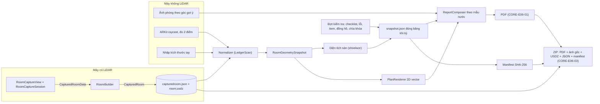
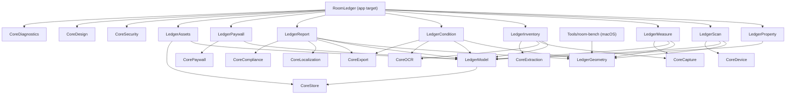
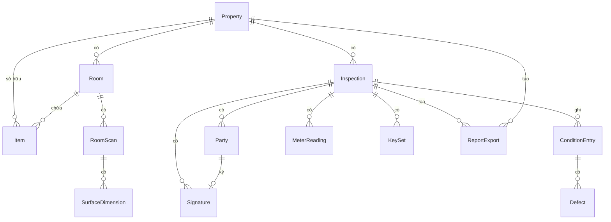
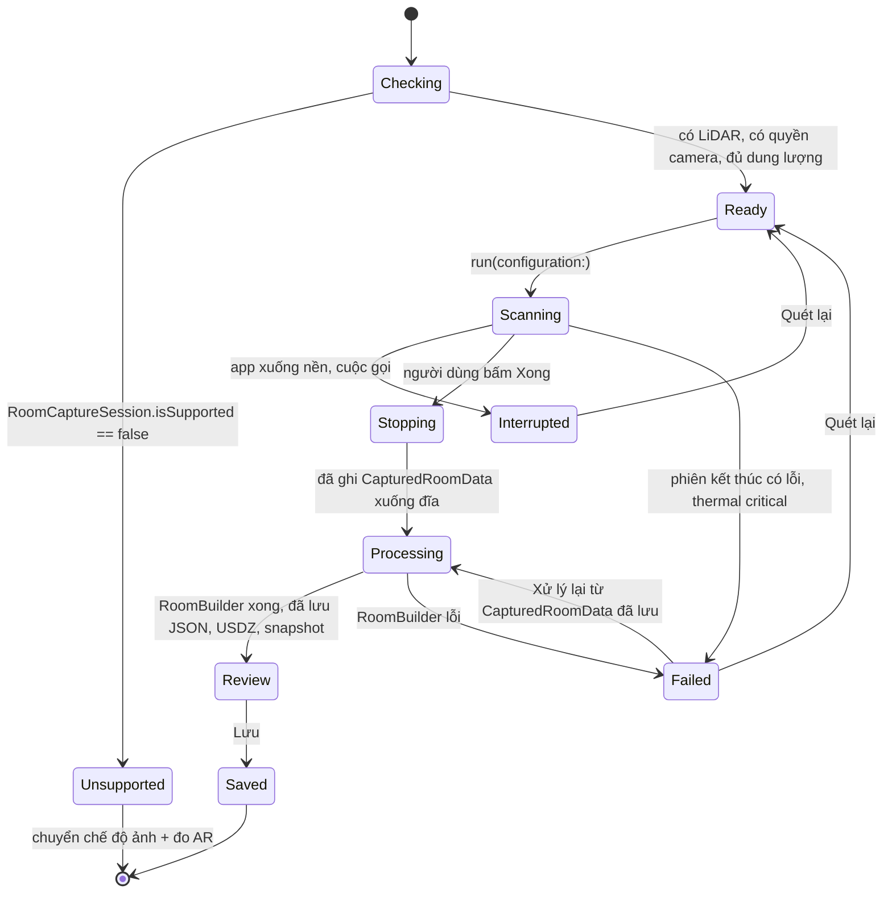
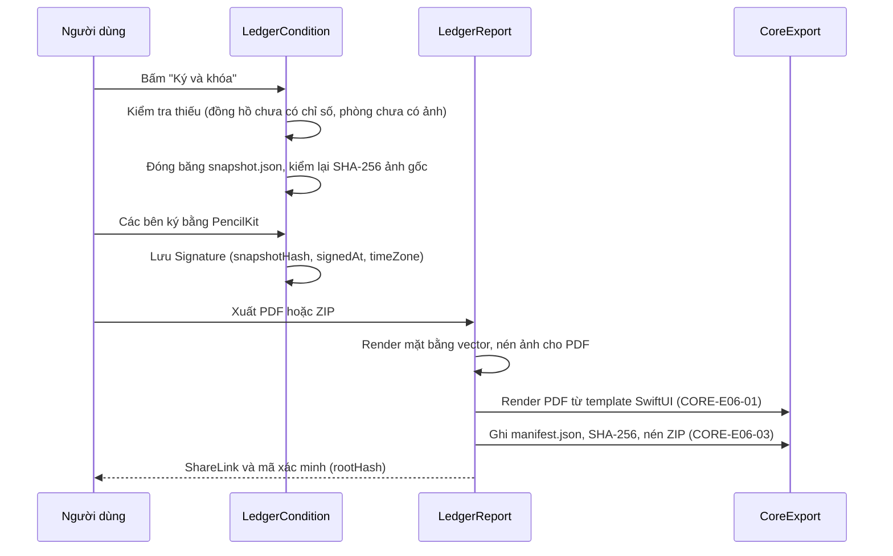
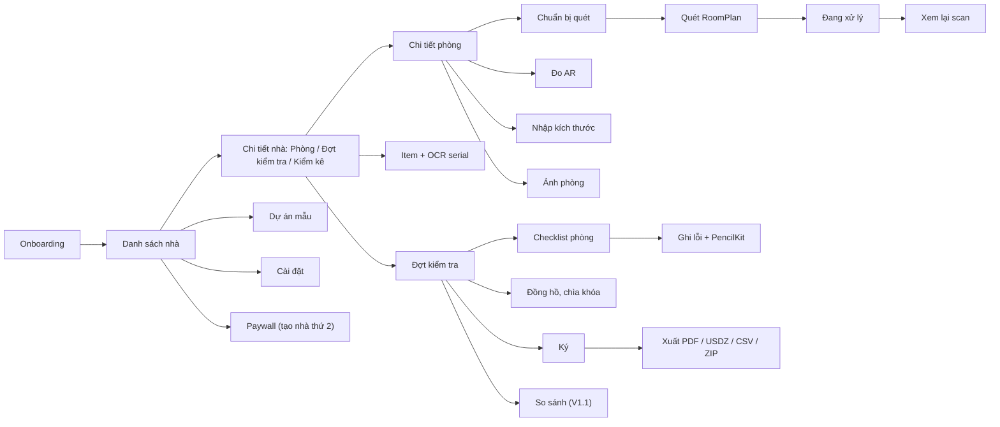

# Thiết kế kỹ thuật · `RoomLedger` (KKL)

Tài liệu này mô tả phần riêng của app 03. Phần dùng chung (chụp, OCR, lưu trữ, xuất, paywall, bảo mật, bản địa hóa, chẩn đoán, tuân thủ) nằm ở [lõi `SensorCore`](../shared-core.md) và chỉ được tham chiếu bằng mã `CORE-…`. Feature và ước tính ở [epics-features.md](epics-features.md).

Ràng buộc chung giữ nguyên: iOS 26 trở lên, Xcode 26 trở lên, Swift 6 strict concurrency, SwiftUI + Observation, không `URLSession`, không SDK analytics, nhắm nhãn "Data Not Collected".

Mọi đoạn code là **phác thảo** để thống nhất cách làm, không phải code cuối cùng. Tên API Apple lấy từ ghi chú nghiên cứu hoặc API đã có từ lâu. Chỗ nào chưa chắc về chữ ký hàm, tên thuộc tính hay phiên bản iOS thì ghi ⚠ cần xác minh và phải đối chiếu tài liệu Xcode 26 trong tuần đầu của sprint 1.

## 1. Kiến trúc tổng quan

Bốn nguyên tắc riêng của app:

1. **Hai tầng dữ liệu hình học.** Dữ liệu gốc của Apple (`CapturedRoomData`, JSON của `CapturedRoom`, USDZ) được lưu nguyên để xử lý lại. Tầng chuẩn hóa `RoomGeometrySnapshot` do app định nghĩa là **nguồn sự thật** cho diện tích, mặt bằng và báo cáo. Lý do: định dạng JSON của `CapturedRoom` phụ thuộc phiên bản RoomPlan ⚠; biên bản đã ký phải mở được nhiều năm sau (đúng điều người dùng magicplan phàn nàn); và logic hình học phải test được trên Simulator và macOS.
2. **Mọi nguồn số đo đi vào cùng một mô hình.** LiDAR (RoomPlan), đo AR và nhập tay đều tạo `RoomGeometrySnapshot`, mỗi số đo mang nhãn nguồn. Báo cáo không cần biết máy có LiDAR hay không.
3. **Biên bản đã ký là bất biến.** Khi ký, dữ liệu được đóng băng thành `snapshot.json`; hash SHA-256 của nó và của mọi ảnh gốc được in vào PDF. Sửa sau khi ký tạo bản sửa đổi mới.
4. **Không mạng, xuất miễn phí.** Paywall chỉ giới hạn số nhà và mẫu có thương hiệu, không bao giờ chặn xuất.

### 1.1 Luồng dữ liệu chính



### 1.2 Phụ thuộc module



`LedgerGeometry` chỉ dùng Foundation và `simd`, không import RoomPlan, ARKit hay UIKit. Nhờ vậy nó chạy trên macOS (cho `Tools/room-bench`) và trên Simulator.

## 2. Module map

### 2.1 Cấu trúc thư mục

```
Apps/RoomLedger/
├── RoomLedger/                  # target app: điều hướng, onboarding, Cài đặt, String Catalog, PrivacyInfo.xcprivacy
├── RoomLedgerKit/               # Swift package cục bộ, Swift 6
│   ├── Sources/
│   │   ├── LedgerModel/         # SwiftData @Model, enum, AssetRef, đơn vị
│   │   ├── LedgerGeometry/      # RoomGeometrySnapshot, diện tích, chiếu 2D, bố cục nhãn, so khớp
│   │   ├── LedgerScan/          # RoomPlan: capture view, phiên, RoomBuilder, StructureBuilder, adapter
│   │   ├── LedgerMeasure/       # camera ảnh, đo AR (ARKit + RealityKit), nhập tay
│   │   ├── LedgerProperty/      # màn nhà, phòng, đợt kiểm tra, các bên, dự án mẫu
│   │   ├── LedgerInventory/     # item, OCR serial/model, hóa đơn
│   │   ├── LedgerCondition/     # checklist, lỗi + PencilKit, đồng hồ, chìa khóa, chữ ký, manifest, so sánh
│   │   ├── LedgerReport/        # mẫu theo nước, renderer mặt bằng, PDF, CSV, USDZ, ZIP
│   │   ├── LedgerAssets/        # bố cục file, thumbnail, lưu trữ .roomledger
│   │   ├── LedgerPaywall/       # sản phẩm, slot, ánh xạ quyền lợi
│   │   └── LedgerSurvey/        # V2: tiền khảo sát cải tạo
│   ├── Tests/                   # Swift Testing, mỗi module một test target
│   └── Fixtures/                # phòng quét thật: *.capturedroom.json, *.snapshot.json, *.usdz, laser.csv
└── RoomLedgerUITests/           # XCUITest
Tools/room-bench/                # CLI macOS dùng LedgerGeometry, đọc fixture + số đo laser
```

### 2.2 Target của app

| Target | Epic | Nội dung | Framework Apple | Module CORE | Test chạy ở |
|---|---|---|---|---|---|
| `LedgerModel` | E01 | Schema SwiftData, enum, `AssetRef`, đơn vị | SwiftData | CoreStore | Simulator, macOS |
| `LedgerGeometry` | E02, E05, E06 | Snapshot hình học, diện tích, chiếu 2D, bố cục nhãn, so khớp move-in/move-out | Foundation, simd | – | macOS, Simulator |
| `LedgerScan` | E02 | Bọc `RoomCaptureView`, vòng đời phiên, `RoomBuilder`, `StructureBuilder`, adapter `CapturedRoom` → snapshot | RoomPlan, ARKit, QuickLook | CoreDevice, CoreDiagnostics | Máy thật (adapter test bằng fixture ⚠ mục 12.3) |
| `LedgerMeasure` | E03 | Camera ảnh, đo AR, nhập tay | AVFoundation, ARKit, RealityKit | CoreCapture | UI: Simulator; AR: máy thật |
| `LedgerProperty` | E01 | Màn nhà, phòng, đợt kiểm tra, các bên, dự án mẫu | SwiftUI, ContactsUI (V1.1) | CoreDesign, CoreLocalization | Simulator |
| `LedgerInventory` | E04 | Item, luật serial/model, hóa đơn | Vision (qua CoreOCR) | CoreCapture, CoreOCR, CoreExtraction | Simulator |
| `LedgerCondition` | E05 | Checklist, lỗi, PencilKit, đồng hồ, chìa khóa, chữ ký, manifest, so sánh | PencilKit, CryptoKit | CoreStore (AuditLog), CoreExport, CoreOCR | Simulator |
| `LedgerReport` | E06 | Mẫu theo nước, renderer mặt bằng, PDF, CSV, USDZ, ZIP | SwiftUI, PDFKit, QuickLook, ImageIO | CoreExport, CoreLocalization, CoreCompliance | Simulator |
| `LedgerAssets` | E08 | Thư mục theo nhà, thumbnail, lưu trữ | ImageIO | CoreStore (`BlobStore`), CoreExport | Simulator |
| `LedgerPaywall` | E09 | Sản phẩm, slot, quyền lợi | StoreKit 2 | CorePaywall | Simulator + `SKTestSession` |
| `LedgerSurvey` (V2) | E07 | Bảng cửa sổ/cửa, tem radiator, IFC | Vision | CoreOCR, CoreExtraction, CoreExport | Simulator |
| `room-bench` | E11 | Tính sai số so với máy đo laser | Foundation | – | macOS |

Không dùng SceneKit cho phần mới, vì Apple đã chuyển hướng sang RealityKit từ WWDC25 ⚠ cần xác minh trạng thái deprecate trên iOS 26. Xem 3D dùng AR Quick Look (`QLPreviewController`), đo AR dùng RealityKit `ARView`.

### 2.3 Module lõi được dùng

| Module CORE | Dùng cho | Feature CORE | Bổ sung đề xuất cho lõi |
|---|---|---|---|
| CoreDevice | Cổng LiDAR/RoomPlan, DataScanner, Foundation Models | (chưa có ID) | Thêm ID backlog cho `Capabilities` ⚠ (câu hỏi mở 1) |
| CoreCapture | Quét hóa đơn, nhập ảnh/PDF, quét mã vạch (V1.1) | CORE-E02-01, -02, -03 | Camera chụp ảnh thường: KKL tự làm ở KKL-E03-01, đưa vào lõi nếu app 02/05 cần |
| CoreOCR | Serial/model, đồng hồ (V1.1), hóa đơn (V1.1), tem radiator (V2) | CORE-E03-01, -02, -03 | `LineRecognizer` cần tham số tắt `usesLanguageCorrection` và vùng quan tâm (câu hỏi mở 3) |
| CoreExtraction | Luật serial/model, trích hóa đơn, gợi ý FM (V2) | CORE-E04-01, -02, -03 | – |
| CoreStore | SwiftData có version, `BlobStore` `.complete`, `AuditLog` | CORE-E05-01, -02, -03 | – |
| CoreExport | PDF từ template SwiftUI, CSV theo locale, ZIP + SHA-256 | CORE-E06-01, -02, -03 | Hash dạng stream cho file lớn (USDZ) nếu lõi chưa có |
| CorePaywall | StoreKit 2, `Entitlements`, màn paywall, offer code | CORE-E07-01, -02, -03 | `Entitlements` nhận quyền lợi dạng số (`propertyLimit`), không chỉ Bool |
| CoreSecurity | Khóa Face ID, che app switcher | CORE-E08-01 | – |
| CoreDesign | Design system, VoiceOver | CORE-E09-01, -02 | – |
| CoreLocalization | String Catalog, định dạng theo storefront | CORE-E10-01 | Thêm `nl` vào danh sách locale đợt 1 cho app 03 |
| CoreIntents | Spotlight, App Shortcuts (V1.1) | CORE-E11-01 | – |
| CoreDiagnostics | OSLog, signpost, MetricKit (không gửi đi) | CORE-E12-01 | – |
| CoreCompliance | Disclaimer đo đạc, `PrivacyInfo.xcprivacy`, mẫu Review Notes, nhãn AI (V2) | CORE-E13-01 | Ngữ cảnh disclaimer "đo đạc" và "biên bản" |

## 3. Mô hình dữ liệu

### 3.1 Quan hệ



Quyết định quan trọng: `Item` thuộc `Property`/`Room` (kiểm kê sống, sửa được bất cứ lúc nào), còn `Inspection` ghi **quan sát tại một thời điểm** (`ConditionEntry` trỏ tới phần tử hoặc item). Khi ký, toàn bộ dữ liệu liên quan được chép thành `snapshot.json`, nên sửa item sau đó không làm đổi biên bản đã ký.

### 3.2 Thực thể SwiftData

| Model | Trường chính | Ghi chú |
|---|---|---|
| `Property` | `id`, `name`, `address` (struct: dòng, mã bưu chính, thành phố, `countryCode`), `kind`, `templateCountry`, `coverPhoto: AssetRef?`, `createdAt`, `isSample`, `unlockedBy: String?` (product ID của slot) | Xóa cascade mọi con và file (KKL-E08-01) |
| `Room` | `id`, `name`, `kind` (preset), `floorLevel`, `sortIndex`, `currentScanID`, `photos: [AssetRef]`, `sourceID` | `kind` quyết định checklist mặc định |
| `RoomScan` | `id`, `source` (`.roomPlan`, `.arMeasure`, `.manual`), `capturedRoomData`, `capturedRoomJSON`, `usdz`, `geometry` (đều là `AssetRef`), `floorAreaM2`, `areaMethod` (`.floorPolygon`, `.wallLoop`, `.manual`, `.arPolygon`), `perimeterM`, `ceilingHeightM`, `osVersion`, `createdAt`, `supersededBy` | Bản quét cũ giữ lại khi đã có biên bản ký trỏ tới |
| `SurfaceDimension` | `id`, `kind` (`wall`, `door`, `window`, `opening`), `roomPlanID: UUID?`, `parentWallID`, `widthM`, `heightM`, `offsetAlongWallM`, `sillHeightM?`, `confidence`, `source` (`.lidar`, `.ar`, `.manual`), `originalWidthM?`, `originalHeightM?` | Giá trị gốc giữ lại khi sửa tay (KKL-E02-09) |
| `Item` | `id`, `name`, `category`, `quantity`, `brand`, `model`, `serial`, `purchaseDate`, `value: Decimal?`, `currencyCode`, `receipts: [AssetRef]`, `photos: [AssetRef]`, `grade` (1–5), `notes`, `planPosition: Point2?`, `roomPlanObjectID: UUID?`, `ocrRaw: String?`, `sourceID` | `ocrRaw` chỉ lưu trên máy để truy vết |
| `Inspection` | `id`, `kind` (`.moveIn`, `.moveOut`, `.inventory`, `.interim`), `performedAt`, `timeZoneID`, `status` (`.draft`, `.signed`, `.amended`), `templateCountry`, `templateVersion`, `snapshot: AssetRef?`, `snapshotHash`, `amends: UUID?`, `sourceInspectionID` | Đã ký thì chỉ đọc |
| `Party` | `id`, `role` (`.tenant`, `.landlord`, `.agent`, `.witness`), `name`, `email?`, `phone?` | Không bắt buộc liên hệ |
| `ConditionEntry` | `id`, `room`, `elementKey` (ví dụ `wall`, `floor`, `window.1`), `itemID?`, `grade`, `cleanliness`, `notes`, `notApplicable`, `sourceID` | `elementKey` ổn định để so sánh |
| `Defect` | `id`, `photo: AssetRef` (gốc), `annotation: AssetRef?` (`PKDrawing.dataRepresentation()`), `rendered: AssetRef?`, `text`, `severity`, `capturedAt`, `importedFromLibrary` | Ảnh gốc không bao giờ bị ghi đè |
| `MeterReading` | `id`, `kind` (`.electricity`, `.gas`, `.water`, `.heat`, `.other`), `meterNumber`, `rawValue: String`, `value: Decimal?`, `unit`, `photo: AssetRef?`, `ocrConfidence?` | `rawValue` giữ số 0 đứng đầu |
| `KeySet` | `id`, `label`, `count`, `photo: AssetRef?`, `notes` | |
| `Signature` | `id`, `party`, `drawing: AssetRef`, `image: AssetRef` (PNG), `signedAt`, `timeZoneID`, `snapshotHash` | Chữ ký gắn với hash dữ liệu đã đóng băng |
| `ReportExport` | `id`, `kind` (`.conditionPDF`, `.inventoryPDF`, `.comparisonPDF`, `.usdz`, `.csv`, `.zip`), `file: AssetRef`, `templateID`, `templateVersion`, `dataHash`, `rootHash`, `appVersion`, `createdAt` | Lịch sử xuất |
| `AuditEntry` | Dùng `AuditLog` của lõi (CORE-E05-03): thời điểm, thực thể, trường, cũ, mới, nguồn (`.lidar`, `.ar`, `.manual`, `.ocr`, `.user`) | Không định nghĩa lại |

`AssetRef` là struct Codable (`blobID: UUID`, `sha256: String`, `byteCount: Int64`, `uti: String`, `createdAt: Date`), lưu trong model như giá trị. File nằm trong `BlobStore` (CORE-E05-02), không dùng `@Attribute(.externalStorage)` để giữ quyền kiểm soát đường dẫn, file protection và hash. Hash SHA-256 tính **ngay lúc lưu file**; lúc xuất tính lại để phát hiện file bị đổi hay hỏng.

Enum lưu dạng `String` raw value. V1.1 thêm `Tenancy` (lượt thuê) cho KKL-E01-08 bằng một `MigrationStage` nhẹ. Nếu V2 bật CloudKit thì phải bỏ `@Attribute(.unique)` và để quan hệ optional ⚠ cần xác minh ràng buộc SwiftData + CloudKit.

```swift
// Phác thảo — không phải code cuối cùng
@Model final class RoomScan {
    @Attribute(.unique) var id: UUID
    var room: Room?
    var createdAt: Date
    var source: MeasureSource           // .roomPlan, .arMeasure, .manual
    var capturedRoomData: AssetRef?     // trước RoomBuilder, để xử lý lại (Codable ⚠)
    var capturedRoomJSON: AssetRef?     // CapturedRoom mã hóa JSON (Codable ⚠)
    var usdz: AssetRef?
    var geometry: AssetRef              // RoomGeometrySnapshot — nguồn sự thật
    var floorAreaM2: Double
    var areaMethod: AreaMethod
    var perimeterM: Double
    var ceilingHeightM: Double?
    var osVersion: String
    var supersededBy: UUID?
    @Relationship(deleteRule: .cascade) var surfaces: [SurfaceDimension] = []
    init(id: UUID = UUID(), geometry: AssetRef, source: MeasureSource) { /* … */ }
}

// Định dạng riêng, Codable, không import RoomPlan — chạy được trên macOS
public struct RoomGeometrySnapshot: Codable, Sendable {
    public var formatVersion = 1
    public var walls: [Wall]
    public var openings: [Opening]
    public var floorPolygon: [Point2]?    // từ `floors` nếu có
    public var objects: [Object]          // danh mục + hộp bao trên mặt XZ, để gợi ý item
    public var source: MeasureSource
    public struct Point2: Codable, Sendable, Hashable { public var x, z: Double }
    public struct Wall: Codable, Sendable { public var id: UUID; public var a, b: Point2; public var height: Double; public var confidence: Confidence }
    public struct Opening: Codable, Sendable {
        public enum Kind: String, Codable, Sendable { case door, window, opening }
        public var id: UUID; public var wallID: UUID; public var kind: Kind
        public var start, end: Double         // mét, tính dọc tường từ điểm a
        public var bottom, height: Double     // mét, bottom tính từ mặt sàn
    }
}
```

### 3.3 Đơn vị và kiểu số

| Đại lượng | Kiểu lưu | Đơn vị | Lý do |
|---|---|---|---|
| Độ dài, tọa độ | `Double` | mét | RoomPlan trả `Float` (`simd_float3`, `simd_float4x4`). Sai số cảm biến cỡ cm, nên `Decimal` không thêm độ chính xác mà làm phép tính hình học chậm và rườm. Đổi sang `Double` ngay ở adapter để cộng dồn (shoelace, chu vi) không mất chính xác. |
| Diện tích | `Double` | m² | Luôn tính lại được từ hình học; chỉ làm tròn khi hiển thị |
| Tiền | `Decimal` + mã ISO 4217 | – | Tránh sai số nhị phân khi cộng tổng giá trị kiểm kê; khớp định dạng tiền của `LocaleFormatters` |
| Chỉ số đồng hồ | `String` nguyên văn + `Decimal?` | kWh, m³, … | Giữ số 0 đứng đầu và đúng chữ số người dùng đã xác nhận |
| Thời điểm | `Date` + `TimeZone.identifier` | UTC | PDF in cả giờ địa phương và UTC |

Làm tròn khi hiển thị: độ dài 0,01 m; diện tích 0,1 m² trong PDF và UI, 0,01 m² trong CSV. Hiển thị qua `Measurement<UnitLength>` và `Measurement<UnitArea>` với formatter theo storefront (CORE-E10-01). PDF luôn in dung sai kèm nguồn số đo (KKL-E03-05).

**JSON của `CapturedRoom`.** `CapturedRoom` được Apple khai là Codable ⚠ cần xác minh trên iOS 26, và `CapturedRoomData` cũng Codable từ iOS 17 ⚠. App lưu cả hai kèm `osVersion` để xử lý lại. Nếu một bản iOS sau không giải mã được JSON cũ, báo cáo vẫn dựng từ `RoomGeometrySnapshot`, còn USDZ vẫn mở được bằng mọi viewer.

## 4. Pipelines chi tiết

### 4.1 Vòng đời phiên RoomPlan



**Hai cách lấy kết quả** ⚠ chọn trong spike S1:
- **Đường A:** để `RoomCaptureView` tự xử lý và hiện kết quả qua `RoomCaptureViewDelegate`: `captureView(shouldPresent:error:)` rồi `captureView(didPresent:error:)`.
- **Đường B (đề xuất):** trong `captureView(shouldPresent:error:)` hoặc `RoomCaptureSessionDelegate.captureSession(_:didEndWith:error:)`, ghi `CapturedRoomData` xuống đĩa trước, rồi app tự chạy `RoomBuilder`. Lợi ích: xử lý lại được khi builder lỗi hay app bị hệ thống tắt, tự chọn tùy chọn builder, và cùng một đường với quét nhiều phòng (V1.1).

`RoomCaptureViewDelegate` kế thừa `NSCoding` ⚠, nên dùng một lớp adapter nhỏ tách khỏi coordinator.

| Callback | Khi nào | App làm gì |
|---|---|---|
| `captureSession(_:didStartWith:)` | Phiên bắt đầu | Tăng bộ đếm `started` (cục bộ), mở signpost |
| `captureSession(_:didUpdate:)` | Liên tục trong phiên | Cập nhật số tường, cửa, cửa sổ đã thấy (giới hạn 2 lần/giây) |
| `captureSession(_:didProvide:)` | RoomPlan đưa hướng dẫn (`RoomCaptureSession.Instruction`, ví dụ đi chậm, bật đèn, lại gần tường ⚠ tên case) | Coaching của `RoomCaptureView` đã hiện; app chỉ ghi lại hướng dẫn gần nhất để gợi ý nếu phiên lỗi (KKL-E02-13) |
| `captureSession(_:didEndWith:error:)` | Phiên kết thúc | Không lỗi: ghi `CapturedRoomData`, sang Processing. Có lỗi: sang Failed với thông điệp theo loại lỗi |
| `captureView(shouldPresent:error:)` | View sắp tự xử lý | Đường B: ghi dữ liệu, trả `false` ⚠ kiểm tra view có dừng đúng không |

| Tình huống | Nhận biết | Xử lý và thông điệp |
|---|---|---|
| Máy không hỗ trợ | `RoomCaptureSession.isSupported == false` | Không tạo session; mở chế độ ảnh + đo AR (KKL-E03) |
| Chưa có quyền camera | `AVCaptureDevice.authorizationStatus(for: .video)` | Giải thích, nút mở Cài đặt; vẫn nhập kích thước tay được |
| Phòng quá lớn | Lỗi vượt kích thước cảnh (`exceedSceneSizeLimit` ⚠). RoomPlan được thiết kế cho phòng cỡ 9 × 9 m ⚠ | "Phòng lớn hơn giới hạn quét. Chia thành hai phần hoặc đo bằng AR." |
| Mất tracking | Lỗi world tracking (`worldTrackingFailure` ⚠) | "Máy mất định vị. Đi chậm hơn, tránh hướng camera vào tường trơn hoặc gương." |
| Thiếu sáng | Instruction bật đèn ⚠ | Coaching hiện; nếu phiên lỗi thì màn thử lại gợi ý bật đèn |
| App xuống nền, cuộc gọi | `scenePhase`, gián đoạn `ARSession` | Coi như phiên kết thúc; nếu có `CapturedRoomData` thì cho "Dùng phần đã quét", không thì "Quét lại" ⚠ hành vi RoomPlan khi gián đoạn |
| Máy nóng | `ProcessInfo.thermalState` | `.serious`: banner "Máy đang nóng, nên hoàn tất phòng này". `.critical`: gọi `stop()`, xử lý phần đã có |
| Bộ nhớ thấp | `UIApplication.didReceiveMemoryWarningNotification` | Xóa cache thumbnail; không giữ `UIImage` nào trong lúc quét |
| Ổ đĩa thấp | `volumeAvailableCapacityForImportantUsage` < 500 MB | Chặn bắt đầu quét, chỉ màn dung lượng |
| `RoomBuilder` lỗi | `throws` | Giữ `CapturedRoomData`; cho "Xử lý lại"; sau 2 lần lỗi gợi ý đo AR hoặc nhập tay |

```swift
// Phác thảo Swift 6 — tên API RoomPlan phải đối chiếu tài liệu Xcode 26 ⚠
import RoomPlan

@MainActor @Observable
final class ScanCoordinator: NSObject, RoomCaptureSessionDelegate {
    enum Phase { case ready, scanning, processing, review(RoomScanResult), interrupted, failed(ScanFailure) }
    private(set) var phase: Phase = .ready
    private let store: ScanStore               // ghi file qua LedgerAssets, tính SHA-256 lúc ghi
    private let counter: ScanSessionCounter    // đếm cục bộ, không gửi đi

    nonisolated func captureSession(_ session: RoomCaptureSession,
                                    didEndWith data: CapturedRoomData, error: (any Error)?) {
        // ⚠ CapturedRoomData có Sendable không: nếu không, mã hóa JSON trước khi đổi actor
        Task { @MainActor in await self.finish(data, error) }
    }

    private func finish(_ data: CapturedRoomData, _ error: (any Error)?) async {
        if let error { phase = .failed(ScanFailure(error)); return }
        do {
            let raw = try store.saveRaw(data)                         // xử lý lại được nếu builder lỗi
            phase = .processing
            let room = try await RoomBuilder(options: [.beautifyObjects]).capturedRoom(from: data)
            phase = .review(try await store.persist(room, raw: raw))  // JSON + USDZ + snapshot + diện tích
            counter.markCompleted()
        } catch {
            phase = .failed(.builder(error))
        }
    }
}
```

Nhiệt độ được theo dõi bằng `NotificationCenter.default.notifications(named: ProcessInfo.thermalStateDidChangeNotification)` trong một `Task` gắn với vòng đời màn quét. Trên màn quét không chạy việc nặng nào khác (không tạo thumbnail, không OCR).

**Bộ đếm phiên (KPI 60%).** `ScanSessionCounter` ghi vào `UserDefaults` các số: phiên bắt đầu, phiên có `CapturedRoom` được lưu với ít nhất 3 tường, phiên lỗi theo loại. Không có dữ liệu cá nhân. Chỉ hiện ở Cài đặt → Chẩn đoán; V1.1 cho người dùng tự gửi qua share sheet (KKL-E11-05) ⚠ ảnh hưởng nhãn quyền riêng tư.

### 4.2 `RoomBuilder`, lưu và xuất USDZ

1. `RoomBuilder(options: [.beautifyObjects])` ⚠: tùy chọn này làm gọn hộp bao đồ vật; phải kiểm tra nó không làm lệch kích thước đồ vật dùng để gợi ý item. Có cờ nội bộ để tắt.
2. Mã hóa `CapturedRoom` bằng `JSONEncoder` (Codable ⚠) → `capturedroom.json`.
3. Xuất USDZ: `room.export(to:exportOptions:)` với `.parametric` ⚠ (iOS 17 có thêm `.mesh`, `.model` ⚠). MVP xuất parametric: nhẹ, đủ xem và chia sẻ.
4. Adapter chuyển `CapturedRoom` → `RoomGeometrySnapshot` (mục 5.2, 5.3) và tính diện tích (5.1).
5. Ghi `RoomScan` + `SurfaceDimension` trong một lần lưu `ModelContext`. Nếu lưu lỗi, xóa các file vừa ghi.

Toàn bộ chạy ngoài main thread trừ phần cập nhật UI; đo thời gian bằng `OSSignposter` (CORE-E12-01).

### 4.3 Quét nhiều phòng (V1.1, sau spike S2)

- Giữ một `ARSession` chung cho các phòng liên tiếp: tạo `RoomCaptureView` với `ARSession` do app cấp ⚠ (initializer có `arSession`, iOS 17), kết thúc mỗi phòng bằng `stop(pauseARSession: false)` ⚠ rồi `run` phòng kế tiếp. Các `CapturedRoom` khi đó chung hệ tọa độ.
- Ghép bằng `StructureBuilder(options:)` → `capturedStructure(from: [CapturedRoom])` → `CapturedStructure` ⚠ (iOS 17), xuất USDZ toàn căn.
- Nếu người dùng rời app giữa các phòng thì mất liên tục. Phương án dự phòng là relocalize bằng `ARWorldMap` ⚠, chỉ làm nếu spike cho thấy cần.
- Spike S2 đo độ lệch mối nối giữa hai phòng trên 3 căn hộ. Không đạt ngưỡng thì V1.1 chỉ ra mặt bằng từng phòng.

### 4.4 Đo bằng ARKit trên máy không LiDAR

1. RealityKit `ARView` chạy `ARWorldTrackingConfiguration` với `planeDetection = [.horizontal, .vertical]`; `ARCoachingOverlayView` với mục tiêu tìm mặt phẳng.
2. Mỗi khung hình (giới hạn 15 lần/giây) raycast từ tâm màn hình, ưu tiên hit trên mặt phẳng đã phát hiện, rồi mới tới mặt phẳng ước lượng. Làm mượt vị trí tâm ngắm bằng trung vị 5 hit gần nhất.
3. Chỉ cho chốt điểm khi `camera.trackingState == .normal`. Trạng thái `.limited(reason)` hiện lý do: đang khởi tạo, chuyển động nhanh, thiếu đặc trưng, thiếu sáng.
4. Chạm lần 1 đặt điểm A (gắn `ARAnchor`), lần 2 đặt điểm B. Khoảng cách = `simd_distance(A, B)` đổi sang `Double` mét. Hiện số trực tiếp khi di chuyển điểm B.
5. Người dùng gán kết quả cho: chiều dài tường, chiều cao trần, rộng/cao cửa hoặc cửa sổ. Lưu `MeasureSample` (A, B, khoảng cách, loại mặt phẳng, trạng thái tracking lúc chốt) để truy vết.
6. Dung sai in trong PDF lấy từ benchmark AR (KKL-E11-02), không phải con số tự đặt.

```swift
// Phác thảo — raycast từ tâm màn hình
let center = CGPoint(x: arView.bounds.midX, y: arView.bounds.midY)
let hits = arView.raycast(from: center, allowing: .existingPlaneGeometry, alignment: .any)
         + arView.raycast(from: center, allowing: .estimatedPlane, alignment: .any)
if let hit = hits.first {
    let p = hit.worldTransform.columns.3
    reticle.position = SIMD3(p.x, p.y, p.z)
}
```

Trên máy có LiDAR nhưng không dùng được RoomPlan (phòng quá lớn), V2 bật `sceneReconstruction = .mesh` và raycast lên mesh (KKL-E03-08).

### 4.5 OCR serial/model cho item

1. Người dùng chụp tem nhãn (KKL-E03-01) và có thể kéo khung quanh vùng chữ.
2. `LineRecognizer` (CORE-E03-02) với ngôn ngữ `en`, `de`, `fr`, `nl`, tắt sửa lỗi ngôn ngữ ⚠ (cần tham số ở lõi), trả về dòng chữ + khung + độ tin cậy.
3. Luật (qua `RuleExtractor`, CORE-E04-01):
   - Tìm nhãn khóa đa ngôn ngữ: `S/N`, `SN`, `Serial No.`, `Serial Number`, `Seriennummer`, `Serien-Nr.`, `N° de série`, `Numéro de série`, `Serienummer`; model: `Model`, `Model No.`, `Modell`, `Modèle`, `Type`, `Typ`, `MPN`, `Art.-Nr.`, `Réf.`.
   - Giá trị nằm sau nhãn trên cùng dòng (sau `:` hoặc khoảng trắng), hoặc ở dòng ngay dưới có khung chồng theo trục ngang.
   - Ứng viên không có nhãn: token 5–24 ký tự `[A-Z0-9-/]`, có ít nhất 2 chữ số.
   - Sinh biến thể cho ký tự dễ nhầm (O↔0, I↔1, S↔5, B↔8) chỉ trong token trộn chữ và số.
   - Điểm = độ gần nhãn + độ tin cậy OCR + độ hợp khuôn. Trả 3 ứng viên đầu.
4. Người dùng chọn hoặc sửa. Lưu `ocrRaw` (trên máy) để truy vết.
5. V1.1: mã vạch Code 128 trên tem serial qua `DataScannerViewController` (CORE-E02-02) thường chính xác hơn OCR.

### 4.6 Chỉ số đồng hồ

MVP: ảnh + nhập tay. V1.1 (KKL-E05-06): `LineRecognizer` trong vùng chọn, tắt sửa lỗi ngôn ngữ, lọc theo `[0-9]{3,9}([.,][0-9]{1,3})?`; giữ chuỗi nguyên văn; người dùng luôn xác nhận. Nhiều đồng hồ in phần thập phân màu đỏ hoặc trong khung riêng, nên giá trị OCR chỉ là gợi ý.

### 4.7 Tạo biên bản và băm



Các bước:
1. **Kiểm tra đủ:** cảnh báo, không chặn (người dùng có thể ký thiếu và ghi chú).
2. **Đóng băng:** dựng `InspectionSnapshot` (Codable, đã phẳng hóa: nhà, các bên, phòng, snapshot hình học, checklist, lỗi, item, đồng hồ, chìa khóa, mẫu + phiên bản mẫu, phiên bản app, locale, múi giờ). Mã hóa bằng `JSONEncoder` với `.sortedKeys` và ngày ISO 8601 để cùng dữ liệu cho cùng byte. `dataHash = SHA256(snapshot.json)`.
3. **Ký:** mỗi `Signature` lưu `snapshotHash`. Dữ liệu đổi sau đó thì phải tạo bản sửa đổi.
4. **Ảnh cho PDF:** mỗi ảnh được downsample bằng ImageIO (cạnh dài 1.600 px, JPEG chất lượng khoảng 0,7 ⚠ tinh chỉnh), từng ảnh một trong `autoreleasepool`. Ảnh gốc không đổi và đi vào ZIP.
5. **PDF:** renderer lõi vẽ từng trang; mặt bằng là path vector. Chân mỗi trang in 12 ký tự đầu của `dataHash`; trang cuối in đầy đủ `dataHash`, bảng hash ảnh gốc, thời điểm ký (giờ địa phương + UTC), và cách kiểm tra.
6. **Manifest và ZIP:** `manifest.json` liệt kê mọi file (kể cả PDF) với SHA-256 và kích thước; `rootHash = SHA256(manifest.json)`. App hiện `rootHash` như "mã xác minh" và gợi ý gửi cho bên kia ngay (email, tin nhắn) để có dấu thời gian của bên thứ ba.

## 5. Thuật toán chính

### 5.1 Diện tích sàn

**Nguồn chính: đa giác sàn** (iOS 17+, ⚠ spike S1).
1. Với mỗi `floor` trong `CapturedRoom.floors`, đổi `polygonCorners` (tọa độ cục bộ ⚠ kiểm trục) sang tọa độ thế giới bằng `transform`, lấy (x, z).
2. Bỏ điểm trùng (cách nhau < 1 cm). Cần ≥ 3 đỉnh; kiểm đa giác đơn (không tự cắt, O(n²) với n < 50).
3. Diện tích bằng công thức shoelace: A = ½ · |Σ (xᵢ·zᵢ₊₁ − xᵢ₊₁·zᵢ)|.
4. Nhiều `floor`: cộng lại nếu chồng lấn < 1% ⚠ chưa rõ khi nào RoomPlan trả nhiều sàn.

**Dự phòng: vòng tường.**
1. Mỗi tường thành đoạn thẳng trên mặt XZ (5.2).
2. Nối hai đầu mút nếu cách nhau ≤ 0,15 m, hoặc nếu phần kéo dài của hai đoạn cắt nhau trong vòng 0,30 m thì dùng giao điểm (ngưỡng chốt sau spike).
3. Đi theo đồ thị đầu mút để tìm chu trình chứa nhiều chiều dài tường nhất.
4. Nếu không khép (phòng mở sang bếp), nối hai đầu hở bằng đoạn thẳng khi khe ≤ 1,5 m và ghi `areaMethod = .wallLoop` kèm cảnh báo "ước tính"; khe lớn hơn thì yêu cầu nhập tay.
5. Shoelace trên các đỉnh đã sắp thứ tự.

Chu vi là tổng các cạnh đa giác. Chiều cao trần là trung vị `dimensions.y` của các tường.

**Ý nghĩa con số.** Tường RoomPlan là mặt phẳng tường nhìn từ trong phòng ⚠, nên diện tích là diện tích sàn giữa các mặt tường, chưa trừ hộp kỹ thuật, bậc hay phần trần thấp. PDF ghi "diện tích sàn đo được", không phải diện tích pháp lý (Wohnfläche theo WoFlV, surface Carrez… ⚠ không áp dụng).

### 5.2 Chiếu 3D sang mặt bằng 2D

RoomPlan dùng hệ tọa độ thế giới của ARKit: trục Y hướng lên, sàn nằm trên mặt XZ. Với một tường có `transform` T và `dimensions` (w, h, _):
- tâm c = cột 3 của T; trục dọc tường u = chuẩn hóa(cột 0 của T) ⚠ kiểm lại trục của `Surface`;
- hai đầu mút: p₁ = c − u·w/2, p₂ = c + u·w/2; bỏ thành phần Y.

Chuẩn hóa hướng: xoay cả phòng quanh gốc sao cho tường dài nhất nằm ngang; tính hộp bao; chọn tỷ lệ chuẩn lớn nhất vừa khung vẽ trong danh sách 1:20, 1:25, 1:50, 1:75, 1:100, 1:200; vẽ thước tỷ lệ. Nét tường 1,2 pt, cửa sổ 2 nét 0,5 pt, cửa là khe + cung 0,5 pt.

```swift
// Phác thảo — thuần Swift, nằm trong LedgerGeometry (không import RoomPlan;
// adapter trong LedgerScan chuyển simd_float4x4 → SIMD3<Double> trước)
struct Segment { var a: SIMD2<Double>; var b: SIMD2<Double> }   // (x, z)

func wallSegment(center c: SIMD3<Double>, axisX u: SIMD3<Double>, width w: Double) -> Segment {
    let d = simd_normalize(u) * (w / 2)
    return Segment(a: SIMD2(c.x - d.x, c.z - d.z), b: SIMD2(c.x + d.x, c.z + d.z))
}

func shoelaceArea(_ p: [SIMD2<Double>]) -> Double {
    guard p.count >= 3 else { return 0 }
    var s = 0.0
    for i in p.indices {
        let j = (i + 1) % p.count
        s += p[i].x * p[j].y - p[j].x * p[i].y      // .y ở đây là trục z
    }
    return abs(s) / 2
}
```

### 5.3 Đặt cửa và cửa sổ lên tường

1. Tìm tường cha: dùng `parentIdentifier` nếu RoomPlan cung cấp (iOS 17 ⚠); nếu không, chọn tường có khoảng cách từ tâm cửa tới đường tường nhỏ nhất và < 0,2 m.
2. Vị trí dọc tường: t = (c_o − p₁) · u; đoạn cửa [t − w_o/2, t + w_o/2], cắt vào [0, L].
3. Cao bệ cửa sổ = (c_o.y − h_o/2) − y_sàn, với y_sàn là đáy tường thấp nhất.
4. Chiều mở cửa: RoomPlan không cho biết bản lề và hướng mở ⚠. Mặc định vẽ cung một phần tư vào trong phòng (pháp tuyến hướng về trọng tâm đa giác), bản lề ở đầu gần góc phòng hơn. V1.1 cho người dùng lật.

### 5.4 Bố cục nhãn kích thước

Thuật toán tham lam, O(n²), đủ cho n < 50 tường:
1. Nhãn là chuỗi độ dài theo locale ("3,42 m"), cỡ chữ cố định theo điểm trang (7 pt).
2. Sắp tường theo chiều dài giảm dần. Mỗi nhãn đặt ở trung điểm, lệch ra ngoài theo pháp tuyến (hướng xa trọng tâm) 6 pt, xoay theo góc tường và chuẩn hóa về (−90°, 90°] để luôn đọc xuôi.
3. Kiểm va chạm bằng hình chữ nhật xoay (định lý trục tách) với các nhãn đã đặt và với nét tường. Nếu va chạm, thử lần lượt lệch 12 pt, 18 pt ra ngoài rồi 6 pt vào trong.
4. Nếu vẫn va chạm, hoặc tường trên trang ngắn hơn bề rộng chữ + 4 pt: MVP bỏ nhãn trên hình và liệt kê tường đó trong bảng kích thước bên dưới; V1.1 (KKL-E06-08) dùng số thứ tự + đường dẫn.
5. Diện tích đặt ở trọng tâm đa giác; nếu trọng tâm nằm ngoài (phòng chữ L), dùng điểm trong đa giác xa cạnh nhất (tìm trên lưới thô).

### 5.5 So sánh move-in và move-out (V1.1)

1. **Phòng:** ghép theo `sourceID` (move-out tạo từ move-in); nếu không có thì theo (`kind`, tên đã chuẩn hóa); còn lại là "không ghép được".
2. **Phần tử:** trong mỗi cặp phòng, ghép theo `elementKey`.
3. **Item:** ghép theo `sourceID`; nếu không có thì chấm điểm = 0,5 × [cùng danh mục] + 0,3 × độ giống tên (Levenshtein chuẩn hóa) + 0,2 × [cùng phòng]; ghép tham lam theo điểm giảm dần, ngưỡng 0,6.
4. **Kết quả mỗi cặp:** `unchanged`, `worse(by:)` (tụt ≥ 1 mức), `better`, `newDefect` (lỗi ở move-out không có lỗi cùng phần tử ở move-in), `missingItem`, `newItem`, `unmatched`.
5. Màn so sánh sắp theo thứ tự phòng và mức thay đổi. App **không kết luận** hư hỏng là hao mòn tự nhiên hay lỗi người thuê; chỉ liệt kê khác biệt kèm ảnh hai thời điểm.

### 5.6 Manifest chống sửa đổi

```swift
// Phác thảo — CoreExport (CORE-E06-03) đã có ZIP + SHA-256; đây là phần định dạng của app
import CryptoKit

struct ManifestEntry: Codable, Sendable { let path: String; let sha256: String; let bytes: Int64 }
struct Manifest: Codable, Sendable {
    let formatVersion: Int
    let inspectionID: UUID
    let dataHash: String            // SHA-256 của snapshot.json, cũng in trong PDF
    let createdAt: Date             // đồng hồ máy
    let timeZone: String
    let appVersion: String
    let entries: [ManifestEntry]    // snapshot.json, ảnh gốc, lớp chú thích, chữ ký, USDZ, PDF, CSV
}

func sha256Hex(of url: URL) throws -> String {          // đọc từng khối 1 MB, không nạp cả file
    var hasher = SHA256()
    let h = try FileHandle(forReadingFrom: url); defer { try? h.close() }
    while let chunk = try h.read(upToCount: 1 << 20), !chunk.isEmpty { hasher.update(data: chunk) }
    return hasher.finalize().map { String(format: "%02x", $0) }.joined()
}
// rootHash = SHA256 của manifest.json mã hóa với .sortedKeys và ngày ISO 8601
```

Manifest **chứng minh được:** sau thời điểm xuất, không file nào trong gói bị đổi mà không bị phát hiện, nếu bên kia giữ `rootHash` hoặc bản PDF. Bên thứ ba kiểm bằng `shasum -a 256` mà không cần app.

Manifest **không chứng minh được:** thời điểm thật (đồng hồ máy chỉnh được, không có máy chủ đóng dấu thời gian khi offline); ai đã chụp ảnh; ảnh nhập từ thư viện có EXIF đã bị sửa hay không. App nói rõ các giới hạn này trong trang cuối PDF, đánh dấu ảnh nhập từ thư viện, và khuyên gửi mã xác minh cho bên kia ngay lúc ký. Đóng dấu thời gian RFC 3161 cần mạng, là câu hỏi mở cho V2 (mục 14).

## 6. Màn hình & điều hướng



iPhone dùng `NavigationStack` một cột; trong chi tiết nhà có bộ chọn 3 mục (Phòng, Đợt kiểm tra, Kiểm kê). Màn quét và đo AR mở toàn màn hình (`fullScreenCover`), khóa hướng dọc.

| Màn | Mục đích | Trạng thái phải thiết kế |
|---|---|---|
| Onboarding | Vai trò, nước, năng lực máy | Có LiDAR; **không LiDAR** ("Máy của bạn đo bằng AR và ảnh"); từ chối camera |
| Danh sách nhà | Điểm vào | Rỗng (nút dự án mẫu); nhà **chỉ đọc** do vượt hạn mức (khóa nhỏ, vẫn mở được) |
| Chi tiết nhà | Phòng, đợt kiểm tra, kiểm kê | Chưa có phòng; đợt kiểm tra đang dở |
| Chuẩn bị quét | Mẹo, kiểm dung lượng và nhiệt | Máy không hỗ trợ → đưa sang đo AR; ổ đĩa thấp; máy đang nóng |
| Quét RoomPlan | Quét một phòng | Đang quét; **thiếu sáng** (coaching bật đèn); đi quá nhanh; **phiên bị gián đoạn**; phòng quá lớn; mất tracking; máy quá nóng |
| Đang xử lý | `RoomBuilder`, lưu file | Tiến trình; lỗi → "Xử lý lại" hoặc "Quét lại" |
| Xem lại scan | Mặt bằng + danh sách bề mặt, AR Quick Look | Không có đa giác sàn (diện tích ước tính); bề mặt độ tin cậy thấp (tô vàng) |
| Đo AR | Đo 2 điểm | Đang tìm mặt phẳng; tracking hạn chế (lý do); thiếu sáng; đã đo |
| Nhập kích thước | Chữ nhật hoặc đa giác vuông góc | Dữ liệu sai (âm, không khép) |
| Ảnh phòng | Các góc gợi ý | Đủ / còn thiếu |
| Item | Tạo, sửa, OCR serial | OCR không thấy chữ; nhiều ứng viên; chưa có giá trị |
| Đợt kiểm tra | Tiến độ theo phòng | Nháp; sẵn sàng ký; **đã ký (khóa)**; bản sửa đổi |
| Checklist phòng | Phần tử, tình trạng, độ sạch | "Không áp dụng" |
| Ghi lỗi | Ảnh + chú thích | Ảnh từ thư viện (nhãn "nhập từ thư viện") |
| Đồng hồ, chìa khóa | Chỉ số, số chìa | Thiếu chỉ số |
| Ký | Các bên ký | Thiếu mục (cảnh báo); đã ký; đang tạo bản sửa đổi |
| Xuất | PDF, USDZ, CSV, ZIP | Đang tạo (tiến trình, hủy được); không đủ dung lượng; xong (chia sẻ + mã xác minh) |
| Paywall | Gói năm và thêm 1 nhà cạnh nhau (CORE-E07-02) | Đang tải sản phẩm; không kết nối App Store; mua đang chờ (Ask to Buy); đã mua |
| Cài đặt | Khóa Face ID, đơn vị, nước mặc định, dung lượng, disclaimer, quyền riêng tư, chẩn đoán, khôi phục mua | – |

## 7. Ma trận thiết bị & dự phòng

### 7.1 iPhone chạy iOS 26

| Nhóm | Model | LiDAR | RoomPlan | Chế độ trong app |
|---|---|---|---|---|
| Pro có LiDAR | iPhone 12 Pro / Pro Max, 13 Pro / Pro Max, 14 Pro / Pro Max, 15 Pro / Pro Max, 16 Pro / Pro Max, 17 Pro / Pro Max, 18 Pro / Pro Max | Có | Có (vẫn kiểm `isSupported` lúc chạy) | Quét RoomPlan + mọi tính năng |
| Không LiDAR | iPhone 11, 11 Pro / Pro Max, 12 / 12 mini, 13 / 13 mini, 14 / 14 Plus, 15 / 15 Plus, 16 / 16 Plus, 16e, 17, 17e, Air, SE (thế hệ 2, 3) ⚠ danh sách máy iOS 26 | Không | Không | Ảnh + đo AR + nhập tay |
| iPhone gập (2026) | Tên và cảm biến chưa xác nhận từ nguồn Apple ⚠ | ⚠ | Kiểm lúc chạy | Theo kết quả `isSupported` |
| iPad Pro có LiDAR | 2020 trở lên | Có | Có | MVP chỉ hỗ trợ iPhone ⚠ (câu hỏi mở 4) |

Ước tính của báo cáo: khoảng 25–35% iPhone đang dùng có LiDAR, tức 65–75% chạy chế độ dự phòng.

### 7.2 Năng lực → kiểm tra → dự phòng

| Năng lực | Kiểm tra lúc chạy | Dùng ở | Khi không có |
|---|---|---|---|
| RoomPlan | `RoomCaptureSession.isSupported` | KKL-E02 | Ảnh + đo AR + nhập tay (KKL-E03) |
| Mesh LiDAR | `ARWorldTrackingConfiguration.supportsSceneReconstruction(.mesh)` | KKL-E03-08 (V2) | Raycast lên mặt phẳng |
| World tracking + plane detection | `ARWorldTrackingConfiguration.isSupported` | KKL-E03-03 | Nhập tay |
| Camera | Quyền camera | Mọi ảnh | Nhập ảnh từ thư viện (`PhotosPicker`, CORE-E02-03) |
| Quét tài liệu | `VNDocumentCameraViewController.isSupported` | Hóa đơn | `fileImporter` |
| Live scanner (mã vạch) | `DataScannerViewController.isSupported` && `.isAvailable` | KKL-E04-07 (V1.1) | Nhập tay |
| Foundation Models | `SystemLanguageModel.default.availability` | KKL-E04-10 (V2) | Không hiện gợi ý |

Không khai `UIRequiredDeviceCapabilities` cho LiDAR, vì app có dự phòng và Apple không có key riêng cho LiDAR ⚠. Có thể khai `arkit` ⚠ (mọi máy iOS 26 đều hỗ trợ ARKit nên không thu hẹp tệp).

### 7.3 RoomPlan theo phiên bản iOS

| iOS | Tính năng RoomPlan liên quan | Ghi chú |
|---|---|---|
| 16 | `RoomCaptureView`, `RoomCaptureSession`, `RoomBuilder`, `CapturedRoom` (`walls`, `doors`, `windows`, `openings`, `objects`), xuất USDZ | Nền |
| 17 | `floors` + `polygonCorners`, `sections`, `parentIdentifier`, `StructureBuilder` / `CapturedStructure`, `ARSession` do app cấp, `stop(pauseARSession:)`, tùy chọn export ⚠ tất cả cần xác minh | App dùng không cần `#available` vì mức tối thiểu là iOS 26 |
| 18, 26 | ⚠ rà release notes; chưa có ghi chú nghiên cứu | |
| 27 (phát hành 14/9/2026) | ⚠ rà release notes WWDC26; API mới bọc `if #available(iOS 27, *)` | Chạy lại benchmark (KKL-E11-06) |

### 7.4 Máy test tối thiểu cho app 03

| Máy | Lý do |
|---|---|
| iPhone 12 Pro | LiDAR cũ nhất, 6 GB RAM, dễ nóng nhất |
| iPhone 15 Pro hoặc 16 Pro | LiDAR phổ biến, có Apple Intelligence (V2) |
| iPhone 17 Pro hoặc 18 Pro | LiDAR mới nhất |
| iPhone 17 hoặc Air | Không LiDAR, đời mới (ảnh hưởng App Review) |
| iPhone 13 hoặc SE thế hệ 3 | Không LiDAR, cũ, màn nhỏ |

## 8. Bản địa hóa

**Ngôn ngữ ra mắt:** EN-GB (và EN-US dùng chung chuỗi), DE, FR, NL. Báo cáo xếp NL vào đợt 2 bản địa hóa chung, nhưng NL là thị trường đợt 1 của app này nên NL có trong MVP (KKL-E10-01). Coaching của `RoomCaptureView` do hệ thống bản địa hóa ⚠ kiểm danh sách ngôn ngữ.

### 8.1 Mẫu biên bản theo nước

Toàn bộ cột "Mục chính" và "Ghi chú pháp lý" là bản nháp từ hiểu biết chung, **không có trong ghi chú nghiên cứu** ⚠ cần xác minh với người có chuyên môn ở từng nước trước sprint 3. App không tuyên bố mẫu "đạt chuẩn pháp lý".

| Nước | Tên mẫu | Mục chính (nháp) | Ghi chú pháp lý (⚠ cần xác minh) |
|---|---|---|---|
| UK | "Inventory and Check-in Report", "Check-out Report" | Các bên, địa chỉ, ngày; chỉ số đồng hồ; chìa khóa; từng phòng: phần tử, tình trạng, độ sạch, ảnh; đồ đạc; chữ ký | Thường dùng làm chứng cứ khi tranh chấp tiền cọc qua các chương trình bảo vệ tiền cọc; quy định ở England, Scotland, Wales, Northern Ireland khác nhau |
| DE | "Wohnungsübergabeprotokoll" (Einzug / Auszug) | Mieter, Vermieter, Anschrift, Datum; Zählerstände (Strom, Gas, Wasser, Heizung); Schlüssel; Räume und Mängel; Unterschriften | Không có mẫu bắt buộc theo luật; nội dung là thông lệ |
| FR | "État des lieux d'entrée / de sortie" | Loại (entrée/sortie), ngày, địa chỉ, tên các bên và người được ủy quyền; relevés des compteurs; détail des clés; mô tả từng phòng và thiết bị; chữ ký; bản sortie đối chiếu bản entrée | Nội dung tối thiểu do luật quy định (loi n° 89-462 du 6 juillet 1989 và décret n° 2016-382); lập có mặt các bên ("contradictoire"), mỗi bên giữ một bản. Đây là spike S5 |
| NL | "Opleveringsrapport" / "Inspectierapport" (begin / einde huur) | Huurder, verhuurder, adres, datum; meterstanden; sleutels; ruimtes en gebreken; handtekeningen | Hệ quả khi không có biên bản lúc nhận nhà theo luật dân sự NL |

Mỗi mẫu là cấu hình (`TemplateSpec`: danh sách mục, thứ tự, thuật ngữ, cột tình trạng, câu disclaimer) dùng chung khung KKL-E06-02, có `templateVersion` in trong PDF và lưu trong `ReportExport`. Test trích chữ bằng PDFKit (`PDFDocument(url:)?.string`) kiểm mọi mục bắt buộc đã duyệt có mặt (KKL-E06-03).

Thuật ngữ cần người bản ngữ duyệt: nhận/trả nhà (EN "check-in / check-out", DE "Einzug / Auszug", FR "entrée / sortie", NL "begin / einde huur"); thang tình trạng 5 mức; độ sạch; tên phòng; phần tử checklist.

### 8.2 Đơn vị và định dạng

Định dạng theo storefront, không theo ngôn ngữ giao diện (CORE-E10-01).

| Locale | Số, diện tích | Ngày | Khổ giấy | Đơn vị phụ |
|---|---|---|---|---|
| EN-GB | 12.4 m² | 09/03/2027 | A4 | ft² tùy chọn (V1.1) |
| DE | 12,4 m² | 09.03.2027 | A4 | – |
| FR | 12,4 m² | 09/03/2027 | A4 | – |
| NL | 12,4 m² | 9-3-2027 | A4 | – |
| EN-US (không phải thị trường chính) | 12.4 m² (133 ft²) | 03/09/2027 | Letter | ft² (V1.1) |

### 8.3 Từ khóa ASO khởi điểm

Từ báo cáo: EN "lidar room scanner", "room scanner", "floor plan scanner", "3d scan room"; DE "lidar scanner 3d"; FR "lidar plan"; NL "meten met camera", "afstand meten". Giả thuyết cần đo bằng Keyword Planner hoặc Apple Ads trước khi chốt ⚠: từ khóa theo việc cần làm như "inventory report", "check-in report", "Wohnungsübergabeprotokoll", "Übergabeprotokoll", "état des lieux", "opleveringsrapport".

## 9. Quyền riêng tư, bảo mật & tuân thủ

| Chủ đề | Thiết kế | Tham chiếu |
|---|---|---|
| Xử lý trên máy | Không `URLSession`, không SDK analytics/crash; CI chặn (CORE-E01-02). Nhắm nhãn "Data Not Collected" ⚠ kiểm MetricKit như ở lõi | shared-core mục 2, 3.11 |
| Quyền | Chỉ camera (`NSCameraUsageDescription` cụ thể, ví dụ "Dùng camera để quét phòng và chụp ảnh tình trạng nhà cho biên bản của bạn. Ảnh chỉ lưu trên iPhone này."). `PhotosPicker` không cần quyền thư viện. Không xin vị trí. V2 ghi chú giọng nói cần thêm quyền micro và nhận dạng giọng nói ⚠ | Guideline 5.1.1 |
| Ảnh nhà và người | Nhắc hỏi ý kiến trước khi chụp người, giấy tờ hay đồ của người khác; bỏ GPS khỏi metadata ảnh; V1.1 làm mờ mặt người trước khi xuất (KKL-E10-06); PDF có mật khẩu (V1.1) | – |
| Dữ liệu cá nhân của bên thứ ba | Tên, email, chữ ký người thuê/chủ nhà chỉ nằm trên máy người dùng; xóa nhà là xóa hết. Chính sách quyền riêng tư nói rõ nhà phát triển không truy cập dữ liệu. Chủ nhà hoặc đại lý dùng app cho công việc có thể là bên kiểm soát dữ liệu theo GDPR ⚠ | – |
| Chữ ký | PencilKit (`PKCanvasView`, cho phép vẽ bằng ngón tay) tạo chữ ký điện tử đơn giản, không phải chữ ký điện tử nâng cao hay đủ điều kiện theo eIDAS ⚠. App không tuyên bố giá trị pháp lý; nếu luật nước nào yêu cầu thì in ra ký tay | – |
| Lưu trữ | File `FileProtectionType.complete` (CORE-E05-02); khóa Face ID tùy chọn, che nội dung trong app switcher (CORE-E08-01); dữ liệu nằm trong backup iCloud/Finder của máy | shared-core 3.5, 3.8 |
| Toàn vẹn | Manifest SHA-256 (mục 5.6); nói rõ giới hạn về thời điểm | – |
| Disclaimer | "Không phải khảo sát đo đạc chính thức"; "không thay tư vấn pháp lý"; dung sai theo benchmark; V2: "không phải tính tải nhiệt theo DIN EN 12831 hay khảo sát MCS", "diện tích sàn đo được, không phải Wohnfläche theo WoFlV" ⚠ | CORE-E13-01 |
| Ảnh chụp màn hình App Store | Không hứa "chính xác đến mm"; nêu "LiDAR trên iPhone Pro; máy khác đo bằng AR" | Guideline 2.3, 2.3.1 |
| App Review 2.1 | Reviewer có thể dùng máy không LiDAR: app không crash, mở chế độ dự phòng; dự án mẫu có mặt bằng thật để xem và xuất; Review Notes có link video quét LiDAR (đặt trên landing page) và cách test gói năm, slot trong sandbox | Guideline 2.1; KKL-E10-04 |
| Guideline 4.2 / 4.3 | Quy trình dọc có đầu ra riêng (biên bản, kiểm kê), không phải "3D scanner" chung chung; ghi điểm khác biệt trong Review Notes | Kế hoạch mục 7 |
| IAP | Mọi mở khóa qua StoreKit 2; không link-out ở EU | Guideline 3.1.1, 3.1.2; mục 10 |
| DSA | Khai trader status ở cấp tài khoản trước khi nộp (địa chỉ doanh nghiệp, không dùng địa chỉ nhà riêng) | Kế hoạch mục 7 |
| AI Act Điều 50 | MVP không có nội dung do AI sinh ra. V2 gợi ý item bằng Foundation Models gắn `AIGeneratedLabel` | CORE-E13-01 |
| `PrivacyInfo.xcprivacy` | Lý do cho UserDefaults (bộ đếm phiên, cài đặt), file timestamp, disk space (kiểm dung lượng trước khi quét) | CORE-E13-01 |

## 10. StoreKit

### 10.1 Sản phẩm

Giá là suy luận của báo cáo ⚠, chốt theo bậc giá Apple khi tạo sản phẩm. GBP và USD dự kiến giữ cùng chữ số như mẫu phổ biến trong báo cáo ⚠.

| Product ID | Loại | Giá dự kiến | Quyền lợi | Bản |
|---|---|---|---|---|
| `kkl.pro.yearly` | Auto-renewable, nhóm `kkl.pro`, trial 7 ngày | khoảng €39,99/năm | Không giới hạn nhà, mẫu thương hiệu, công cụ chủ nhà | MVP |
| `kkl.property.slot.01` … `kkl.property.slot.10` | Non-consumable | khoảng €14,99 mỗi slot | +1 nhà vĩnh viễn | MVP |
| `kkl.bundle.landlord5` | Non-consumable | ⚠ chưa định giá | +5 nhà | V1.1 (KKL-E09-06) |
| `kkl.pro.monthly` | Auto-renewable, nhóm `kkl.pro` | ⚠ chưa định giá | Như gói năm | V1.1, tùy dữ liệu |
| `kkl.pro.lifetime` | Non-consumable | ⚠ chưa định giá | Như gói năm, không hết hạn | V1.1, thử ở DE |
| `kkl.survey.pack` | ⚠ gộp vào gói năm hay mua riêng | ⚠ | Module tiền khảo sát | V2 |

### 10.2 Phân tích "mua một lần theo nhà" ⚠

| Phương án | Mô tả | Đánh giá |
|---|---|---|
| A. Consumable "tín dụng nhà" | Mua 1 tín dụng, dùng để mở khóa 1 nhà | **Không chọn.** Mở khóa lâu dài bằng consumable dễ bị App Review yêu cầu đổi loại IAP ⚠; consumable không có trong khôi phục mua, nên cài lại máy là mất quyền mà không có server để khôi phục. Guideline 3.1.1 yêu cầu tín dụng mua qua IAP không hết hạn và có cơ chế khôi phục cho IAP khôi phục được ⚠ cần đối chiếu văn bản. Khóa Info.plist cho phép `Transaction.all` trả cả consumable đã hoàn tất (iOS 18) ⚠ vẫn không đổi bản chất loại sản phẩm. |
| B. Non-consumable gắn với từng nhà | Mỗi nhà một sản phẩm | **Không khả thi.** Sản phẩm phải khai trước trong App Store Connect và mỗi Apple ID chỉ mua một non-consumable một lần. |
| C. **Slot non-consumable đánh số (đề xuất)** | 10 sản phẩm giống nhau `kkl.property.slot.01…10`, mỗi cái +1 nhà; app gán slot cho nhà ngay trên máy | Đúng ngữ nghĩa non-consumable (mở khóa vĩnh viễn một năng lực), khôi phục được qua `Transaction.currentEntitlements`, không cần server. Rủi ro: reviewer thắc mắc nhiều IAP giống nhau ⚠ → tên rõ ("Property slot 2", "Property slot 3"…) và giải thích trong Review Notes; hỏi App Review sớm (KKL-E09-04). |
| D. Chỉ gói năm | Bỏ mua một lần | Phương án B dự phòng nếu C bị từ chối. Mất nhóm người chỉ cần thêm 1 nhà và không muốn thuê bao. |

### 10.3 Thiết kế slot

- **Hạn mức:** `propertyLimit = 1 + số slot` (gói chủ nhà +5), hoặc không giới hạn khi có `kkl.pro.*` còn hiệu lực. Dự án mẫu không tính.
- **Gán slot:** `Property.unlockedBy` lưu product ID của slot. Nhà đầu tiên dùng suất miễn phí. Khi tạo nhà vượt hạn mức, paywall mua slot có số nhỏ nhất chưa sở hữu rồi gán ngay.
- **Xóa nhà:** slot được giải phóng và dùng lại cho nhà khác. Slot là "một chỗ cho một nhà đang hoạt động", mô tả đúng như vậy trên paywall và trong tên IAP.
- **Cài lại máy:** nếu khôi phục từ backup, bản ghi gán còn nguyên. Nếu không có backup thì cũng không còn nhà nào, slot chỉ được đếm lại.
- **Hoàn tiền hoặc hết hạn gói:** `revocationDate` hoặc gói hết hạn làm hạn mức giảm. Nhà vượt hạn mức chuyển **chỉ đọc**: vẫn xem, xuất PDF/USDZ/CSV/ZIP và xóa được; không thêm scan, item hay đợt kiểm tra mới. Người dùng chọn nhà nào giữ quyền sửa (mặc định: nhà sửa gần nhất). **Không bao giờ xóa hay khóa dữ liệu.**
- **Giới hạn 10 slot:** mua tới slot thứ 3 thì paywall nhắc gói năm rẻ hơn (3 × 14,99 € = 44,97 € > 39,99 €/năm).
- **Family Sharing:** ⚠ quyết định trước khi tạo sản phẩm, vì đã bật thì không tắt được ⚠.
- **Paywall** tuân thủ checklist lõi (CORE-E07-02): gói năm và "thêm 1 nhà" đặt cạnh nhau, không toggle; giá thật và chu kỳ là chữ lớn nhất; mốc "Ngày 7: bị tính tiền"; một lối từ chối; không bao giờ chặn xuất.

```swift
// Phác thảo — ánh xạ giao dịch → hạn mức nhà, đưa vào Entitlements của CorePaywall
struct PropertyAllowance: Sendable, Equatable {
    var unlimited = false
    var slots = 0
    var limit: Int? { unlimited ? nil : 1 + slots }       // 1 nhà miễn phí
}

func currentAllowance() async -> PropertyAllowance {
    var a = PropertyAllowance()
    for await result in Transaction.currentEntitlements {
        guard case .verified(let t) = result, t.revocationDate == nil else { continue }
        switch t.productID {
        case "kkl.pro.yearly", "kkl.pro.monthly", "kkl.pro.lifetime": a.unlimited = true
        case "kkl.bundle.landlord5": a.slots += 5
        case let id where id.hasPrefix("kkl.property.slot."): a.slots += 1
        default: break
        }
    }
    return a
}
```

### 10.4 Ánh xạ quyền lợi

| Quyền lợi (`Entitlements`) | Miễn phí | Slot / gói chủ nhà | `kkl.pro.*` |
|---|---|---|---|
| `propertyLimit` | 1 | 1 + số slot | Không giới hạn |
| `export` (PDF, USDZ, CSV, ZIP) | Có | Có | Có |
| `brandedTemplates` | Không | Không | Có |
| `landlordTools` (lịch sử thuê, xuất hàng loạt) | Không | Không | Có |
| `preSurvey` (V2) | Không | ⚠ | ⚠ |

### 10.5 Review Notes (phần IAP)

Nêu: app miễn phí 1 nhà; "Property slot N" là non-consumable, mỗi cái cho thêm 1 nhà đang hoạt động, khôi phục được; gói năm cho không giới hạn; xuất luôn miễn phí; cách test trên máy không LiDAR (dự án mẫu → tạo nhà thứ 2 → paywall).

## 11. Hiệu năng

Các con số là **mục tiêu thiết kế**, hiệu chỉnh sau spike S1 và ma trận thiết bị (KKL-E11-03).

| Chỉ số | Mục tiêu | Đo bằng |
|---|---|---|
| Thời gian quét 1 phòng ≤ 20 m² (người dùng) | Trung vị ≤ 3 phút; nhắc nhẹ sau 5 phút | Bộ đếm cục bộ, TestFlight |
| `RoomBuilder` 1 phòng | ≤ 5 giây trên iPhone 12 Pro | Signpost |
| Adapter + diện tích + snapshot | ≤ 50 ms | Swift Testing + đo thời gian |
| JSON `CapturedRoom` | ≤ 500 KB mỗi phòng ⚠ | Fixture |
| USDZ parametric | ≤ 5 MB mỗi phòng ⚠ | Fixture |
| Ảnh gốc | Giữ nguyên định dạng máy chụp (HEIC), không nén lại | – |
| PDF 5 phòng, 60 ảnh | Tạo ≤ 15 giây trên iPhone 12 Pro; ≤ 25 MB | Signpost, KKL-E06-02 |
| ZIP | Cảnh báo trước khi tạo nếu > 200 MB | – |
| Bộ nhớ đỉnh khi quét | ≤ 1,2 GB trên iPhone 12 Pro (6 GB RAM) ⚠ | Instruments |
| Bộ nhớ khi tạo PDF | ≤ 300 MB, xử lý từng ảnh | Instruments |
| Nhiệt | Phiên 10 phút ở phòng khoảng 22 °C không chạm `.critical` trên iPhone 12 Pro | KKL-E11-03 |
| Cuộn 300 thumbnail | 60 fps, bộ nhớ ≤ 200 MB | Instruments |
| Mở app lạnh | ≤ 1 giây (ngân sách lõi) | MetricKit |
| Gói cài | < 200 MB (lõi); fixture dự án mẫu ≤ 10 MB | App Store Connect |

## 12. Kiểm thử

### 12.1 Các tầng test

| Tầng | Nội dung | Chạy ở |
|---|---|---|
| Unit (Swift Testing) | `LedgerGeometry`: chiếu 2D, shoelace, vòng tường, đặt cửa, bố cục nhãn, so khớp; manifest và hash; luật serial/model; ánh xạ quyền lợi | macOS, Simulator, CI |
| Snapshot | Renderer mặt bằng trên 12 fixture, so ảnh có ngưỡng sai khác (tự viết hoặc thư viện chỉ dùng trong test target) | Simulator, CI |
| Nội dung PDF | `PDFDocument(url:)?.string` chứa mọi mục bắt buộc của từng mẫu; hash in trong PDF khớp hash tính lại | Simulator, CI |
| Tích hợp trên máy | Giải mã JSON `CapturedRoom`, `RoomBuilder`, xuất USDZ, raycast AR | Máy thật, chạy tay trước mỗi bản phát hành |
| UI (XCUITest) | Luồng chính với scanner giả; luồng không LiDAR; từ chối camera; nhà chỉ đọc | Simulator, CI |
| StoreKit | File `.storekit` + `SKTestSession` | Simulator, CI |
| Độ chính xác đo | Giao thức 12.2 | Máy thật, thủ công có quy trình |

### 12.2 Giao thức đo độ chính xác so với máy đo laser (KKL-E11-02)

- **Dụng cụ:** máy đo khoảng cách laser (sai số nhà sản xuất ≤ ±2 mm), thước cuộn cho khung cửa.
- **Máy:** 3 máy LiDAR (12 Pro, 15/16 Pro, 17/18 Pro) và 2 máy không LiDAR (17 hoặc Air, 13 hoặc SE).
- **Phòng (N ≥ 12):** 4 phòng chữ nhật (< 8 m², 10–20 m², > 25 m², một phòng có cạnh ≥ 6 m); 2 phòng chữ L; 1 phòng có hốc tường hoặc cột; 1 phòng áp mái trần dốc; 1 phòng tắm nhỏ có gương và kính; 1 bếp nhiều tủ che tường; 1 phòng thiếu sáng; 1 phòng có cửa kính lớn hoặc cửa trượt.
- **Số đo tham chiếu:** mỗi tường đo 2 lần giữa hai góc ở độ cao khoảng 1 m, lấy trung bình; chiều cao trần ở giữa phòng; rộng × cao khung trong của mỗi cửa và cửa sổ; diện tích tham chiếu tính tay từ số đo laser bằng cách chia hình.
- **Số đo app:** mỗi phòng quét 3 lần trên mỗi máy LiDAR, bởi 2 người (1 người quen app, 1 người mới). Máy không LiDAR đo AR các tường của 6 phòng.
- **Chỉ số:** sai số tuyệt đối theo tường (cm), MAE và P95 theo loại số đo và máy; sai số tương đối diện tích (%); tỷ lệ phát hiện đúng cửa và cửa sổ; thời gian quét.
- **Mục tiêu ban đầu (mục tiêu nội bộ, chốt sau benchmark ⚠):** LiDAR P95 chiều dài tường ≤ 3 cm, sai số diện tích ≤ 3%; AR P95 ≤ 5% chiều dài. Không đạt thì công bố số thật, không làm tròn cho đẹp.
- **Đầu ra:** `room-bench` đọc `laser.csv` + `*.snapshot.json`, in bảng Markdown/CSV lưu trong repo. Dung sai công bố trong app và PDF = P95 làm tròn lên. Lặp lại mỗi bản iOS lớn (KKL-E11-06).

### 12.3 RoomPlan, Simulator và fixture

- RoomPlan không quét được trong Simulator: `RoomCaptureSession.isSupported` trả `false` ⚠ cần xác minh; Xcode Cloud cũng không chạy trên máy thật ⚠.
- Vì vậy mọi logic sau bước quét nhận đầu vào qua protocol `RoomScanning`, có hai bản: `LiveRoomScanner` (RoomPlan) và `FixtureRoomScanner` (nạp fixture). Launch argument `-UseFixtureScanner <tên>` bật bản giả cho UI test, SwiftUI preview và dự án mẫu.
- Fixture có hai tầng: `*.capturedroom.json` (định dạng Apple, dùng test adapter) và `*.snapshot.json` (định dạng riêng, dùng cho mọi test còn lại). Test adapter cần giải mã `CapturedRoom`: thử chạy trong Simulator ⚠ (framework có thể link được nhưng chưa chắc giải mã được); nếu không thì đưa vào test plan chỉ chạy trên máy thật trước mỗi bản phát hành.
- Fixture ghi từ 12 phòng của giao thức 12.2, nên cùng một bộ dữ liệu phục vụ unit test, benchmark và dự án mẫu.

### 12.4 UI test và StoreKit test

- UI: tạo nhà → quét giả → xem lại → thêm item (OCR giả) → checklist → ký → xuất PDF; luồng máy không LiDAR (đo AR bị thay bằng nhập tay trong Simulator); từ chối camera; tạo nhà thứ 2 → paywall; nhà chỉ đọc vẫn xuất được.
- StoreKit (`SKTestSession`): mua slot → hạn mức 2; xóa dữ liệu giao dịch rồi khôi phục → vẫn 2; hoàn tiền slot → nhà chuyển chỉ đọc, dữ liệu còn; gói năm hết hạn → hạn mức về 1 + slot; Ask to Buy đang chờ → không đổi hạn mức; mua slot 10 → slot 11 không hiện.

### 12.5 Beta

TestFlight bên ngoài từ cuối S3 (khoảng 12/2/2027): ≥ 30 người ở UK, DE, FR, NL, trong đó ≥ 15 người có máy LiDAR, gồm cả người thuê và chủ nhà nhỏ. Mục tiêu: đo tỷ lệ hoàn tất phiên quét (KPI 60%), thu phản hồi về mẫu biên bản.

## 13. Spike & rủi ro

### 13.1 Spike (time-box)

| # | Spike | Câu hỏi | Time-box | Khi nào | Feature | Tiêu chí quyết định |
|---|---|---|---|---|---|---|
| S1 | Đa giác sàn 🧪 | `floors` và `polygonCorners` có mặt và đúng trên iOS 26? Đường A hay B cho kết quả quét? | 0,5 ngày | S1 | KKL-E02-08 | ≥ 4/5 phòng có đa giác và lệch ≤ 2% so với laser → mặc định đa giác sàn; không thì mặc định vòng tường |
| S2 | Ghép nhiều phòng 🧪 | `StructureBuilder` ghép có lệch mối nối bao nhiêu? | 2 ngày | V1.1 | KKL-E02-11 | Lệch trung vị ≤ 5 cm, tối đa ≤ 10 cm trên 3 căn hộ → làm KKL-E02-12; không thì chỉ mặt bằng từng phòng |
| S3 | Chất lượng mặt bằng trong PDF 🧪 | Mặt bằng vector in A4 có đọc được không? | 0,5 ngày đầu của KKL-E06-01 | S2 | KKL-E06-01 | 2 chủ nhà hoặc đại lý đọc đúng kích thước trên bản in của 5 fixture; không thì đơn giản hóa (bỏ cung cửa, tăng cỡ chữ, bảng kích thước) |
| S4 | IAP theo nhà 🧪 | App Review có chấp nhận slot non-consumable đánh số? | 0,5 ngày + thời gian chờ | S1 | KKL-E09-04 | Có phản hồi chấp nhận hoặc build TestFlight qua review có IAP → giữ C; bị phản đối → D (chỉ gói năm) |
| S5 | Mẫu état des lieux FR | Nội dung bắt buộc theo luật FR ⚠ | 1–2 ngày, việc nội dung (không tính ngày dev) | Trước S3 | KKL-E06-03 | Danh sách mục được người có chuyên môn ở FR duyệt; làm tương tự nhẹ hơn cho UK, DE, NL |
| S6 | Xuất IFC 🧪 | Tự viết IFC tối thiểu có mở được trong viewer? | 3 ngày | V2 | KKL-E07-05 | 3 fixture mở được trong 2 viewer |
| – | Giải mã `CapturedRoom` trong Simulator | Có chạy được test adapter trên CI không? | 1–2 giờ, trong KKL-E11-01 | S1 | KKL-E11-01 | Được → test trên CI; không → test plan chỉ chạy trên máy thật |

### 13.2 Rủi ro kỹ thuật

| Rủi ro | Ảnh hưởng | Cách xử lý |
|---|---|---|
| API RoomPlan hoặc định dạng JSON đổi ở iOS 27 ⚠ | Không đọc được scan cũ, lệch kích thước | `RoomGeometrySnapshot` riêng là nguồn sự thật; chạy lại benchmark mỗi bản iOS lớn |
| Đồ đạc che tường, gương, kính lớn | Tường ngắn hoặc thiếu, cửa sổ nhận sai | Màn xem lại cho xóa bề mặt sai; V1.1 sửa kích thước tay; benchmark có phòng khó |
| Phòng lớn hoặc không gian mở vượt giới hạn RoomPlan | Phiên lỗi | Thông điệp rõ; chia phòng; đo AR; V2 dùng mesh |
| iPhone 12 Pro nóng khi quét lâu | Phiên dừng, KPI 60% không đạt | Theo dõi `thermalState`; khuyên ≤ 3 phút mỗi phòng; không làm việc nặng khi quét |
| Kiểu dữ liệu RoomPlan chưa `Sendable` với Swift 6 ⚠ | Cảnh báo hoặc lỗi biên dịch | Cô lập trong `LedgerScan` trên main actor; mã hóa JSON trước khi chuyển actor |
| Đồng hồ máy bị chỉnh | Dấu thời gian yếu | Nói rõ giới hạn; mã xác minh gửi cho bên kia; câu hỏi mở về RFC 3161 |
| Mất máy hoặc xóa app | Mất biên bản | Backup máy; xuất ZIP khi ký; `.roomledger` ở V1.1 |
| Paywall slot bị từ chối | Trễ ra mắt | Spike S4 ngay S1; phương án D sẵn sàng |
| Nội dung mẫu biên bản sai luật ⚠ | Đánh giá xấu, rủi ro pháp lý | Spike S5; disclaimer; `templateVersion` để sửa nhanh |

## 14. Câu hỏi mở

1. ~~**`CoreDevice` chưa có ID trong backlog lõi.**~~ Đã xử lý: lõi thêm CORE-E14-01 (MVP), KKL-E02-01 phụ thuộc vào đó.
2. **Camera chụp ảnh thường** chưa có trong CoreCapture. KKL tự làm ở KKL-E03-01; có đưa vào lõi cho app 02/05 không?
3. **Tham số OCR:** `LineRecognizer` (CORE-E03-02) cần cho phép tắt `usesLanguageCorrection` và đặt vùng quan tâm cho serial và đồng hồ.
4. **iPad Pro** có LiDAR và chạy RoomPlan: có hỗ trợ ngay ở MVP không? Đề xuất: chỉ iPhone ở MVP, xem lại ở V2.
5. **Family Sharing** cho slot và gói năm: bật hay không (không đảo ngược được ⚠).
6. **Gói tháng và trọn đời:** báo cáo gợi ý gói năm mặc định kèm gói tháng, và trọn đời cho khối nói tiếng Đức. Đề xuất: ra mắt chỉ gói năm + slot, thêm sau 8 tuần theo dữ liệu (KKL-E09-07).
7. **Ai duyệt nội dung mẫu biên bản** ở UK, DE, FR, NL, ngân sách bao nhiêu, xong trước S3 được không?
8. **Dấu thời gian tin cậy (RFC 3161)** cần gọi mạng, mâu thuẫn với "không `URLSession`" và có thể ảnh hưởng nhãn quyền riêng tư ⚠. Đề xuất: không làm ở MVP; V2 cân nhắc tùy chọn bật tay, chỉ gửi hash.
9. **Đo KPI hoàn tất phiên quét** khi không có analytics: chấp nhận đo trên nhóm TestFlight và thống kê tự nguyện (KKL-E11-05) không? Tùy chọn gửi tự nguyện có được coi là "optional disclosure" trong App Privacy không ⚠?
10. **App Group với app 01** (KKL-E04-09, V2): cần chốt App Group ID và cùng team khi build app 01 (12/2026) để khỏi phải chuyển dữ liệu sau này ⚠.
11. **Persona chính cho ASO:** người thuê hay chủ nhà nhỏ? Quyết định thứ tự ảnh chụp màn hình, subtitle và từ khóa ở từng locale.
12. **Ảnh nhập từ thư viện** vào biên bản: cho phép có gắn nhãn (đề xuất) hay chỉ cho ảnh chụp trong app để tăng giá trị chứng cứ?
13. **Mùa ra mắt:** từ khóa 3D/LiDAR đạt đỉnh tháng 11–12; lịch chuyển nhà ở 4 nước chưa có dữ liệu. Có nên dời ngân sách Apple Ads chính sang mùa chuyển nhà hè không?
